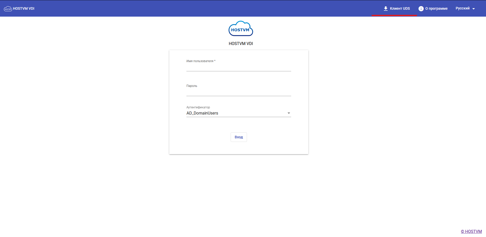
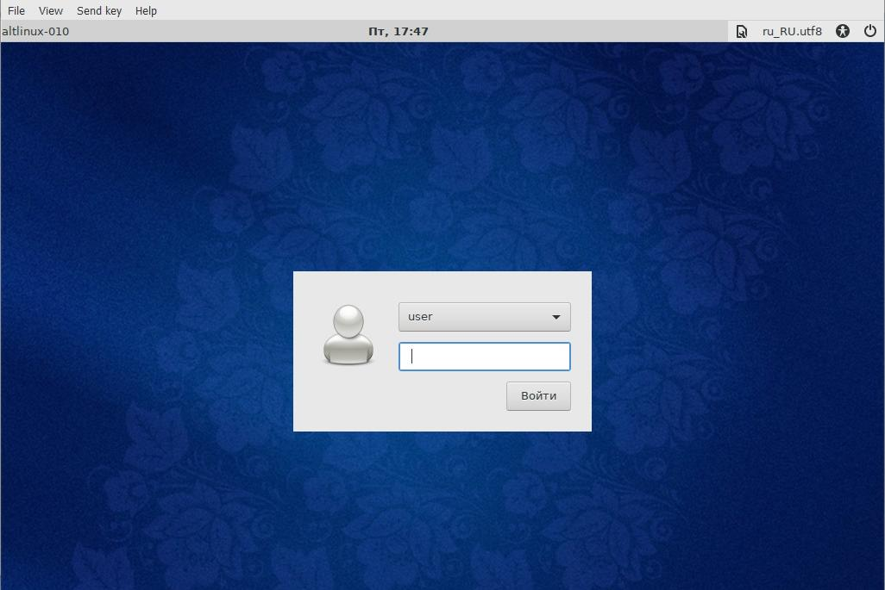
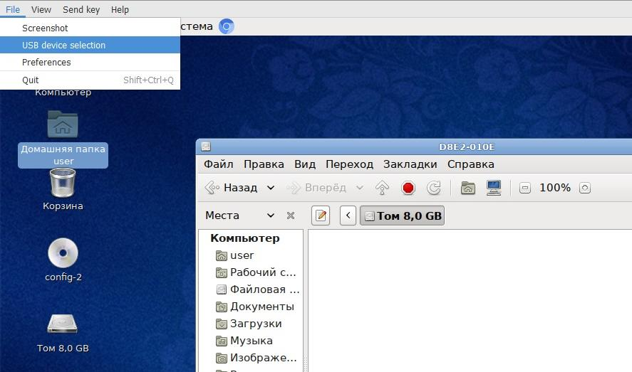

# Руководство пользователя

## Общие данные

Компонент платформы виртуализации HOSTVM VDI предназначен для виртуализации рабочего стола пользователя.

С помощью специализированного ПО на рабочем месте пользователь может удаленно подключиться в систему, получая доступ ко всем программам, приложениям и данным.

## Инструкция по подключению

### Подготовка к работе

Скачайте дистрибутивы и установите следующее ПО:

**Virt-Viewer**

Данный дистрибутив размещен в личном кабинете.\
&#xNAN;_&#x41A;аталог загрузок -> Дистрибутивы -> Tools -> Virt-viewer_

**Usb-Dk**\
\
Данный дистрибутив размещен в личном кабинете.\
&#xNAN;_&#x41A;аталог загрузок -> Дистрибутивы -> Tools -> Usb-dk_

**UDS Client**\
\
Данный дистрибутив размещен на портале брокера VDI.\
&#xNAN;_&#x417;агрузить его можно, перейдя на соответствующую вкладку._\
 

<figure><figcaption></figcaption></figure>

**Рис.1 Раздел UDS Client**

### Вход в систему

Для входа в систему выполните следующие шаги: 1. Откройте в браузере адрес VDI-портала; 2. В открывшуюся форму введите логин, пароль и предоставленный аутентификатор. 

<figure><figcaption></figcaption></figure>

**Рис.2 Форма для авторизации**

1.  Выберите нужный сервис и нажмите на иконку для открытия сессии.

    <figure><figcaption></figcaption></figure>

**Рис.3 Перечень сервисов**

После открытия  сессии может потребовать еще раз ввести пароль

<figure><figcaption></figcaption></figure>

**Рис.4 Вход в систему**

Если необходимо подключить в сессию USB-устройство с локальной машины, выполните следующие шаги: 1. В окне с открытой сессией выберите пункт меню: Файл → USB Device Selection;

<figure><figcaption></figcaption></figure>

**Рис.5 Окно с открытой сессией**

1. Отметьте нужное устройство в появившемся списке;

**Рис.6 Выбор USB-устройства**

1. Закройте список и дождитесь подключения устройства в сессию.

### Свернутое приложение HTML5 RemoteApp


В случае, когда используется HTML5 RemoteApp транспорт возможна ситуация, при которой после сворачивания окна презентованного приложения пользователю останется виден лишь пустой рабочий стол сессии.  Для восстановления свернутого приложения в таком случае можно воспользоваться экранной клавиатурой.


Для использования экранной клавиатуры:\
1\. Сделайте клик в левом-верхнем углу окна, для отображения меню Windows

<figure><figcaption></figcaption></figure>

2.  Выберите Экранную клавиатуру в разделе Специальных возможностей 

    <figure><figcaption></figcaption></figure>

3. Нажмите сочетание клавиш Alt+Tab на экранной клавиатуре для выбора свернутого приложения

<figure><figcaption></figcaption></figure>

