# Лаунчер HOSTVM VDI

Приложение HOSTVM VDI Лаунчер позволяет получать доступ к витрине сервисов без открытия web-портала в браузере.

После запуска приложения будет представлен следующий интерфейс:

<figure>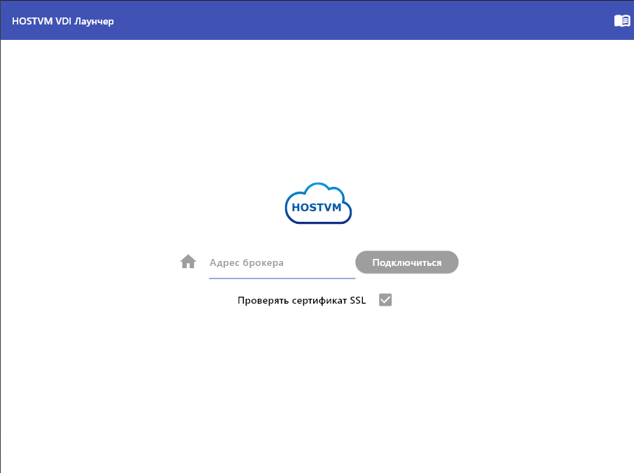<figcaption></figcaption></figure>

## Смена языка интерфейса 

Для переключения языка интерфейса (русский/английский) нажмите на иконку в правом-верхнем углу экрана:

<figure>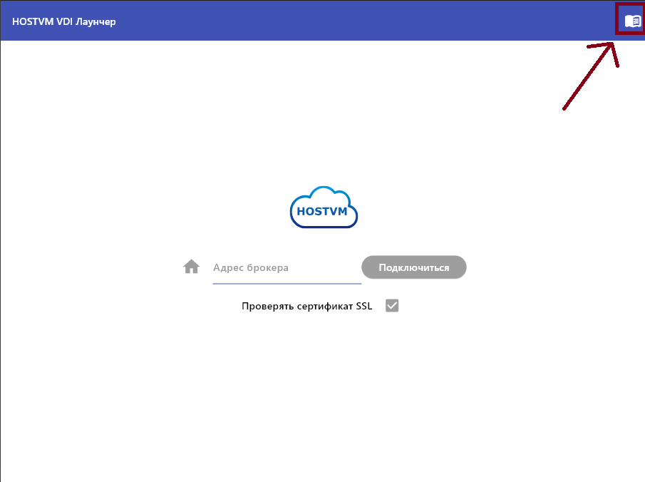<figcaption></figcaption></figure>

## Аутентификация 

### Подключение к брокеру 

Для начала работы необходимо пройти аутентификацию. Для этого укажите адрес брокера в соответствующем поле. После ввода адреса брокера станет активна кнопка **Подключиться**, которую необходимо нажать для инициализации подключения:

<figure>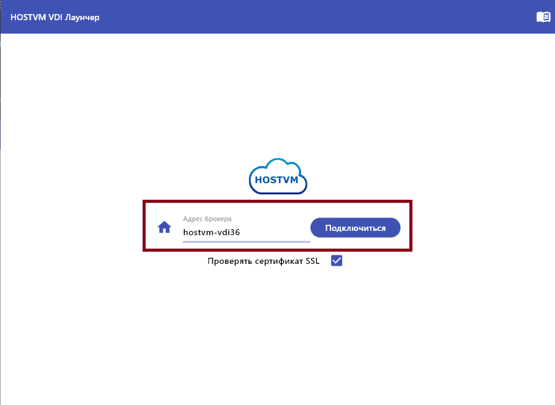<figcaption></figcaption></figure>

В случае неудачного подключения в нижней части приложения отображается информация о возникших проблемах:

<figure>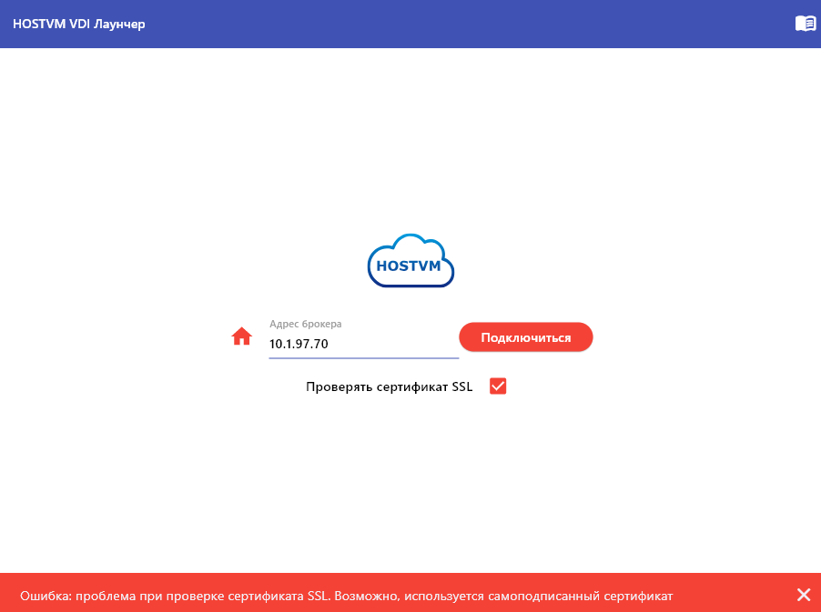<figcaption></figcaption></figure>

При возникновении ошибок, связанных с сертификатами, вы можете отключить их проверку. Для этого снимите флажок **"Проверять сертификат SSL"** (по умолчанию включен).

**Важно:** После этого все ошибки, связанные с сертификатами, будут игнорироваться, что может представлять угрозу безопасности.

### Учетные данные пользователя и аутентификатор 

После успешного подключения к брокеру HOSTVM будут отображены новые поля: имя пользователя, пароль пользователя и выпадающий список аутентификаторов:

<figure>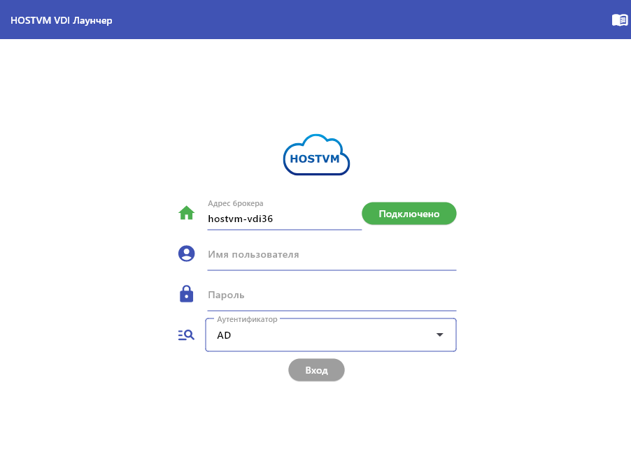<figcaption></figcaption></figure>

Как только будут введены учетные данные пользователя и выбран аутентификатор - кнопка **Вход** станет активна:

<figure>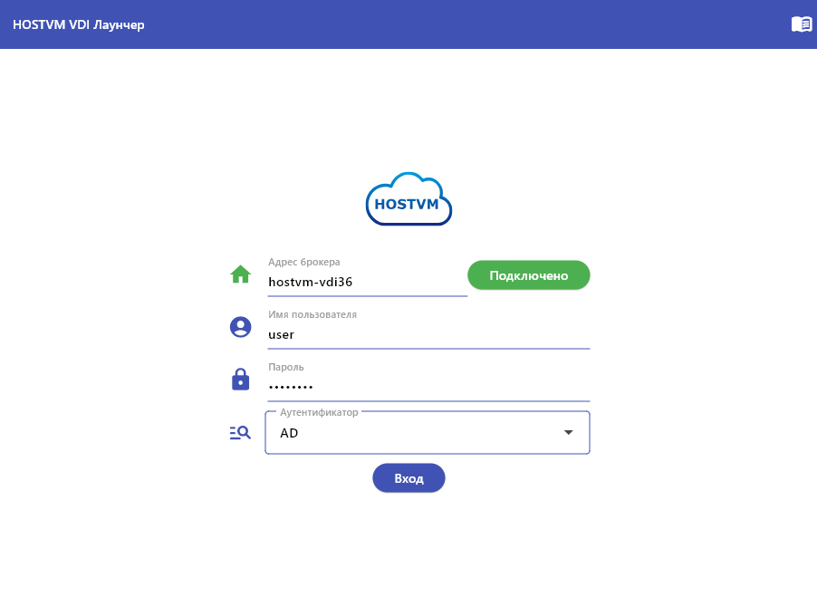<figcaption></figcaption></figure>

После ее нажатия будет запрошен доступ к витрине сервисов.

## Витрина сервисов 

В случае успешной авторизации будет отображена витрина сервисов, представляющая из себя пролистываемый список всех сервисов, доступных пользователю:

<figure>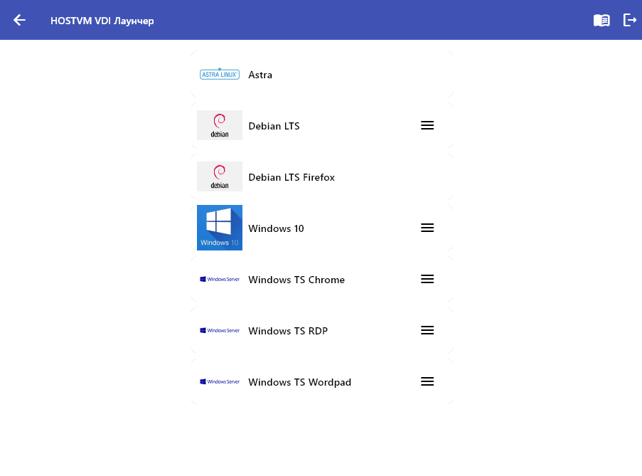<figcaption></figcaption></figure>

В случае, если у сервиса более одного доступного транспорта, справа от него отображается иконка выпадающего меню, после нажатия на которую отобразятся все доступные дополнительные транспорты:

<figure>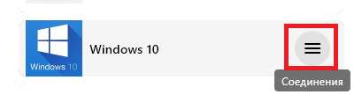<figcaption></figcaption></figure>

<figure>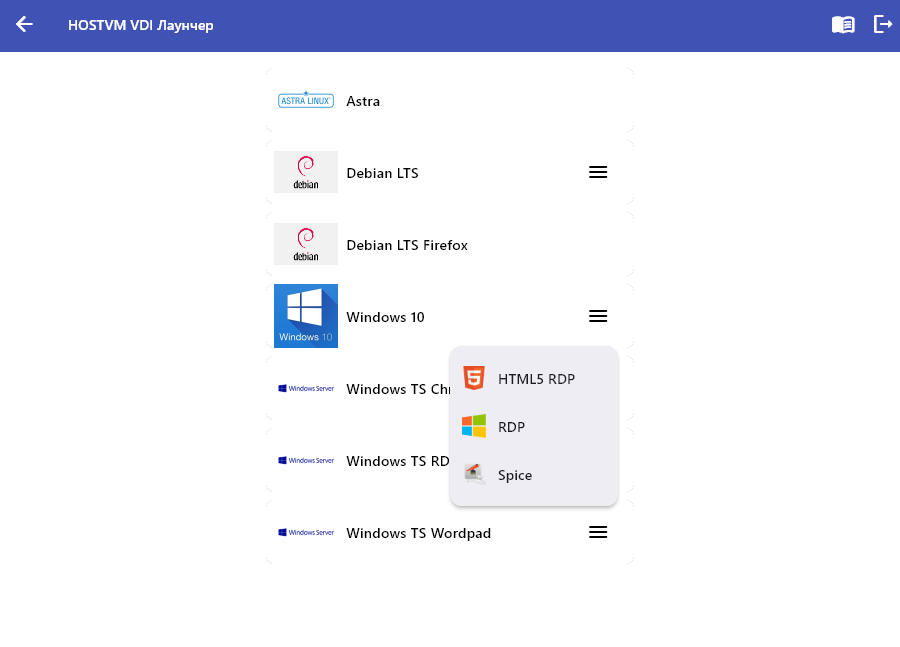<figcaption></figcaption></figure>

Чтобы выбрать сервис, нажмите на его название. Если для сервиса доступны варианты транспортов, выберите нужный тип из выпадающего списка.

## Страница открытия сервиса 

После инициализации будет открыта специальная страница запроса сервиса:

<figure>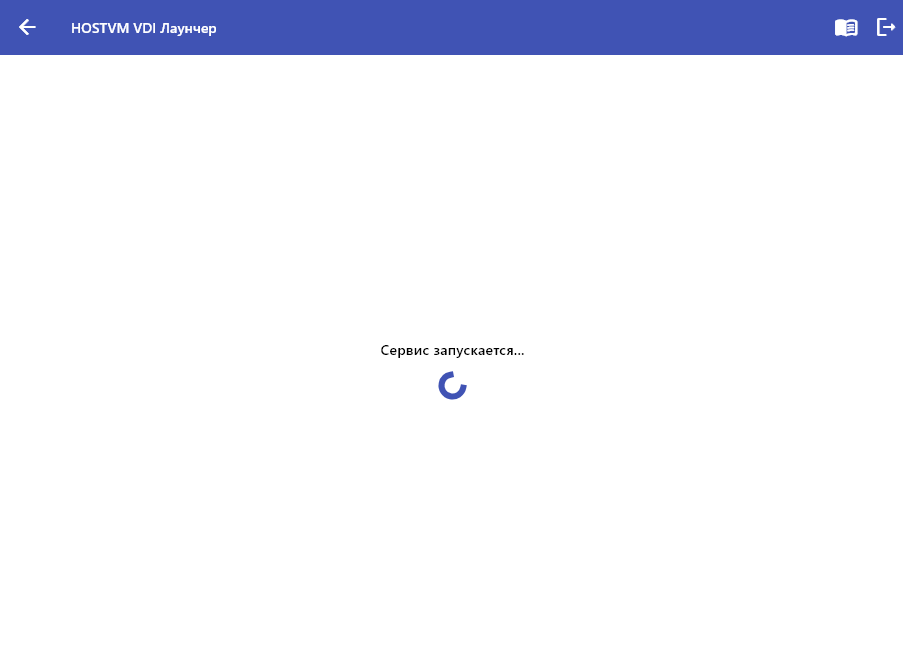<figcaption></figcaption></figure>

После запроса сервиса будет произведен автоматический возврат на витрину сервисов. В случае, если произойдет какая-либо ошибка, она так же будет отображена в нижней части экрана:

<figure>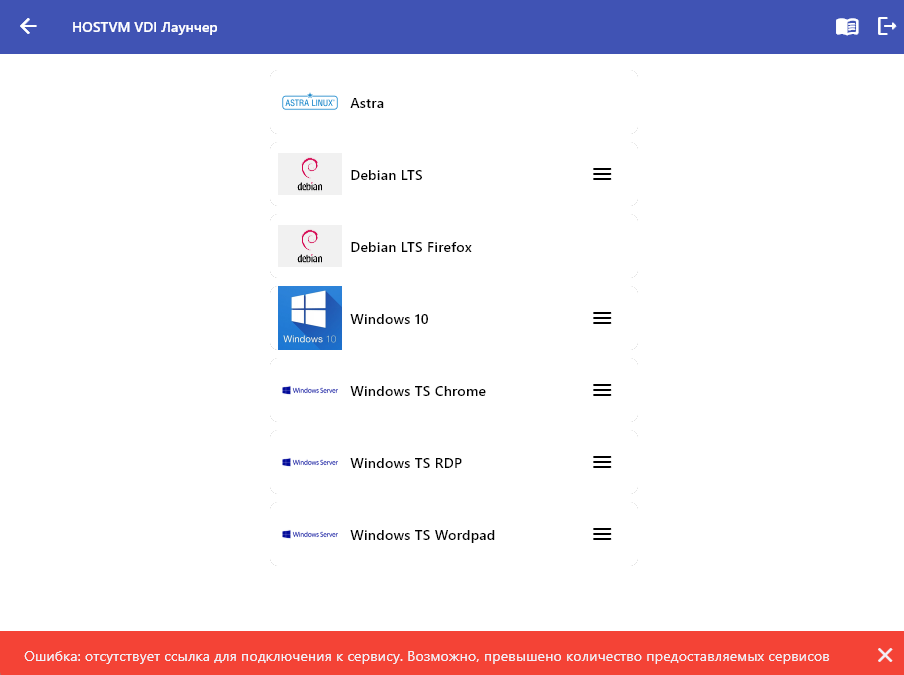<figcaption></figcaption></figure>

