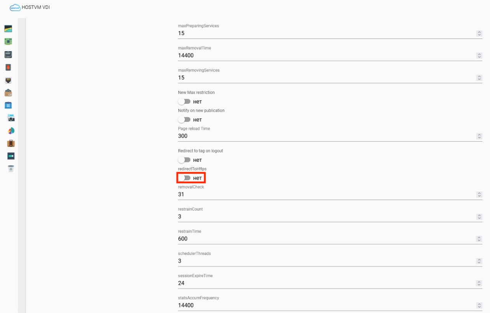

# Переключение брокера HOSTVM на HTTP

По умолчанию брокер использует HTTPS-соединение. Для использования HTTP необходимо отключить редирект в брокере и выполнить настройку Nginx.

1. В административной панели управления перейдите в раздел `Инструменты` -> `Конфигурация` -> Выключите чекбокс `redirectToHttps`. Сохраните изменения.

<figure><figcaption></figcaption></figure>

2. В консоли машины HOSTVM VDI выполните команды:

```
unlink /etc/nginx/sites-available/hostvm  
```

```
ln -s /etc/nginx/sites-available/hostvm.insecure /etc/nginx/sites-enabled  
```

3. Перезапустите службы:

```
systemctl restart nginx vdi.service vdiweb.service
```
