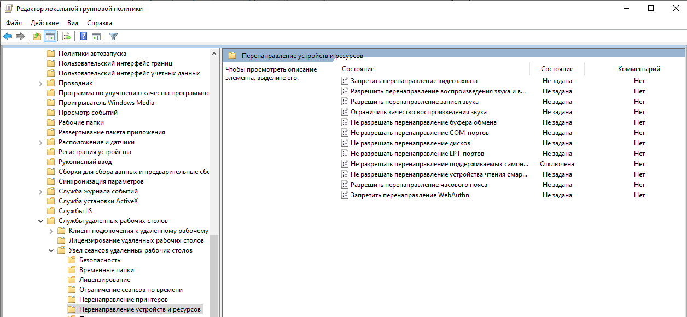
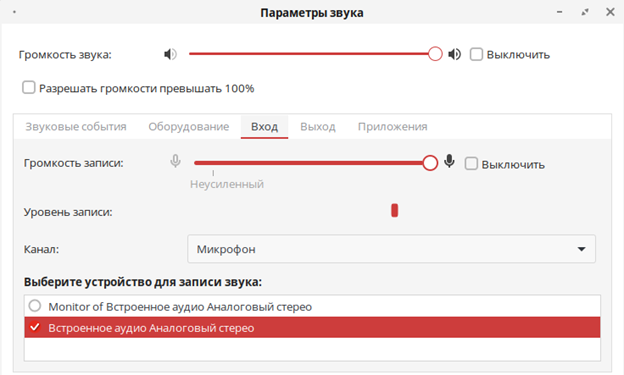
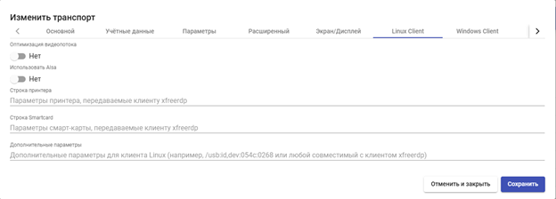
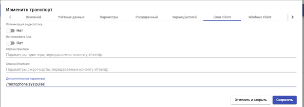
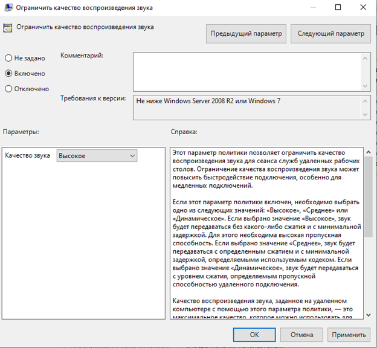
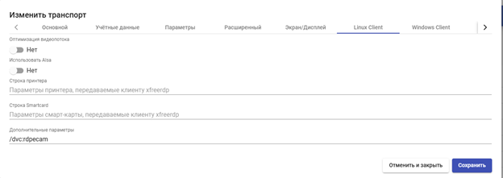

# Проблемы с перенаправлением звука и камеры в сеанс RDP

### Блокирующие политики Windows 

Для того, чтобы была возможность перенаправлять камеру/микрофон/звук в удалённую сессию, на конечной машине должна быть отключена политика, запрещающая перенаправление поддерживаемых самонастраиваемых устройств.

Нажмите сочетание клавиш `Win + R`, в открывшемся окне наберите `gpedit.msc` и нажмите `ОК`.

Перейдите в соответствующий раздел групповой политики:

`Политика «Локальный компьютер» -> Конфигурация компьютера -> Административные шаблоны -> Компоненты Windows -> Службы удалённых рабочих столов -> Узел сеансов удалённых рабочих столов -> Перенаправление устройств и ресурсов`

Отключите политику `Не разрешать перенаправление поддерживаемых самонастраиваемых устройств`

<figure><figcaption></figcaption></figure>

Для применения политики требуется выполнить в командной строке Windows команду `gpupdate /force` либо перезагрузить машину.

### Антивирусное ПО на клиентском устройстве 

Антивирусное ПО также может быть причиной блокировки проброса периферии в удалённый сеанс.

В процессе подключения к сессии задействованы два компонента:

* UDSClient, который отвечает за инициализацию и запуск процесса;
* клиент протокола подключения, который запускается первым компонентом, принимает параметры и непосредственно управляет сессией.

Для корректной работы необходимо добавить приложение UDSClient в исключения антивирусного ПО.

* В Windows по умолчанию клиент устанавливается в C:\Program Files (x86)\UDSClient
* В Linux – в директорию /usr/lib/UDSClient/

### На клиентской РЕД ОС выбрано неверное устройство записи звука 

В случае с РЕД ОС может быть неверно выбрано устройство для записи звука.

Перейдите в настройки звука и проверьте, что выбраны верный канал и устройство для записи звука, а при использовании микрофона шкала «Уровень записи» реагирует на звуки.&#x20;


В качестве устройства для записи недопустимо использование «Monitor of…».


<figure><figcaption></figcaption></figure>

Если после смены устройства записи вручную канал или устройство записи не меняются, необходимо обратиться в техническую поддержку РЕД ОС.

### Использование ALSA для микрофона и звука для Linux-клиентов 

Если клиент не поддерживает ALSA, либо не установлены соответствующие компоненты, использование этой архитектуры приведёт к тому, что в удалённой сессию устройства записи и воспроизведения звука не будут работать. В этом случае необходимо отключить использование ALSA в настройках транспорта.

На портале администрирования HOSTVM VDI Broker перейдите в настройки транспорта RDP:

`Подключение -> Транспорты -> Выберите транспорт RDP -> Редактировать -> Перейдите на вкладку Linux Client -> Отключите функцию «Использовать Alsa»`

<figure><figcaption></figcaption></figure>

Также можно явно указать, чтобы при перенаправлении устройства записи использовался Pulse. Для этого в строке `Дополнительные параметры` укажите `/microphone:sys:pulse`

<figure><figcaption></figcaption></figure>

### Задержки при использовании микрофона в удалённой сессии и плохое качество звука (xfreerdp) 

При искажениях или задержках звука с микрофона в приложениях для ВКС проблема может быть в неактуальной версии xfreerdp. Проверьте версию xfreerdp и выполните обновление, при наличии более актуального пакета.

Также опционально можно включить следующую политику на ВМ Windows:

`Нажмите сочетание клавиш Win + R -> В открывшемся окне наберите gpedit.msc и нажмите ОК -> Политика «Локальный компьютер» -> Конфигурация компьютера -> Административные шаблоны -> Компоненты Windows -> Службы удалённых рабочих столов -> Узел сеансов удалённых рабочих столов -> Перенаправление устройств и ресурсов -> Ограничить качество воспроизведения звука -> Включить`

<figure><figcaption></figcaption></figure>

Для применения политики требуется выполнить в командной строке Windows команду `gpupdate /force` либо перезагрузить машину.


При диагностике проблемы качества микрофона в приложения для ВКС рекомендуется проверить микрофон в разных приложениях, т.к. проблема может проявляться только в конкретном приложении.


### Задержки и плохое качество веб-камеры 

Если камера перенаправляется в удалённую сессию как USB-устройство, причиной плохого качества изображения звука может быть недостаток ресурсов на конечной виртуальной машине.

Проверьте утилизацию ресурсов, в частности CPU, в диспетчере задач или в интерфейсе виртуализации при использовании камеры. При сильной загруженности может потребоваться увеличение количества CPU.

Тем не менее, практика перенаправления микрофона как USB-устройства не является предпочтительной, т.к. в этом случае USB-проброс передаёт устройство на низком уровне целиком и сильнее зависит от драйверов Windows, чувствительнее к задержкам, хуже работает с потоковыми устройствами типа камер.

Для передачи веб-камеры в удалённую сессию штатным способом является использование параметра `rdpecam`. В этом случае в удалённую сессию перенаправляется только видеопоток, сама камера при этом остаётся локальным устройством Linux.&#x20;

Для использования данного параметра необходимо указать `/dvc:rdpecam` на вкладке Linux Client в строке «Дополнительные параметры» настроек транспорта:

<figure><figcaption></figcaption></figure>

В случае, если используемый актуальный билд xfreerdp не поддерживает работу с данным параметром, обратитесь в техническую поддержку HOSTVM.
