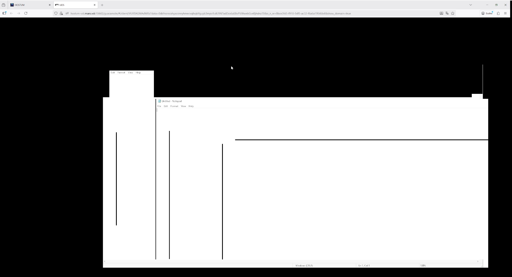

# Настройка Yandex ALB при проблемах отрисовки приложений

При использовании Yandex Application Load Balancer (ALB) могут возникать ошибки отрисовки приложений, доставляемых по HTML5 (изображение искажается при перемещении и изменении размеров окна приложения):

<figure><figcaption></figcaption></figure>

Причина такого поведения связана с отсутствием привязки сессии по IP-адресу: если эта функция не включена, трафик распределяется между целевыми ресурсами при каждом запросе в ALB.

Чтобы запросы в рамках одной пользовательской сессии обрабатывал один и тот же эндпоинт бэкенда, необходимо включить для группы бэкендов привязку сессий (session affinity).

Сейчас она работает, только если в группе бэкендов активен (имеет положительный вес) один бэкенд, он состоит из одной или нескольких целевых групп и для него выбран [режим балансировки](https://yandex.cloud/ru/docs/application-load-balancer/concepts/backend-group#balancing-mode) MAGLEV\_HASH. Подробнее об этом на [странице](https://yandex.cloud/ru/docs/application-load-balancer/concepts/backend-group).


Режим балансировки MAGLEV\_HASH с привязкой сессий необходимо настроить только для бэкенда, используемого для HTML5 трафика.&#x20;



Для групп типа Stream доступна только привязка сессий по IP-адресу клиента.

