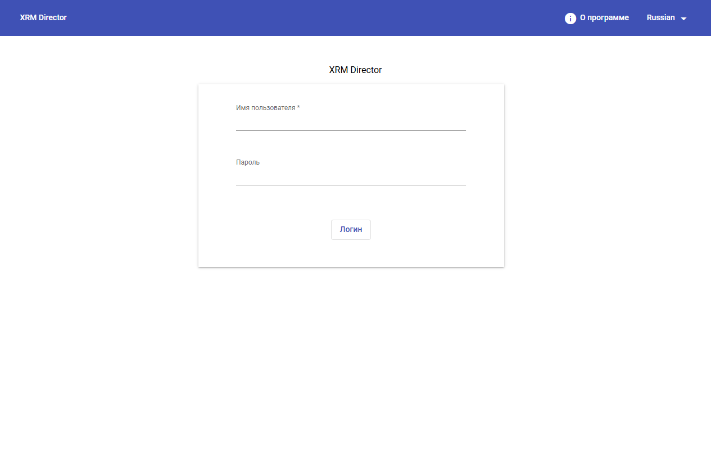
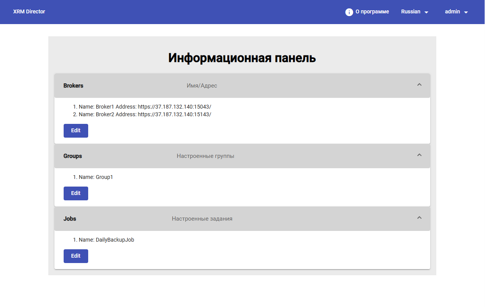

# Начальная настройка

Цель этапа:

* убедиться, что интерфейс HOSTVM XRM Director доступен;
* подготовиться к подключению брокеров HOSTVM VDI.

#### 1. Вход в систему

После открытия веб-интерфейса HOSTVM XRM Director администратор выполняет вход с учетной записью, имеющей права управления системой.

<figure><figcaption></figcaption></figure>

После успешной аутентификации отображается главный интерфейс HOSTVM XRM Director.

#### 2. Обзор основного интерфейса

Главный интерфейс HOSTVM XRM Director используется как единая точка управления инфраструктурой HOSTVM VDI.

На предоставленном примере после входа администратор попадает на экран `Информационная панель`.

В типовом административном сценарии используются следующие разделы:

* раздел брокеров;
* раздел групп брокеров;
* раздел заданий миграции;
* раздел журналов выполнения.

<figure><figcaption></figcaption></figure>

**HOSTVM** **XRM Director после входа администратора (`Информационная панель`).**

* в блоке `Brokers` отображаются зарегистрированные брокеры и их адреса;
* в блоке `Groups` отображаются настроенные группы;
* в блоке `Jobs` отображаются созданные задания;

#### 3. Административная логика работы с системой

HOSTVM XRM Director не заменяет брокеры HOSTVM VDI, а централизует управление ими и автоматизирует перенос конфигурации между площадками.

С точки зрения администратора работа строится по следующей модели:

1. в системе регистрируются брокеры;
2. брокеры объединяются в логические группы;
3. для группы создается задание миграции;
4. по заданию формируется план восстановления;
5. план запускается и переносит конфигурацию на резервный брокер;
6. результат контролируется по журналам и фактическому состоянию резервной площадки.

#### 4. Что нужно подготовить до дальнейшей настройки

Перед переходом к подключению брокеров рекомендуется заранее определить:

* имя основной площадки;
* имя резервной площадки;
* адреса брокеров HOSTVM VDI;
* учетные данные для подключения;
* используемый `authenticator`;
* перечень сервис-пулов, которые должны входить в план восстановления.
