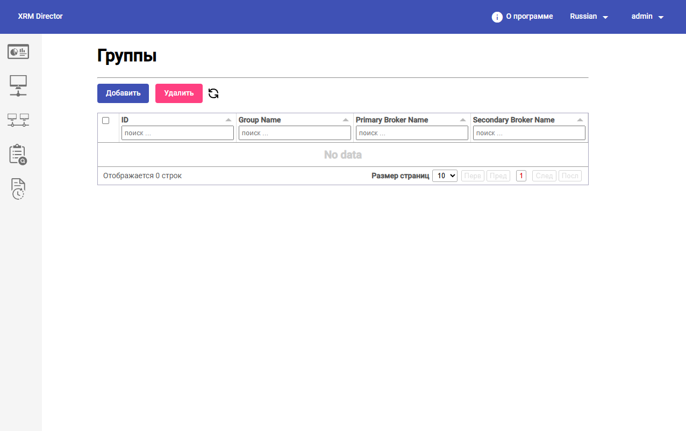
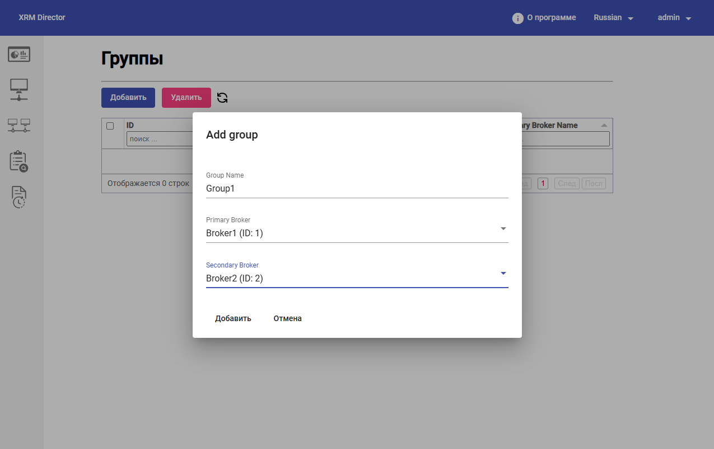

# Настройка групп брокеров

#### 1. Зачем нужны группы брокеров

В HOSTVM XRM Director группа брокеров представляет собой логическую связку из двух площадок:

* основной;
* резервной.

Группа используется как административная сущность, на основе которой создаются задания миграции конфигурации.


Без создания группы система не сможет однозначно определить, откуда должна считываться конфигурация и куда именно ее необходимо переносить.


#### 2. Переход в раздел `Группы`

Для создания группы брокеров администратор открывает раздел `Группы` в интерфейсе HOSTVM XRM Director.

В верхней части страницы доступны основные действия:

* `Добавить`; `Удалить`;
* обновление списка.

Ниже расположена таблица групп с колонками:

* `ID`; `Group Name`; `Primary Broker Name`; `Secondary Broker Name`.

Через этот экран администратор может просматривать уже созданные группы, искать их по колонкам и переходить к созданию новой связки основной и резервной площадки.

<figure><figcaption></figcaption></figure>

#### 3. Создание новой группы

Для создания группы необходимо:

1. нажать кнопку `Добавить`;
2. указать имя группы;
3. выбрать основной брокер в поле `Primary Broker`;
4. выбрать резервный брокер в поле `Secondary Broker`;
5. сохранить изменения.

В демонстрационном сценарии создается группа `Group 1`, где:

* `Broker1` — основная площадка;
* `Broker2` — резервная площадка.

На предоставленном примере в выпадающих списках выбраны:

* `Broker1 (ID: 1)` в поле `Primary Broker`;
* `Broker2 (ID: 2)` в поле `Secondary Broker`.

<figure><figcaption></figcaption></figure>

#### 4. Что важно проверить после создания группы

После сохранения администратор должен проверить:

* группа отображается в общем списке;
* основной брокер указан корректно;
* резервный брокер указан корректно.

В типовом примере в списке должна появиться группа `Group 1` с привязкой к `Broker1` и `Broker2`.

На предоставленном скриншоте группа отображается в таблице в виде строки со значениями:

* `ID = 1`;
* `Group Name = Group1`;
* `Primary Broker Name = Broker1`;
* `Secondary Broker Name = Broker2`.

<figure><figcaption></figcaption></figure>

После завершения этапа администратор должен иметь настроенную группу брокеров, которая может использоваться для создания задания миграции.
