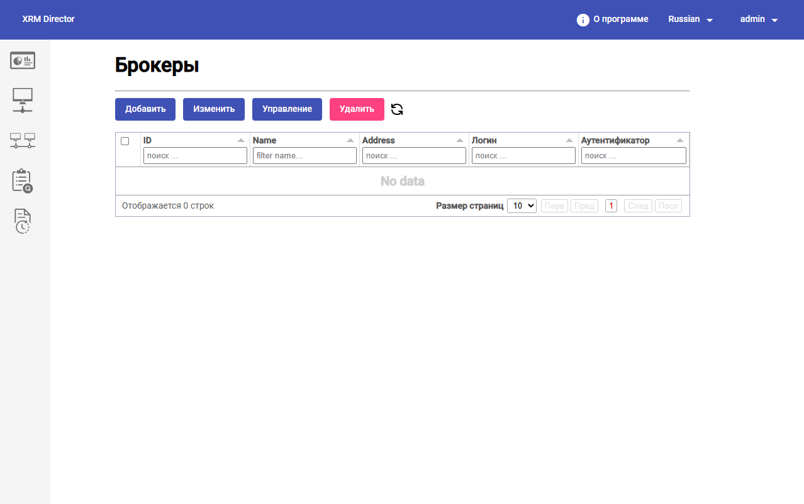
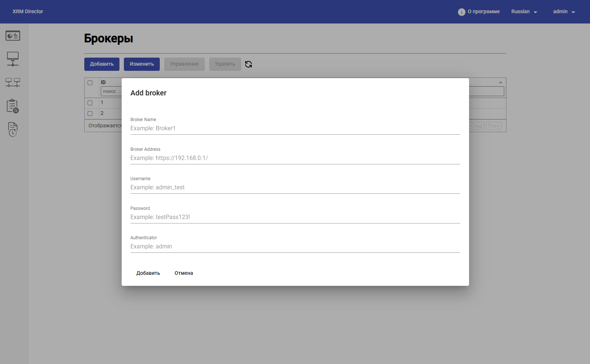
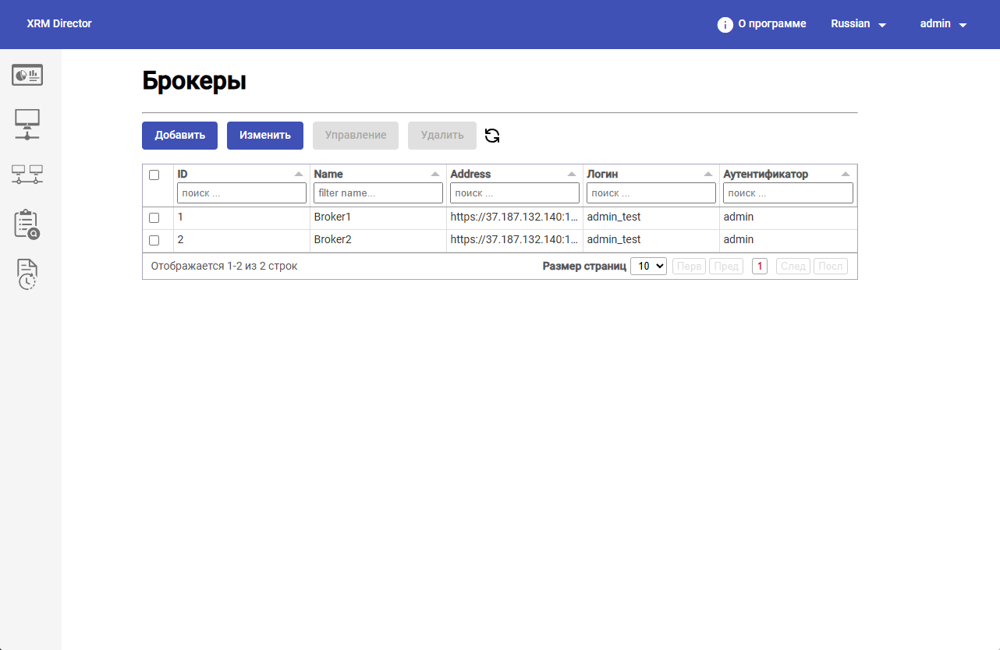
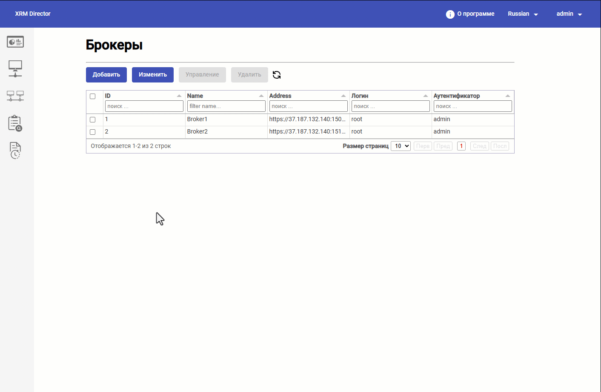
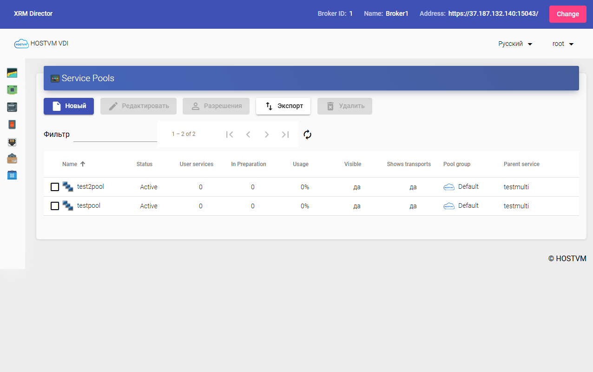
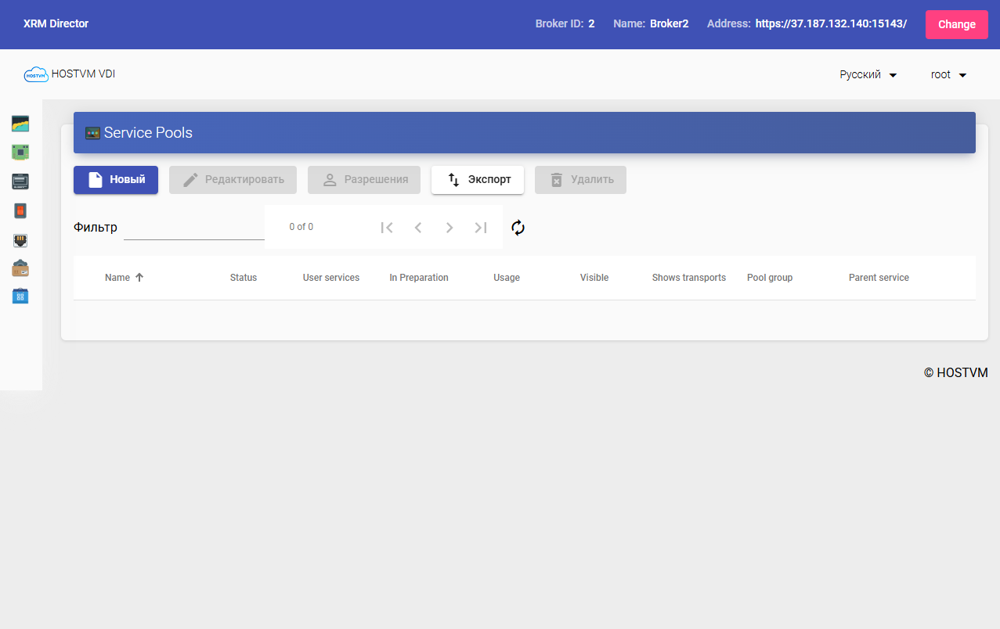

# Подключение и управление брокерами

#### 1. Переход к разделу настройки брокеров

Для подключения брокеров администратор открывает раздел настройки брокеров в интерфейсе HOSTVM XRM Director.

На экране отображается раздел `Брокеры`, в котором доступны основные действия управления:

* `Добавить`; `Изменить`; `Управление`; `Удалить`;
* обновление списка брокеров.

Ниже расположена таблица зарегистрированных брокеров. Через этот экран администратор выполняет добавление новых брокеров, изменение параметров подключения и переход к управлению выбранной площадкой.

<figure><figcaption></figcaption></figure>

#### 2. Добавление основного брокера

Для регистрации основной площадки необходимо нажать кнопку `Добавить`. После этого открывается модальное окно `Add broker`.

В форме указываются следующие поля:

* `Broker Name`;
* `Broker Address`;
* `Username`;
* `Password`;
* `Authenticator`.

В нижней части формы доступны кнопки:

* `Добавить` — сохранить конфигурацию брокера;
* `Отмена` — закрыть форму без сохранения.

<figure><figcaption></figcaption></figure>

В демонстрационном сценарии первым подключается `Broker1`, который используется как основная площадка.

#### 3. Добавление резервного брокера

После регистрации основного брокера аналогичным образом добавляется резервный брокер.

В демонстрационном примере он обозначается как `Broker2`.

После сохранения оба брокера должны отобразиться в общем списке и стать доступными для дальнейшей настройки.

<figure><figcaption></figcaption></figure>

#### 4. Проверка доступности брокеров

После регистрации брокеров администратор должен убедиться, что:

* оба брокера отображаются в списке;
* в таблице присутствуют идентификаторы зарегистрированных брокеров;
* данные подключения сохранены корректно;
* управление брокерами доступно из интерфейса HOSTVM XRM Director.

Если система позволяет выделить брокер в таблице и выбрать действие `Управление`, это означает, что HOSTVM XRM Director может использовать зарегистрированную запись для перехода к управлению выбранным брокером.

***

#### 5. Использование команды `Управление`

Ключевая административная возможность HOSTVM XRM Director — открытие веб-интерфейса брокера непосредственно из системы.

Для этого:

1. выберите нужный брокер в списке;
2. нажмите `Управление`;
3. дождитесь открытия интерфейса соответствующего брокера.

После открытия веб-интерфейса брокера в верхней части страницы отображается служебная панель HOSTVM XRM Director. Она показывает, что администратор работает с брокером через HOSTVM XRM Director, а не выполняет прямой вход на площадку вручную.

На этой панели отображаются:

* **Broker ID** – внутренний идентификатор брокера в HOSTVM XRM Director;
* **Name** – имя зарегистрированного брокера;
* **Address** – адрес брокера, веб-интерфейс которого открыт в текущий момент.

Кнопка **Change** в правой части панели позволяет вернуться обратно в интерфейс HOSTVM XRM Director и выбрать другой зарегистрированный брокер для открытия через **Управление**. Это удобно, когда администратору необходимо последовательно проверить несколько площадок и быстро переключаться между ними из единой точки управления.

<figure><figcaption></figcaption></figure>

#### 6. Проверка основной площадки

После открытия основной площадки администратор должен проверить, что:

* продуктивные сервис-пулы присутствуют;
* сервис-пулы находятся в рабочем статусе;
* именно эти объекты должны быть перенесены на резервную площадку.

В сценарии из демонстрационного материала на основной площадке находятся два сервис-пула:

* `testpool`; `test2pool`.

Оба пула имеют статус `Active`.

<figure><figcaption></figcaption></figure>

#### 7. Проверка резервной площадки

После этого администратор должен открыть резервный брокер и убедиться, что на нем пока отсутствуют целевые сервис-пулы.

Смысл этой проверки — зафиксировать исходное состояние резервной площадки до запуска миграции.

В демонстрационном сценарии на резервном брокере изначально отсутствуют `testpool` и `test2pool`.

<figure><figcaption></figcaption></figure>

#### 8. Результат этапа

После завершения этапа подключения брокеров администратор должен получить:

* зарегистрированную основную площадку;
* зарегистрированную резервную площадку;
* подтверждение доступности обеих площадок через HOSTVM XRM Director;
* понимание, какие сервис-пулы будут участвовать в переносе.
