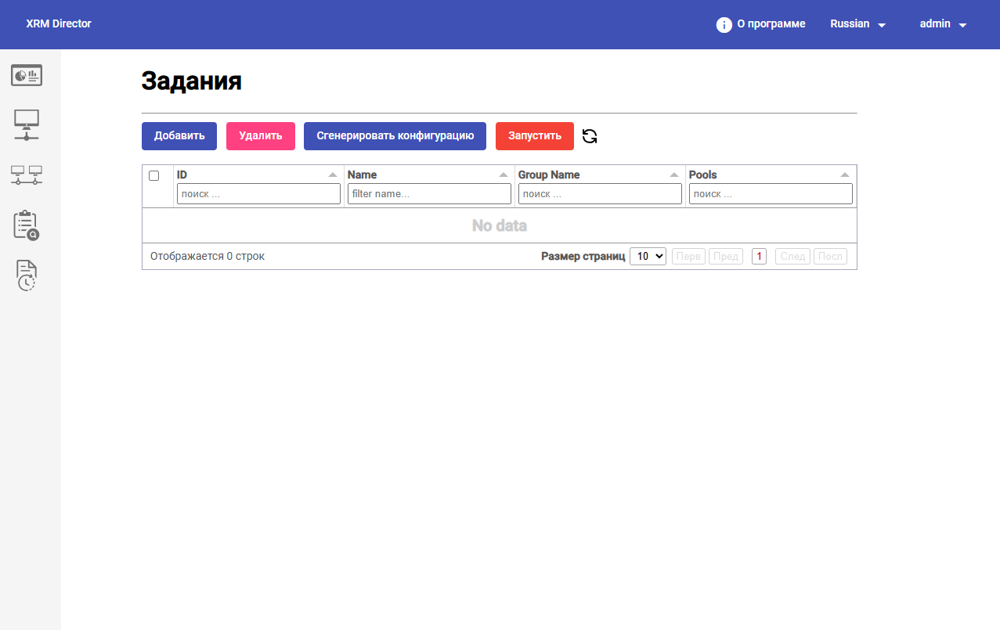
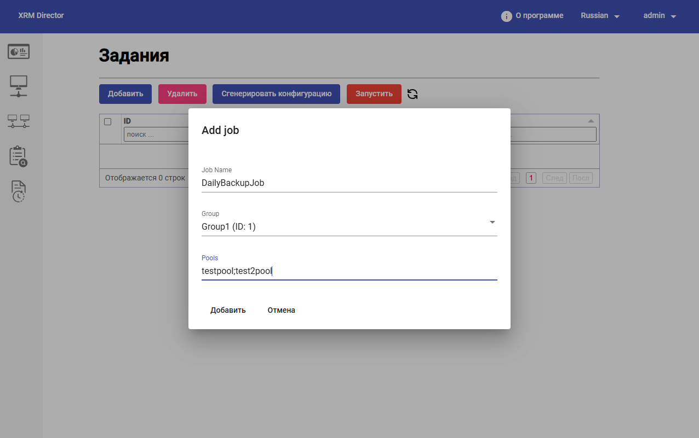
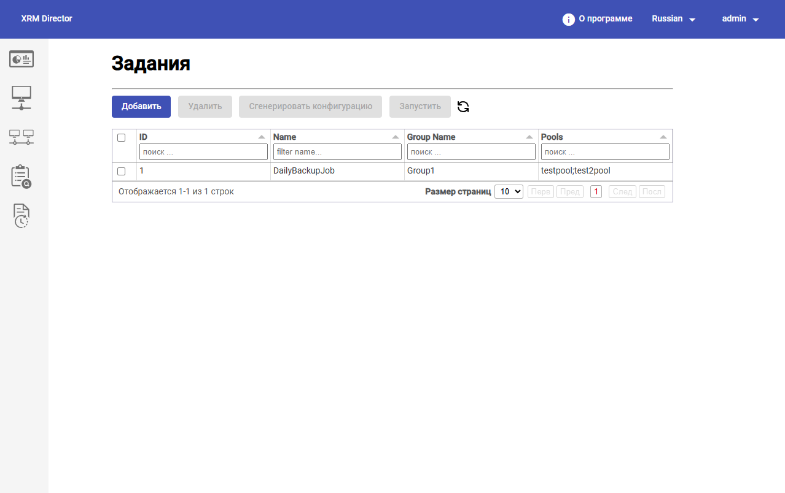

# Создание и запуск планов восстановления

#### 1. Переход к разделу `Задания`

После настройки группы брокеров администратор переходит в раздел `Задания`.

В верхней части страницы доступны основные действия:

* `Добавить`; `Удалить`; `Сгенерировать конфигурацию`; `Запустить`;
* обновление списка.

Через этот раздел создаются задания миграции, определяющие:

* какую группу брокеров использовать;
* какие сервис-пулы необходимо переносить;

<figure><figcaption></figcaption></figure>

#### 2. Назначение задания миграции

Задание в HOSTVM XRM Director представляет собой описанный администратором сценарий переноса конфигурации.

В задании фиксируются:

* имя задания;
* выбранная группа брокеров;
* список сервис-пулов, которые нужно перенести.

В демонстрационном сценарии создается задание `DailyBackupJob` для группы `Group 1`.

#### 3. Создание нового задания

Для создания задания необходимо нажать кнопку `Добавить`. После этого открывается модальное окно `Add job`.

В форме создания задания доступны следующие поля:

* `Job Name`;
* `Group`;
* `Pools`.

Для создания задания необходимо:

1. указать имя задания;
2. выбрать группу брокеров;
3. перечислить сервис-пулы для переноса;

В примере:

* имя задания: `DailyBackupJob`;
* группа: `Group 1`;
* сервис-пулы: `testpool`, `test2pool`.

<figure><figcaption></figcaption></figure>

#### 4. Проверка созданного задания

После сохранения задания администратор должен проверить:

* задание отображается в списке;
* выбрана правильная группа;
* список сервис-пулов заполнен без ошибок.

<figure><figcaption></figcaption></figure>

На предоставленном примере задание отображается в таблице со значениями:

* `ID = 1`;
* `Name = DailyBackupJob`;
* `Group Name = Group1`;
* `Pools = testpool;test2pool`.

#### 5. Панель управления заданием

В разделе `Задания` используются основные административные действия:

* `Добавить` — создание нового задания;
* `Удалить` — удаление выбранного задания;
* `Сгенерировать конфигурацию` — генерация плана восстановления;
* `Запустить` — запуск миграции по подготовленному плану.


Жизненный цикл задания обычно выглядит так: создание → проверка → генерация конфигурации → запуск → анализ журналов.


#### 6. Генерация плана восстановления

После создания задания необходимо сформировать план восстановления.

Для этого:

1. выделите нужное задание в списке;
2. нажмите `Сгенерировать конфигурацию`.

**Что делает система на этом этапе**

На этапе генерации HOSTVM XRM Director:

* анализирует конфигурацию указанных сервис-пулов на основном брокере;
* считывает параметры объектов, участвующих в переносе;
* формирует внутренний план миграции.

#### 7. Запуск плана восстановления

После успешной генерации конфигурации (плана восстановления) выполняется запуск переноса.

Для этого:

1. выберите подготовленное задание;
2. нажмите `Запустить`.

**Что делает система на этом этапе**

Во время выполнения `Run` HOSTVM XRM Director:

* использует ранее сформированный план;
* подключается к резервному брокеру;
* создает или воспроизводит необходимые объекты;
* переносит конфигурацию сервис-пулов на резервную площадку.

В демонстрационном сценарии запускается перенос `testpool` и `test2pool` с `Broker1` на `Broker2`.

#### 8. Практические рекомендации перед запуском

Перед выполнением `Run` рекомендуется убедиться, что:

* выбрано правильное задание;
* группа брокеров указана корректно;
* резервная площадка доступна;
* список сервис-пулов соответствует согласованному плану восстановления;
* на резервной площадке нет конфликтующей конфигурации.


Ошибочно выбранное задание или неверно настроенная группа может привести к переносу конфигурации не на ту площадку.

