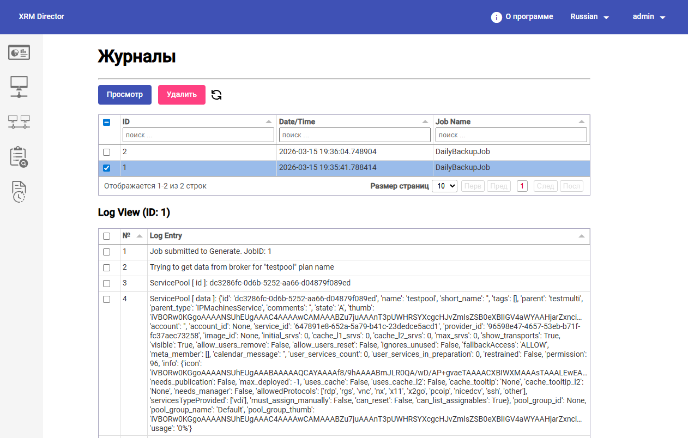
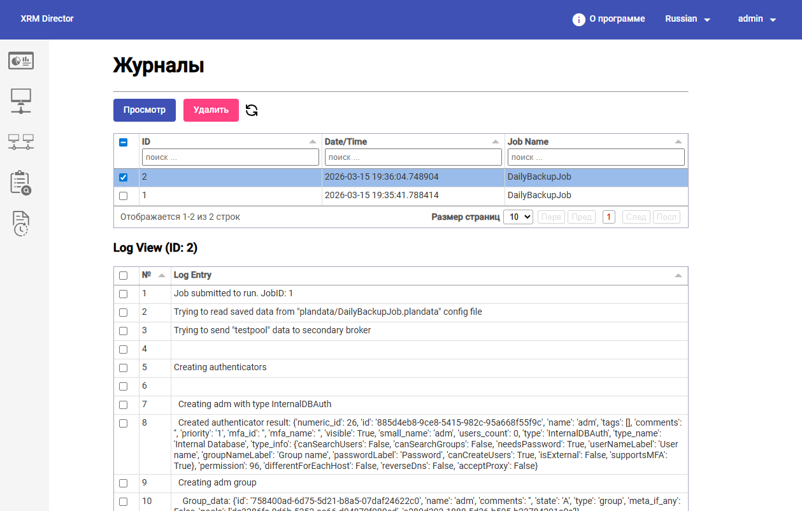
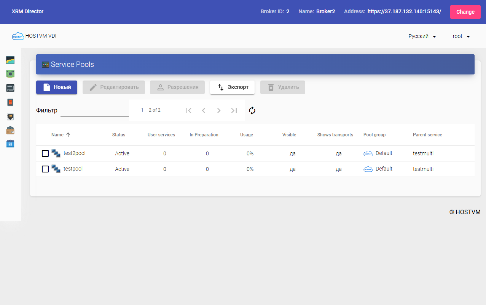

# Журналы, контроль выполнения и проверка результата

#### 1. Переход в раздел `Журналы`

После выполнения операций `Generate Config` и `Run` администратор открывает раздел `Журналы`.

В верхней части страницы доступны основные действия:

* `Просмотр`; `Удалить`;
* обновление списка.

В верхней таблице отображается список записей журнала с колонками:

* `ID`; `Date/Time`; `Job Name`.

Ниже располагается область детального просмотра `Log View (ID: ...)`, в которой отображается содержимое выбранной записи.

<figure><figcaption></figcaption></figure>

#### 2. Какие записи должен увидеть администратор

В типовом сценарии после выполнения задания должны появиться как минимум две записи:

* журнал генерации конфигурации (`Generate Config`);
* журнал выполнения миграции (`Run`).

Если используется задание `DailyBackupJob`, администратор должен увидеть записи, относящиеся именно к этому заданию.

На предоставленном примере в списке отображаются две записи для `DailyBackupJob`:

* запись с `ID = 1`;
* запись с `ID = 2`.

Обе записи содержат дату и время выполнения и позволяют открыть подробный журнал в нижней части страницы.

***

#### 3. Анализ журнала `Generate Config`

Журнал генерации конфигурации подтверждает, что HOSTVM XRM Director смог:

* подключиться к основному брокеру;
* считать конфигурацию выбранных сервис-пулов;
* сохранить необходимые параметры для дальнейшего переноса.

В демонстрационном сценарии из журнала должно быть видно, что система считала конфигурацию пула `testpool` и других связанных объектов.

На предоставленном примере журнал генерации открывается для записи `Log View (ID: 1)`.

В начале журнала отображаются характерные строки:

* `Job submitted to Generate. JobID: 1`;
* `Trying to get data from broker for 'testpool' plan name`.

Далее в журнале последовательно отображаются данные, считанные из конфигурации сервис-пула, включая:

* идентификатор и имя сервис-пула;
* параметры пула;
* группы;
* транспорты;
* назначенные сервисы;
* assignables и другие связанные сущности.

#### 4. Анализ журнала `Run`

Журнал выполнения `Run` подтверждает фактический перенос конфигурации на резервную площадку.

Из него администратор должен увидеть, что система:

* считала ранее сформированный план;
* подключилась к резервному брокеру;
* начала создание или воспроизведение объектов;
* перенесла конфигурацию сервис-пулов.

На предоставленном примере журнал выполнения открывается для записи `Log View (ID: 2)`.

В начале журнала отображаются характерные строки:

* `Job submitted to run. JobID: 1`;
* `Trying to read saved data from 'plandata/DailyBackupJob.plandata' config file`;
* `Trying to send 'testpool' data to secondary broker`.

Далее в журнале отображаются пошаговые действия по воспроизведению конфигурации на резервной площадке, например:

* `Creating authenticators`;
* создание группы `adm`;
* создание пользователей `authenticator users`;
* последующее создание и привязка связанных объектов.

<figure><figcaption></figcaption></figure>

#### 5. Как открыть запись журнала

Для просмотра содержимого конкретной записи администратор должен:

1. выбрать нужную строку в верхней таблице журнала;
2. отметить ее чекбоксом;
3. нажать кнопку `Просмотр`.

После этого в нижней части страницы в блоке `Log View` отобразится содержимое выбранной записи.


Если запись не выбрана, нижняя область `Log View` может отображать пустое состояние `No data`.


#### 6. Проверка результата на резервном брокере

После анализа журналов необходимо убедиться в фактическом результате миграции.

Для этого:

1. вернитесь в раздел управления брокерами;
2. выберите резервный брокер;
3. нажмите `Управление`;
4. откройте интерфейс резервной площадки;
5. перейдите в раздел сервис-пулов.

**Что должен увидеть администратор**

Если перенос выполнен успешно, на резервной площадке должны появиться сервис-пулы, которых до миграции там не было.

В демонстрационном сценарии это:

* `testpool`;
* `test2pool`.

Оба должны находиться в статусе `Active`.

<figure><figcaption></figcaption></figure>

#### 7. Что считается подтверждением успешной миграции

Администратор может считать миграцию успешной, если одновременно выполнены следующие условия:

* в журналах нет критических ошибок;
* операция `Generate Config` завершилась успешно;
* операция `Run` завершилась успешно;
* на резервном брокере появились ожидаемые сервис-пулы;
* сервис-пулы активны;
* ключевые элементы конфигурации воспроизведены корректно.
