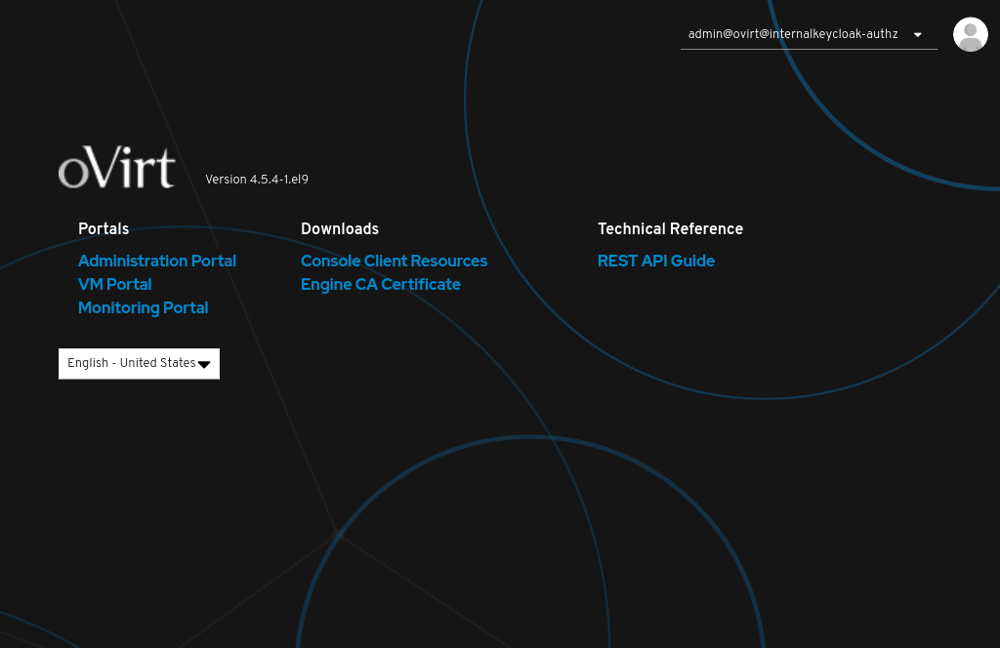

# Руководство по внедрению в среде HOSTVM

Система управления виртуализацией oVirt позволяет управлять полным спектром компонентов инфраструктуры виртуализации, таких как хосты, локальные и сетевые дисковые хранилища, логические сети, виртуальные машины и т.д.

<figure><figcaption><p>Система управления виртуализацией oVirt</p></figcaption></figure>

Модуль **xrm\_ovirt** в составе X Recovery Manager (XRM) предназначен для автоматизации аварийного восстановления oVirt-подобных систем управления виртуализацией (zVirt, РЕД Виртуализация, HOSTVM, ROSA виртуализация, RHEV, OLVM).\


<figure><figcaption><p>Рабочее окно модуля xrm_ovirt</p></figcaption></figure>

Его использование оправдано в ряде ситуаций и обеспечивает следующие преимущества:

1. **Обеспечение отказоустойчивости**: Виртуальные инфраструктуры, такие как oVirt, играют критическую роль в бизнес-процессах многих организаций. Модуль **xrm\_ovirt** помогает обеспечить отказоустойчивость путем быстрого и автоматизированного восстановления системы управления в случае сбоев, аварий или других непредвиденных ситуаций.
2. **Минимизация времени простоя**: Аварийные ситуации могут привести к простою операций и серьезным финансовым потерям. Модуль **xrm\_ovirt** позволяет быстро и эффективно восстановить работоспособность системы управления виртуализацией, что сокращает время простоя и минимизирует влияние сбоев на бизнес-процессы.
3. **Автоматизация восстановления**: Модуль автоматизирует процесс восстановления, что делает его более надежным и уменьшает вероятность человеческих ошибок при выполнении восстановительных действий.
4. **Уменьшение операторских затрат**: Автоматизация аварийного восстановления с использованием **xrm\_ovirt** позволяет сэкономить время и ресурсы администраторов систем виртуализации, так как множество операций выполняется автоматически.

### Рассмотрим последовательность шагов для настройки

Для демонстрации процесса аварийного восстановления рассмотрим сценарий аварийной ситуации, которая могла бы возникнуть на основной площадке организации, управляемой системой виртуализации oVirt.

Предположим, что у нас есть две независимые инсталляции oVirt Engine на разных физических серверах: **engine1.localdomain** (Primary Site) и **engine2.localdomain** (Secondary Site).

Основная площадка (Primary Site) — это место, где развернуты активные сервисы и находятся виртуальные машины, несущие бизнес-нагрузку организации. Однако, несмотря на предпринятые меры предосторожности, иногда возникают аварийные ситуации, такие как отказы оборудования, сетевые проблемы или другие непредвиденные события, которые могут привести к недоступности основной площадки.\


<figure><figcaption><p>Панель управления (Dashboard) engine1.localdomain (Primary Site) в системе oVirt</p></figcaption></figure>

В таких критических сценариях, необходимо быстро и эффективно восстановить доступ к данным и сервисам организации. Для этого используется резервная площадка (Secondary Site), которая предварительно подготовлена к принятию данных и сервисов с основной площадки в случае аварии.

Однако важно помнить, что резервная площадка (Secondary Site) является временным решением для обеспечения непрерывности бизнес-процессов в аварийной ситуации. После восстановления основной площадки (Primary Site), также необходимо выполнить процедуру возврата всех сервисов и данных обратно на основную площадку.

В данном контексте мы будем рассматривать сценарий, в котором возникла аварийная ситуация на основной площадке (**engine1.localdomain**), и нам необходимо выполнить аварийное восстановление на резервной площадке (**engine2.localdomain**). Разберем пошаговый план и действия, необходимые для успешного восстановления хранилища данных, виртуальных машин и сервисов, используя модуль **xrm\_ovirt** , на примере нашего тестового стенда.

#### Описание стенда:

Две независимые инсталляции oVirt Engine на разных физических серверах. Каждая из них управляет своим собственным кластером хостов.

| Параметр                                                                              | Основная площадка            | Резервная площадка                    |
| ------------------------------------------------------------------------------------- | ---------------------------- | ------------------------------------- |
| Адрес сервера управления:                                                             | **engine1.localdomain**      | **engine2.localdomain**               |
| Тип хранилища                                                                         | **NFS**                      | **NFS**                               |
| Путь до системы хранения данных для  основной копии хранилища виртуальных машин       | **192.168.122.210:/nfs\_ds** | **-**                                 |
| Путь до системы хранения данных для реплицированной копии хранилища виртуальных машин | -                            | **192.168.122.210:/nfs\_ds\_replica** |

При использовании NFS-хранилища на основе Linux-подобной управляющей среды системы хранения данных (СХД) и для обеспечения корректного подключения хранилищ к среде oVirt рекомендуется настроить права для экспортируемых NFS-каталогов следующим образом:\



Для уточнения конкретных команд и шагов для настройки прав экспорта NFS-хранилищ вы также можете обратится к документации производителя СХД.


```
[admin@T-NFS ~]# cat /etc/exports|grep nfs_ds
/nfs_ds       10.0.0.0/8(rw,async,no_subtree_check,all_squash,anonuid=36,anongid=36)
/nfs_ds_replica       10.0.0.0/8(rw,async,no_subtree_check,all_squash,anonuid=36,anongid=36)
[admin@T-NFS ~]# ls -la /|grep nfs
drwxrwxrwx    3 vdsm kvm    49 Sep 12 20:45 nfs_ds
drwxrwxrwx    3 vdsm kvm    49 Sep 12 20:11 nfs_ds_replica
[admin@T-NFS ~]# id vdsm
uid=36(vdsm) gid=36(kvm) groups=36(kvm)
```


Если при репликации данных между NFS-хранилищем основной площадки и NFS-хранилищем резервной площадки используются базовые утилиты уровня операционной системы (например, cp, rsync и аналоги), убедитесь, что при копировании сохраняются атрибуты прав и владельца файлов и каталогов.&#x20;

Это может быть обеспечено путем использования ключа -a (cp -a \<command> или rsync -a \<command>).


#### Основная площадка (Primary Site):

* **engine1.localdomain** – основная площадка, где развернуты активные сервисы с которой генерируем план восстановления;
* **https://engine1.localdomain/ovirt-engine/** - адрес web-интерфейса управления.
* **192.168.122.210:/nfs\_ds** - сетевой путь (path) к хранилищу данных;
* **NFS** - протокол сетевого доступа, тип хранилища (Storage Type);
* Domain Name: **nfs\_ds** - имя хранилища данных (Storage Domain) для хранения виртуальных машин и их дисков;
* **vm1, vm2, vm3** - виртуальные машины в составе.

<figure><figcaption><p>nfs_ds - имя хранилища данных (Storage Domain) для хранения виртуальных машин и их дисков, NFS тип хранилища (Storage Type)</p></figcaption></figure>

<figure><figcaption><p>vm1, vm2, vm3 - виртуальные машины в составе</p></figcaption></figure>

<figure><figcaption><p>Cетевой путь (path) к хранилищу данных</p></figcaption></figure>

#### Резервная площадка (Secondary Site):

* **engine2.localdomain** – «пустая» резервная площадка подготовленная к принятию данных и сервисов с основной площадки (engine1.localdomain) в случае аварийных ситуаций;
* **https://engine2.localdomain/ovirt-engine/** - адрес web-интерфейса управления.
* **Path (путь)** - сетевой путь к резервному хранилищу данных, исходя из вашей системы хранения данных.

<figure><figcaption><p>Резервная площадка engine2, Storage Domains</p></figcaption></figure>

<figure><figcaption><p>Резервная площадка engine2, Virtual Machines</p></figcaption></figure>

### Шаг 1. Настройка раздела "ПАРАМЕТРЫ" модуля xrm\_ovirt для создания, удаления и запуска плана восстановления.

Войти в XRM используя[ ](https://kb.x-rm.ru/dokumentaciya/dokumentaciya/xrm-versiya-1.2/rukovodstvo-polzovatelya)[Руководство пользователя](../../rukovodstvo-polzovatelya.md). На верхней панели в меню навигации выбрать **МОДУЛИ**, слева в разделе **INSTALLED** выбрать модуль **xrm\_ovirt**

<figure><figcaption><p>XRM, секция ПАРАМЕТРЫ модуля xrm_ovirt</p></figcaption></figure>

Cправа в секции **ПАРАМЕТРЫ** необходимо настроить следующие параметры:


С более подробным описанием каждого параметра можно ознакомиться, развернув  описание нажатием на символ **>**


<details>

<summary>01_site_primary_url * (Primary engine API address)</summary>

Адрес API сервера управления (Engine) **основной площадки**, с которой генерируем план восстановления. (Добавьте "/api" к URL сервера управления, как на примере.)

Пример:

`https://engine1.localdomain/ovirt-engine/api`

</details>

<details>

<summary>02_site_primary_username * (Primary engine account username)</summary>

Административный логин для сервера управления (Engine) **основной площадки.**

Пример:

`admin@internal` (для oVirt 4.4.\*)

`admin@ovirt@internal` (для oVirt 4.5.\* при использовании встроенного Keycloak)

</details>

<details>

<summary>03_site_primary_password * (Primary engine account password)</summary>

Пароль от административной учетной записи сервера управления (Engine) **основной площадки.**

</details>

<details>

<summary>04_site_secondary_url * (Secondary engine API address)</summary>

Адрес API сервера управления (Engine) **резервной площадки**, с которой генерируем план восстановления. (Добавьте "/api" к URL сервера управления, как на примере.)

Пример:

`https://engine2.localdomain/ovirt-engine/api`

</details>

<details>

<summary>05_site_secondary_username * (Secondary engine account username)</summary>

Административный логин для сервера управления (Engine) **резервной площадки**.

Пример:

`admin@internal` (для oVirt 4.4.\*)

`admin@ovirt@internal` (для oVirt 4.5.\* при использовании встроенного Keycloak)

</details>

<details>

<summary>06_site_secondary_password * (Secondary engine account password)</summary>

Пароль от административной учетной записи сервера управления (Engine) **резервной площадки.**

</details>

<details>

<summary>07_primary_storage * (Storage domains on primary site).</summary>

Перечень хранилищ (Storage Domain), видимые серверами кластера виртуализации на **основной площадке**, которые будут использованы в ходе аварийного восстановления.

Пример:

`nfs://192.168.122.210:/nfs_ds`

</details>

<details>

<summary>08_secondary_storage * (Storage domains on secondary site)</summary>

Перечень реплик хранилищ (Storage Domain), видимые серверами кластера виртуализации на **резервной площадке**, которые необходимо подключить в ходе аварийного восстановления.

Пример:

`nfs://192.168.122.210:/nfs_ds_replica`

</details>

<details>

<summary>09_additional_params (Optional parameters in JSON format)</summary>

Дополнительные параметры для использования в рамках плана восстановления (необязательное поле, указываются при необходимости)

</details>

\*Обязательные поля для заполнения

В нашем примере секция CONFIG модуля «xrm\_ovirt» выглядит следующим образом.

<figure><figcaption><p>XRM, заполненная секция ПАРАМЕТРЫ модуля xrm_ovirt</p></figcaption></figure>

Подчеркнем важность полей **07\_primary\_storage** и **08\_secondary\_storage** и более подробно остановимся на них:

**07\_primary\_storage (Storage domains on primary site)**

В этом поле необходимо указать сетевой путь (включая тип хранилища) к основному хранилищу данных или перечень хранилищ (Storage Domain), видимых серверами кластера виртуализации на **основной площадке**, которые будут использованы в ходе аварийного восстановления. Для того чтобы найти путь хранилища (Storage Domain) в oVirt, войдите в веб-интерфейс oVirt > **Administration Portal**, перейдите в раздел **Storage** > **Domains**, найдите нужное хранилище (в нашем примере: nfs\_ds). Кликните на название этого хранилища, чтобы открыть его настройки. Во вкладке **General** вы найдете значение в поле **Path:**, скопируйте его. (в нашем примере основное хранилище **192.168.122.210:/nfs\_ds**).

<figure><figcaption><p>oVirt, сетевой путь к хранилищу данных</p></figcaption></figure>

Далее дополните путь, перед скопированным значением в зависимости от типа вашего хранилища: NFS, iSCSI, FC/FCoE. Узнать типа хранилища вы можете разделе **Storage** > **Domains**, поле **Storage Type**.

<figure><figcaption><p>oVirt, Storage > Domains, поле Storage Type</p></figcaption></figure>

Например, если это NFS, то добавьте **nfs://** перед скопированным значением. Если это iSCSI, соответственно, добавьте **iscsi://**, и так далее. В нашем примере путь с NFS будет выглядеть следующим образом: **nfs://**192.168.122.210:/nfs\_ds

В случае наличия нескольких хранилищ, они указываются списком через разделитель “**;**” (точка с запятой).

**Формат управляющих адресов (URL) хранилищ:**

<table data-full-width="false"><thead><tr><th width="171.33333333333331">Тип хранилища</th><th width="149">Формат управляющего URL</th><th>Пример управляющего URL</th></tr></thead><tbody><tr><td>NFS</td><td>nfs://%IP_ADDRESS%:/%PATH%</td><td>nfs://192.168.0.1:/nfsdata</td></tr><tr><td>iSCSI</td><td>iscsi://%DOMAIN_ID%:/%IP_ADDRESS%: %PORT%:/%IQN%</td><td>iscsi://bcca8438-810f-4932-bf25-d874babd97b1:/192.168.0.1:3260:/iqn.2006-01.com.openfiler:vm-data1</td></tr><tr><td>FC/FCoE</td><td>fcp://%DOMAIN_ID%</td><td>fcp://3dd5d4c2-e9b8-4046-aa98-499d6f91cb19</td></tr></tbody></table>

**08\_secondary\_storage (Storage domains on secondary site).**

В этом поле указываем сетевой путь к **резервному хранилищу** данных (исходя из вашей системы хранения данных) или перечень реплик хранилищ (Storage Domain), видимых серверами кластера виртуализации на резервной площадке, которые необходимо подключить в ходе аварийного восстановления. Формат адресов реплик хранилищ аналогичен приведенным выше примерам для параметра **07\_primary\_storage**. В нашем примере путь будет выглядеть следующим образом: **nfs://192.168.122.210:/nfs\_ds\_replica**

**Конфигурация модуля xrm\_ovirt завершена.**

### Шаг 2. Создание, удаление, и запуск планов восстановления.

Войти в XRM используя[ ](https://kb.x-rm.ru/dokumentaciya/dokumentaciya/xrm-versiya-1.2/rukovodstvo-polzovatelya)[Руководство пользователя](../../rukovodstvo-polzovatelya.md). На верхней панели в меню навигации выбрать **ДЕЙСТВИЯ**, слева разверните раздел **XRM\_OVIRT**.

XRM подключается к внешним системам с помощью расширяемого набора модулей, содержащих действия.

Действия - это набор сценариев доступных в составе модуля XRM. C помощью действий выполняются основные операции по управлению внешними системами, например, создание и запуск планов восстановления.&#x20;

**В модуле доступны следующие действия с планами восстановления:**

<table><thead><tr><th width="169">Действие</th><th>Описание</th><th data-hidden></th></tr></thead><tbody><tr><td>Generate (Generate recovery plan configuration)</td><td><p><strong>Генерация нового плана восстановления.</strong></p><p>При запуске действия необходимо указать уникальное наименование плана (по умолчанию - test).</p><p>Для повторного пересоздания плана с тем же именем его необходимо предварительно удалить с помощью действия Delete.</p></td><td></td></tr><tr><td>Delete (Delete recovery plan configuration)</td><td><p><strong>Удаление существующего плана восстановления.</strong></p><p>При запуске действия необходимо указать наименование плана (по умолчанию - test).</p></td><td></td></tr><tr><td>Fail_Over (Perform disaster recovery to secondary Site)</td><td><p><strong>Запуск созданного с помощью действия Generate восстановления сервисов на резервной площадке.</strong></p><p>В рамках выполнения действия происходит запуск сервисов после сбоя на резервной площадке (Secondary Site).</p><p>При запуске действия необходимо указать наименование плана (по умолчанию - test).</p></td><td></td></tr><tr><td>Fail_Back (Perform return to primary site)</td><td><p><strong>Запуск созданного с помощью действия Generate возврата сервисов на основную площадку.</strong></p><p>В рамках выполнения действия происходит запуск сервисов после отработки сценария Fail_Over для возврата на основную площадку (Primary Site).</p><p>При запуске действия необходимо указать наименование плана (по умолчанию - test).</p></td><td></td></tr></tbody></table>

Для эффективного восстановления основной площадки (Primary Site) и последующих действий, таких как **Fail\_Over** (Выполнение процедуры аварийного восстановления на резервной площадке) и **Fail\_Back** (Возврат на основную площадку), необходимо сначала сгенерировать план восстановления – **Generate**.

#### Шаг 2.1. Генерация плана восстановления.

План определяет последовательность действий, необходимых для восстановления сервисов после аварии.

В меню навигации **XRM** выберите **ДЕЙСТВИЯ**, в левой части окна разверните раздел **XRM\_OVIRT** и выберите опцию **Generate** (Generate recovery plan configuration).

<figure><figcaption><p>XRM, модуль XRM_OVIRT, опция Generate</p></figcaption></figure>

В правой части окна укажите наименование плана восстановления **plan\_name**. Рекомендуется выбирать имя, которое ясно отражает суть аварийного восстановления, В нашем примере: **Plan\_Recovery**. После указания наименования плана восстановления, вам следует нажать кнопку **ЗАПУСТИТЬ**. После нажатия, вы увидите в левом нижнем углу экрана всплывающее зеленое окно с надписью **Действие 'xrm\_ovirt\_Generate' было успешно запущено.**

<figure><figcaption></figcaption></figure>

Это сообщение указывает на то, что задача на выполнение операции генерации плана восстановления была успешно создана, и поставлена в очередь для выполнения.

Чтобы убедиться в успешном завершении операции по генерации плана восстановления. В меню навигации XRM выберите **ИСТОРИЯ** в этом разделе находится история операций и событий. В левой части окна найдите запись, связанную с выполнением операции по генерации плана восстановления (**xrm\_ovirt.Generate**). Если процесс генерации плана восстановления все еще выполняется, в правой части окна отображается надпись СТАТУС **Выполняется**. Это информирует вас о том, что операция еще не завершилась, и ей требуется дополнительное время для выполнения. В этом случае, дождитесь завершения процесса генерации. После внимательно просмотрите статус этой записи. Если операция завершилась успешно, вы увидите зеленую галочку и зеленую надпись **Успешно**.

<figure><figcaption><p>Генерация плана восстановления успешно выполнена</p></figcaption></figure>

В случае неуспешного выполнения, статус будет сопровождаться красным крестом и статусом **Ошибка**. Для просмотра логов хода операции в правой части, на сером блоке с названием **result**, перейдите по ссылке **expand**.

<figure><figcaption><p>Ошибка при генерации плана восстановления</p></figcaption></figure>

Кроме того, вы также можете просматривать логи в интерфейсе oVirt, перейдя в раздел **Events** (События), где вы найдете информацию о произошедших событиях и операциях, включая результаты выполнения модуля.

<figure><figcaption><p>engine1, events (События)</p></figcaption></figure>

В нашей демонстрации процесса аварийного восстановления, генерация плана успешно выполнена!

После успешной генерации плана восстановления и сбора конфигурационных данных с первой основной площадки (Primary Site) **engine1.localdomain** у нас теперь имеется готовый и эффективный план восстановления!

Когда аварийная ситуация произошла и основная площадка **engine1.localdomain** недоступна, резервная площадка **engine2.localdomain** готова взять на себя роль основной для обеспечения непрерывности вашей инфраструктуры. Давайте перейдем к следующему действию, которое заключается в запуске сервисов после сбоя на резервной площадке (Secondary Site)

С помощью модуля аварийного восстановления, запустим процедуру **Fail\_Over** для переключения на резервную площадку.

#### Шаг 2.2. Процедура Fail\_Over. Перенос и запуск сервисов на резервной площадке. (Secondary Site).

<figure><figcaption><p>"Пустая" резервная площадка engine2, Storage Domains</p></figcaption></figure>

В меню навигации **XRM** выберите **ДЕЙСТВИЯ**, в левой части окна разверните раздел **XRM\_OVIRT** и выберите опцию **Fail\_Over** (Perform disaster recovery to secondary Site). В правой части окна укажите наименование плана восстановления **plan\_name**, который вы указывали в шаге 2.1. Генерация плана восстановления, в нашем примере: **Plan\_Recovery.** После указания имени плана восстановления, вам следует нажать кнопку **ЗАПУСТИТЬ**.



Перед запуском действия **Fail\_Over** убедитесь, что на резервной площадке (Secondary Site) все хранилища, указанные при генерации плана восстановления **отключены** от кластеров oVirt и удалены из конфигурации Engine, а также отсутствуют подключенные иные хранилища (Domains) с совпадающими названиями.

Это является обязательным условием для корректного выполнения процедуры восстановления.


<figure><figcaption><p>XRM, модуль XRM_OVIRT, процедура Fail_Over для переноса и запуска сервисов на резервной площадке</p></figcaption></figure>

После нажатия, вы увидите в левом нижнем углу экрана всплывающее зеленое окно с надписью **Действие 'xrm\_ovirt\_Fail\_Over' было успешно запущено**.

Это сообщение указывает на то, что задача на выполнение операции Fail\_Over была успешно создана, и поставлена в очередь для выполнения.

В меню навигации **ИСТОРИЯ** вы так же можете отслеживать текстовые аспекты выполнения процедуры **xrm\_ovirt.Fail\_Over** по аналогии с предыдущим шагом.

<figure><figcaption><p> Процедура Fail_Over успешно выполнена</p></figcaption></figure>

Процедура **Fail\_Over** успешно завершена. В интерфейсе oVirt на **резервной площадке**, перейдя в раздел **Events** (События), в логах о произошедших событиях и операциях, мы видим, что все сервисы и хранилище данных успешно развернуты на резервном хранилище.

<figure><figcaption><p>engine2, events (События)</p></figcaption></figure>

<figure><figcaption><p>Хранилище данных nfs_ds на резервной площадке engine2</p></figcaption></figure>

<figure><figcaption><p>Свойства хранилища данных nfs_ds на резервной площадке engine2</p></figcaption></figure>

<figure><figcaption><p>engine2, vm1, vm2, vm3 - виртуальные машины в составе</p></figcaption></figure>

Однако важно помнить, что резервная площадка (Secondary Site) является временным решением для обеспечения непрерывности бизнес-процессов в аварийной ситуации. После успешного восстановления основной площадки (Primary Site), также необходимо выполнить процедуру возврата всех сервисов и данных обратно.

В модуле этот этап называется **Fail\_Back** и представляет собой перенос данных и сервисов с резервной площадки обратно на основную площадку после ее восстановления. Это важный шаг, чтобы вернуть инфраструктуру в нормальное состояние и минимизировать время работы на резервной площадке.

#### Шаг 2.3. Процедура Fail\_Back. Возврат сервисов на основную площадку (Primary Site).

Перед обратным переносом данных (процедура **Fail\_Back**) требуется удалить данные из разделов **Data Centers** и **Storage Domains** в системе oVirt основной площадки. Это является важной мерой безопасности. Это гарантирует, что никакие устаревшие или ненужные данные не будут мешать новому процессу обратного переноса, и не будет конфликтов между старыми и новыми данными. Ненужные данные могут вызвать проблемы с идентификацией и соответствием ресурсов при попытке восстановить данные на основной площадке.


Перед запуском действия **Fail\_Back** убедитесь, что на основной площадке (Primary Site) все хранилища, указанные при генерации плана восстановления **отключены** от кластеров oVirt и удалены из конфигурации Engine, а также отсутствуют подключенные иные хранилища (Domains) с совпадающими названиями.

Это является обязательным условием для корректного выполнения процедуры возврата сервисов.


Если после восстановления работоспособности основной площадки в конфигурации сервера Engine присутствуют подключенные исходные хранилища (в активном или неактивном состоянии), то для подготовки основной площадки к возврату сервисов с резервной площадки и выполнению процесса обратного переключения с использованием модуля **xrm\_ovirt**, выполним следующие шаги:

Для хранилищ в состоянии Active необходимо перевести хранилища данных в режим **Maintenance** (обслуживание), для последующего выполнения операции **Detach** (открепления) в системе управления виртуализацией oVirt.

Перейдите в раздел **Compute** > **Data Centers**, кликните на имя вашего дата центра (Name) в нашем примере Default. Во вкладке **Storage** выделите ваше хранилище данных, в нашем примере **nfs\_ds** и в верхнем меню выберите **Maintenance** (Обслуживание).

<figure><figcaption><p>engine1, перевод в режим обслуживания (Maintenance).</p></figcaption></figure>

Подтвердите, что вы хотите перевести хранилище данных в режим обслуживания **Maintenance**. Это действие позволит системе завершить активные операции на хранилище. После того как хранилище данных переведено в режим обслуживания **Maintenance**. В верхнем меню выберите **Detach** (Открепить).

Для деактивированных хранилищ (в состоянии Unattached) в разделе **Storage** > **Domains** выделите имя вашего хранилища данных, в нашем примере **nfs\_ds,** и в верхнем меню выберите **Remove** (Удалить). Система попросит вас подтвердить ваше намерение удалить хранилище данных.

<figure><figcaption><p>engine1, удаление домена</p></figcaption></figure>

После выполнения этих процедур по очистке и подготовке основной площадки, переходим к работе с модулем **xrm\_ovirt** для обратного переноса данных с резервной площадки.

В меню навигации **XRM** выберите **ДЕЙСТВИЯ**, в левой части окна разверните раздел **XRM\_OVIRT** и выберите опцию **Fail\_Back** (Perform return to primary site). В правой части окна укажите наименование плана восстановления plan\_name, который вы указывали в шаге 2.1. Генерация плана восстановления, в нашем примере: **Plan\_Recovery**. После указания имени плана восстановления, вам следует нажать кнопку **ЗАПУСТИТЬ**.

<figure><figcaption><p>XRM, процедура Fail_Back</p></figcaption></figure>

После нажатия, вы увидите в левом нижнем углу экрана всплывающее зеленое окно с надписью **Действие 'Fail\_Over' было успешно запущено**.

В меню навигации **ИСТОРИЯ** вы так же можете отслеживать текстовые аспекты выполнения процедуры "xrm\_ovirt.Fail\_Back" по аналогии с шагом 2.1. Генерация плана восстановления.

<figure><figcaption><p>Процедура Fail_Back Status Succeeded (Успешно выполнено)</p></figcaption></figure>

Процедура **Fail\_Back** успешно завершена. В интерфейсе oVirt на основной площадке, перейдя в раздел **Events** (События), по логам о произошедших событиях и операциях, мы видим, что все сервисы и хранилище данных успешно развернуты на основной площадке.

Обратите внимание, что данный документ является общим руководством. В зависимости от конкретной ситуации и конфигурации вашей системы oVirt могут потребоваться дополнительные действия и настройки.
