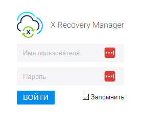

# Руководство пользователя

***

<figure><figcaption></figcaption></figure>

**X Recovery Manager (XRM)** - это платформа для автоматизации аварийного восстановления виртуализованных сервисов после сбоя, предназначенная для автоматизации следующих операций:

* Создание плана восстановления основной и резервной площадки для аварийного восстановления (failover) и возврата (failback)
* Проверка корректности файла маппинга переменных
* Выполнение аварийного восстановления на резервную площадку
* Выполнение возврата на основную площадку

**Вход в X Recovery Manager**

Откройте в веб-браузере адрес целевой машины, где был развернут **XRM**. В адресной строке браузера введите URL для доступа к **XRM** (используйте свой адрес):

```
http://192.168.0.110/
```

На странице входа введите `Имя пользователя` и `пароль` от вашей учетной записи, нажмите кнопку `ВОЙТИ` (или нажмите клавишу Enter), чтобы войти в систему.

**`Имя пользователя`** по умолчанию:

```
xrmadmin
```

**`Пароль`** по умолчанию:

```
xrmadmin
```

<figure><figcaption><p><code>Имя пользователя</code> по умолчанию <strong><code>xrmadmin</code></strong> <code>Пароль</code> по умолчанию <strong><code>xrmadmin</code></strong></p></figcaption></figure>

**Главная страница X Recovery Manager**&#x20;

После успешного входа вы будете перенаправлены на главную страницу, где вы увидите информацию о статусе системы, выполненных задачах и других доступных функциях.

<figure><figcaption><p>Главная страница X Recovery Manager</p></figcaption></figure>

**Навигация XRM**

На верхней панели Вы найдете меню навигации для доступа к различным функциям и страницам системы. Важные элементы навигации включают:

<figure><figcaption><p><strong>Основное меню XRM</strong></p></figcaption></figure>

<table><thead><tr><th width="192">Компонент меню</th><th>Краткое описание</th></tr></thead><tbody><tr><td>История</td><td><ul><li>Вкладка "История" отображает историю выполненных задач и событий в системе XRM.</li><li>Здесь можно найти записи о предыдущих действиях, запущенных рабочих процессах и других событиях.</li><li>Используйте фильтры и поиск, чтобы уточнить результаты и найти интересующие вас записи.</li></ul></td></tr><tr><td>Действия</td><td><p></p><ul><li>Вкладка "Действия" содержит список доступных автоматизированных действий в системе.</li><li>Здесь вы можете выбрать конкретное действие и выполнить его с помощью кнопки "Run".</li><li>Вы также можете просмотреть дополнительные сведения о каждом действии, такие как входные и выходные параметры.</li></ul></td></tr><tr><td>Модули</td><td><ul><li>Вкладка "Модули" позволяет управлять установленными пакетами действий.</li><li>Пакеты содержат сценарии и скрипты, которые могут быть использованы для автоматизации различных задач.</li><li>Вы можете устанавливать, обновлять и удалять пакеты в этой вкладке.</li></ul></td></tr></tbody></table>

**XRM** подключается к внешним системам с помощью расширяемого набора модулей, содержащих действия.

**Действия** - это набор сценариев доступных в составе модуля **XRM**. C помощью действий выполняются основные операции по управлению внешними системами, например, создание и запуск планов восстановления.&#x20;

**Модули** - это компоненты для интеграции XRM с внешними системами управления. В рамках модуля содержаться все необходимые компоненты для взаимодействия с API систем управления, например, oVirt Engine.&#x20;
