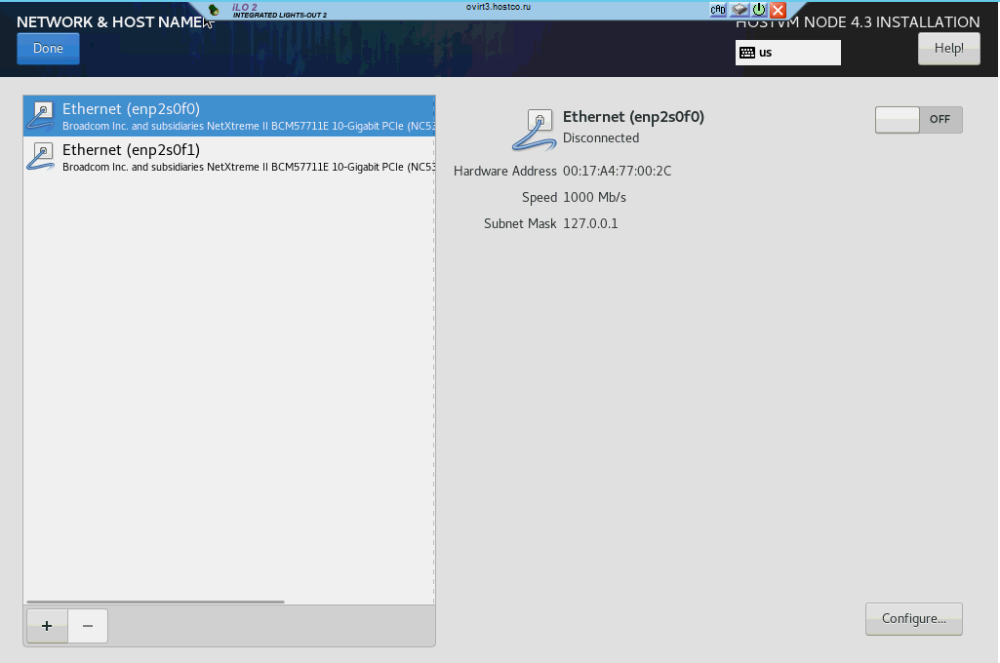

# Создание ISO-хранилища

Откройте браузер, перейдите в панель управления `https://engine.testdomain.ru`

Перейдите в `Storage -> Domains -> New Domain`. Выберете `Domain Function`, `Storage Type` как показано на картинке ниже. В поле `Export Part` введите адрес вашей nfs-share в формате `ip-адрес:/путь/до/папки` . Нажмите `OK`.

<figure><figcaption></figcaption></figure>

<figure><figcaption></figcaption></figure>

Убедитесь, что ISO-домен активен.

<figure><figcaption></figcaption></figure>
