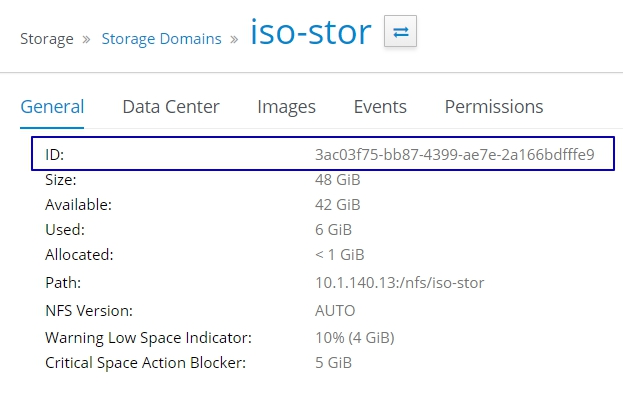
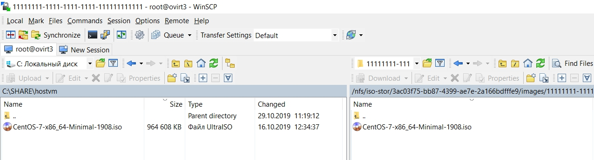
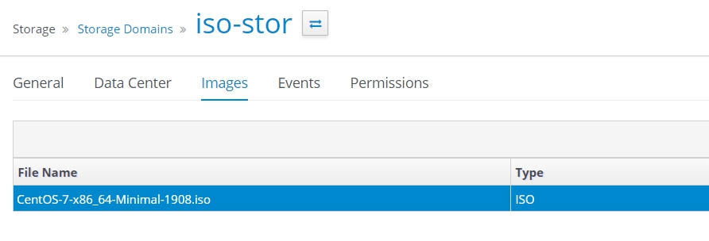

# Загрузка ISO-образов

Для того, чтобы загрузить iso-образ в виртуализацию, необходимо поместить выбранный iso-образ в папку `/путь к папке iso-домена/<domain-id>/images/11111111-1111-1111-1111-111111111111/`

Получить `<domain-id>` можно в панели управления

Domain-ID из примера ниже - `3ac03f75-bb87-4399-ae7e-2a166bdfffe9` , `/путь к папке iso-домена` в предыдущем шаге обозначили как `/nfs/iso-stor` значит iso-образ загрузим в папку `/nfs/iso-stor/3ac03f75-bb87-4399-ae7e-2a166bdfffe9/images/11111111-1111-1111-1111-111111111111/`

<figure><figcaption></figcaption></figure>

Для передачи файла на сервер с рабочего места, где установлена ОС Windows, необходимо использовать утилиту [WinSCP](https://winscp.net), которая доступна [в наборе дистрибутивов для развертывания решения](https://lk.pvhostvm.ru/Download).

<figure><figcaption></figcaption></figure>

После загрузки файлов в указанную папку, необходимо изменить владельца файла.

Перейдите в папку `/путь к папке iso-домена/<domain-id>/images/11111111-1111-1111-1111-111111111111/` командой `cd /путь к папке iso-домена/<domain-id>/images/11111111-1111-1111-1111-111111111111/`

Назначим нового владельца файла командой `chown 36:36 ./<ваш-образ>.iso` . Обратите внимание, что владелец и группа файла изменилась с `root root` на `vdsm kvm`

```
[root@testname1 ~]# cd /nfs/iso-stor/3ac03f75-bb87-4399-ae7e-2a166bdfffe9/images/11111111-1111-1111-1111-111111111111/
[root@testname1 11111111-1111-1111-1111-111111111111]# ls -la
total 93936
drwxr-xr-x. 2 vdsm kvm        46 Oct 29 15:22 .
drwxr-xr-x. 3 vdsm kvm        50 Oct 28 19:18 ..
-rw-r--r--. 1 root root 96187182 Oct 29 15:22 CentOS-7-x86_64-Minimal-1908.iso
[root@testname1 11111111-1111-1111-1111-111111111111]# chown 36:36 CentOS-7-x86_64-Minimal-1908.iso
[root@testname1 11111111-1111-1111-1111-111111111111]# ls -la
total 93936
drwxr-xr-x. 2 vdsm kvm       46 Oct 29 15:22 .
drwxr-xr-x. 3 vdsm kvm       50 Oct 28 19:18 ..
-rw-r--r--. 1 vdsm kvm 96187182 Oct 29 15:22 CentOS-7-x86_64-Minimal-1908.iso
```

Перейдите в панель управления и убедитесь, то ISO-образ доступен.

<figure><figcaption></figcaption></figure>
