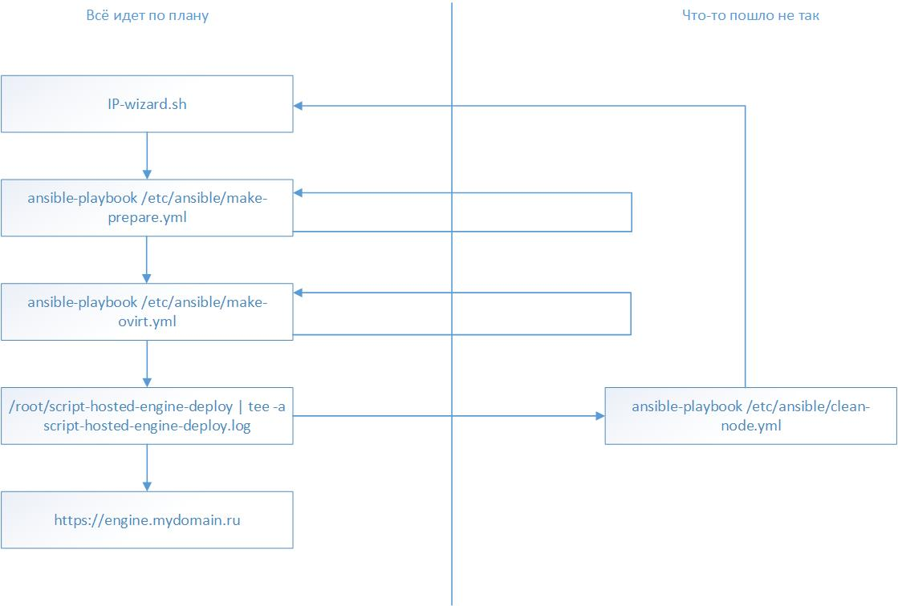

# Установка HOSTVM Manager на Gluster

После установки ISO-дистрибутива на сервер обратитесь по адресу, указанному в процессе установки на порт 9090 через браузер и зайдите под пользователем root. Альтернативно можно подключиться через [putty](pered-ustanovkoi/podgotovka-putty-k-rabote.md).

Пароль root по умолчанию для новой версии hostvm node: HostvmNode.

Логин HOSTVM Manager по умолчанию: admin\
Пароль HOSTVM Manager задается в процессе установки

Перейдите на вкладку Terminal

<figure><figcaption></figcaption></figure>

## Запуск программы-помощника IP-wizard

Запустите `IP-wizard.sh`, чтобы подготовить файлы переменных к работе. Следуйте указаниями инструкции в программе:

```
sh IP-wizard.sh 

Добро пожаловать в программу-помощник IP-wizard Группы компаний ХОСТ!
Мы попросим ответить на несколько вопросов и сформируем нужные файлы конфигурации Ansible.

Внимание! Программа изменит файлы в папках /etc/ansible/group_vars и /etc/ansible/host_vars!

Нажмите ENTER для продолжения или ^C для выхода из программы!
Для принятия значений по-умолчанию просто нажимайте ENTER. ;)

Укажите ваш Домен: hostco.ru
Домен: hostco.ru

Укажите DNS имя для oVirt Engine(консоли,веб-интерфейса управления)(без домена)[по умолчанию: engine]: engine-test
DNS имя консоли(веб-интерфейса) управления: engine-test

Укажите  IP адрес для oVirt Engine(консоли,веб-интерфейса управления): 10.1.140.15
IP адрес HostedEngine: 10.1.140.15

На данном сервере имеются интерфейсы:
lo : 127.0.0.1
enp2s0f0 : 10.1.140.13

Укажите имя интерфейса первого сервера, которое будет использовано как виртуальный коммутатор(например enp2s0f0). Список интерфейсов выведен выше. : enp2s0f0
имя интерфейса первого сервера: enp2s0f0

Укажите доступный клиентам IP адрес этого сервера [по умолчанию: 10.1.140.13] :
IP адрес текущего сервера: 10.1.140.13

Укажите шлюз (gateway) сети этого сервера[по умолчанию: 10.1.140.1] :
Шлюз текущего сервера: 10.1.140.1

Укажите hostname текущего хоста (без домена)[по умолчанию ovirt3]:
hostname текущего сервера: ovirt3


Укажите ваш DNS сервер[по умолчанию: 10.1.64.248]:
DNS: 10.1.64.248
Укажите тип хранилища для размещения oVirt Engine(консоли,веб-интерфейса управления)(fc или glusterfs)[по умолчанию: glusterfs]: glusterfs
Тип хранилища HostedEngine: glusterfs

На сервере будет развернута нода glusterfs.
Укажите предпочтительный gluster-hostname первого сервера (без домена)(glusternode1): glust1
gluster-hostname первого сервера: glust1

В среде виртуализации для размещения управляющей машины engine будет создан домен хранения hosted-engine
Укажите предпочтительное название тома gluster (hosted-engine): 
Имя тома gluster для домена хранения hosted-engine: hosted-engine

Укажите директорию для размещения тома gluster hosted-engineОбратите внимание, что для установки на разделе выбранного расположения директории должно быть свободно минимум 61ГБ
(/data/gluster/hosted_engine): 
Директория для glusterfs : /data/gluster/hosted_engine

Начинаю модификацию файлов...
dns_root: 10.1.64.248
Изменен файл /etc/ansible/group_vars/all.

Генерируем /etc/ansible/group_vars/nodes...
ansible_connection: ssh 
ansible_ssh_user: root 
ansible_ssh_pass: engine
ansible_ssh_common_args: '-o StrictHostKeyChecking=no'
ovirt_engine_ip: 10.1.140.15
ovirt_engine_fqdn: 'engine-test.mydomain.ru'
ovirt_engine_domain: 'mydomain.ru'
ovirt_engine_password: 'engine'
Изменен файл /etc/ansible/group_vars/nodes.

Генерируем /etc/ansible/host_vars/host1...
hostname: myhost1.mydomain.ru
shothostname: myhost1
ip: 10.1.140.13
ip_gateway: 10.1.140.1
nic_for_ovirtmgmt_bridge: enp2s0f0
gluster_hostname: glust1
Изменен файл /etc/ansible/host_vars/host1.

Генерируем /etc/ansible/group_vars/gluster...
gluster_dir_for_hosted_engine: /data/gluster/hosted_engine/brick1
gluster_hosted_engine_volume_name: hosted-engine
Изменен файл /etc/ansible/group_vars/gluster.

Правим файл ответов для hosted-engine...
Файл ответов обновлен.

[root@host1 ~]#
```

## Установка виртуализации

Выполните команду `ansible-playbook /etc/ansible/make-prepare.yml`, чтобы подготовить к работе /etc/hosts.

Выполните команду `ansible-playbook /etc/ansible/make-gluster-storages.yml`, чтобы подготовить к работе glusterfs.

```
[root@host1 ~]# ansible-playbook /etc/ansible/make-gluster-storages.yml
```

Запустите установку необходимых пакетов виртуализации командой `ansible-playbook /etc/ansible/make-ovirt.yml`. На ее выполнение уйдет чуть больше часа.

```
[root@host1 ~]# ansible-playbook /etc/ansible/make-ovirt.yml
[DEPRECATION WARNING]: The TRANSFORM_INVALID_GROUP_CHARS settings is set to allow bad characters in group names by default, this will change, but still be user configurable on deprecation. This feature will be removed in version 2.10.
Deprecation warnings can be disabled by setting deprecation_warnings=False in ansible.cfg.
 [WARNING]: Invalid characters were found in group names but not replaced, use -vvvv to see details


PLAY [ovirt-master] *************************************************************************************************************************************************************************************************************************

TASK [Gathering Facts] **********************************************************************************************************************************************************************************************************************
ok: [localhost]

TASK [ovirt-master : Ensure that ovirt-release43.rpm is installed] **************************************************************************************************************************************************************************
[DEPRECATION WARNING]: Invoking "yum" only once while using a loop via squash_actions is deprecated. Instead of using a loop to supply multiple items and specifying `name: "{{ item }}"`, please use `name:
['http://resources.ovirt.org/pub/yum-repo/ovirt-release4
ok: [localhost] => (item=[u'http://resources.ovirt.org/pub/yum-repo/ovirt-release43.rpm'])
3.rpm']` and remove the loop. This feature will be removed in version 2.11. Deprecation warnings can be disabled by setting deprecation_warnings=False in ansible.cfg.
TASK [ovirt-master : Ensure that ovirt-hosted-engine-setup is installed. !A very long time. Wait!] ******************************************************************************************************************************************
[DEPRECATION WARNING]: Invoking "yum" only once while using a loop via squash_actions is deprecated. Instead of using a loop to supply multiple items and specifying `name: "{{ item }}"`, please use `name: ['ovirt-hosted-engine-
setup-2.3.12-1.el7.noarch']` and remove the loop. This feature will be removed in version 2.11. Deprecation warnings can be disabled by setting deprecation_warnings=False in ansible.cfg.
ok: [localhost] => (item=[u'ovirt-hosted-engine-setup-2.3.12-1.el7.noarch'])

TASK [ovirt-master : Ensure that ovirt-engine-appliance is installed. !A very long time. Wait!] *********************************************************************************************************************************************
[DEPRECATION WARNING]: Invoking "yum" only once while using a loop via squash_actions is deprecated. Instead of using a loop to supply multiple items and specifying `name: "{{ item }}"`, please use `name: ['ovirt-engine-
appliance-4.3-20190926.1.el7.x86_64']` and remove the loop. This feature will be removed in version 2.11. Deprecation warnings can be disabled by setting deprecation_warnings=False in ansible.cfg.
ok: [localhost] => (item=[u'ovirt-engine-appliance-4.3-20190926.1.el7.x86_64'])

TASK [ovirt-master : Ensure that expect is installed] ***************************************************************************************************************************************************************************************
[DEPRECATION WARNING]: Invoking "yum" only once while using a loop via squash_actions is deprecated. Instead of using a loop to supply multiple items and specifying `name: "{{ item }}"`, please use `name: ['expect']` and remove the
loop. This feature will be removed in version 2.11. Deprecation warnings can be disabled by setting deprecation_warnings=False in ansible.cfg.
ok: [localhost] => (item=[u'expect'])

TASK [ovirt-master : Ensure that script-hosted-engine-deploy is pushed] *********************************************************************************************************************************************************************
changed: [localhost]

TASK [ovirt-master : Check hosted-deploy status] ********************************************************************************************************************************************************************************************
ok: [localhost]

TASK [ovirt-master : debug] *****************************************************************************************************************************************************************************************************************
ok: [localhost] => {
    "msg": "You must run deploy first"
}

PLAY RECAP **********************************************************************************************************************************************************************************************************************************
localhost                  : ok=9    changed=2    unreachable=0    failed=0    skipped=0    rescued=0    ignored=0

[root@host1 ~]#
```

Сформированный файл `/root/script-hosted-engine-deploy` содержит инструкции, необходимые для развертывания виртуализации Запустите его на исполнение командой `/root/script-hosted-engine-deploy | tee -a /root/script-hosted-engine-deploy.log`:

```
/root/script-hosted-engine-deploy | tee -a /root/script-hosted-engine-deploy.log
```

После завершения развертывания виртуализации откройте браузер и перейдите по адресу [https://engine.mydomain.ru](https://engine.mydomain.ru), чтобы попасть в панель управления.

**Примечание:** для HOSTVM Manager версии 4.3 необходимо дополнительно доустановить набор брендирования и локализации HOSTVM.

1. Загрузите архив HOSTVM-localocalization-branding.zip из каталога загрузок HOSTVM.
2. Подключитесь к виртуальной машине Engine и загрузите на неё архив в любое удобное расположение.
3. Распакуйте архив, перейдите в папку hostvm-localocalization-branding/branding/, и запустите файл makeHostvmBranding.sh:\
   cd hostvm-localocalization-branding/branding/:

```
cd hostvm-localocalization-branding/branding/
sh makeHostvmBranding.sh
```

## Если что-то пошло не так

1. Проверить корректность данных, которые были введены в IP-wizard. При обнаружении ошибки выполните команду `ansible-playbook /etc/ansible/clean-node.yml` и начните сначала.
2. Если на этапе `/root/script-hosted-engine-deploy | tee -a /root/script-hosted-engine-deploy.log` появилась ошибка, то выполните команду `ansible-playbook /etc/ansible/clean-node.yml` и начните сначала
3. Если на этапе `ansible-playbook /etc/ansible/make-prepare.yml` появилась ошибка, повторите выполнение данной команды
4. Если на этапе `ansible-playbook /etc/ansible/make-gluster-storages.yml` появилась ошибка, повторите выполнение данной команды
5. Если на этапе `ansible-playbook /etc/ansible/make-ovirt.yml` появилась ошибка, повторите выполнение данной команды
6. Если после завершения установки вам не открывается страница в браузере с адресом [https://engine.mydomain.ru](https://engine.mydomain.ru), то
   1. Проверьте, что ip для engine, указанный в таблице в начале установки отвечает на команду ping
   2. Проверьте, что имя `engine.mydomain.ru` разрешается вашим dns-сервером.
7. Если на этапе установки engine `/root/script-hosted-engine-deploy | tee -a /root/script-hosted-engine-deploy.log` установка зависает на этапе `Engine VM domain: [rtc.local]rtc.local Enter root password that will be used for the engine appliance: engine`, то подключитесь к консоли сервера не по SSH, а с помощью ipmi(iLO, iDRAC, etc.) и повторно запустите скрипт установки engine.

Схема установки hostvm и самостоятельного решения проблем представлена на рисунке ниже:



Если устранить проблему не удалось, обратитесь в [техническую поддержку](https://lk.pvhostvm.ru/) используя [инструкцию](https://lk.pvhostvm.ru/) К обращению приложите лог вывода вашей консоли, который был настроен в начале установки и файл `/root/script-hosted-engine-deploy.log`.
