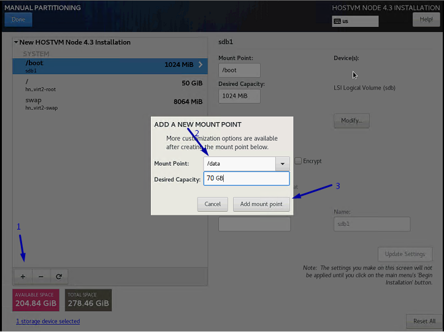
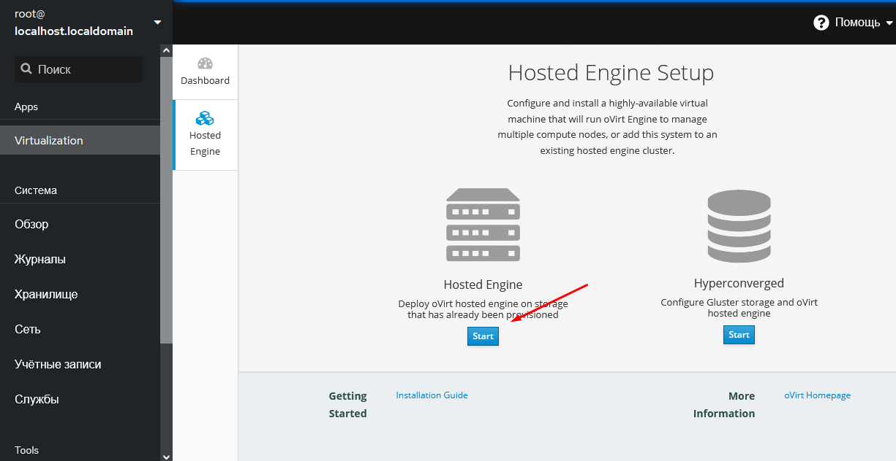
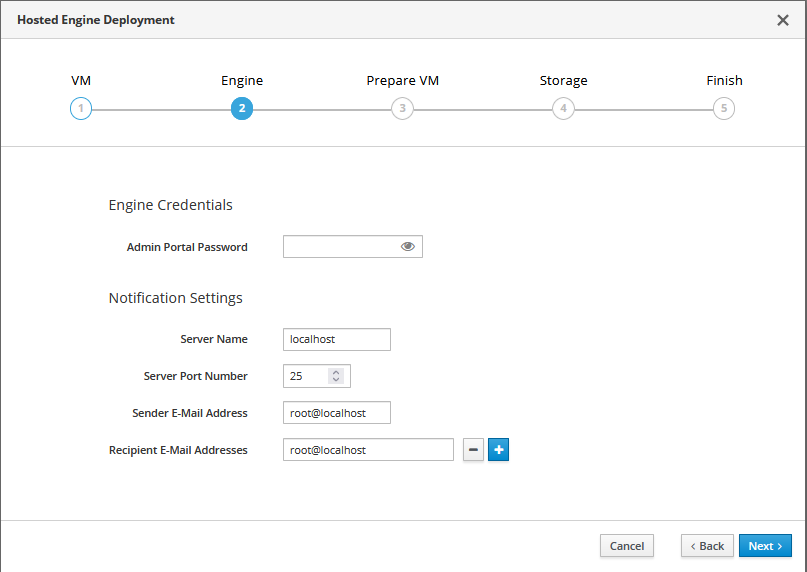
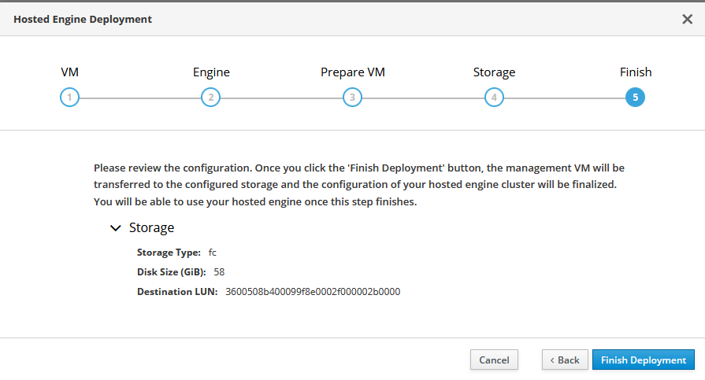
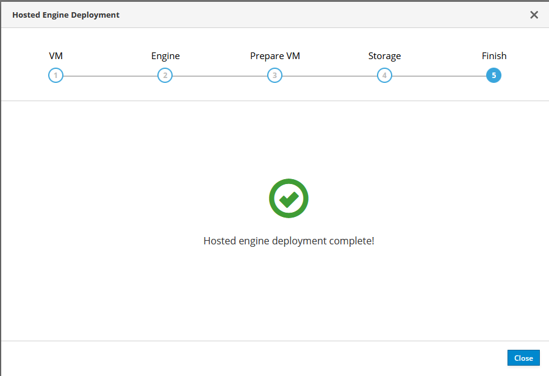

# Установка HOSTVM через GUI 4.3

## Перед установкой

Перед установкой подготовьте диски вашего сервера: соберите диски в raid-группы используя инструкции вендора вашего оборудования.

Для установки необходимо использовать iso-образ HOSTVM Node, который доступна в [наборе дистрибутивов для развертывания решения](https://lk.pvhostvm.ru/Download)

Подключите полученный iso-образ к серверу, запустите сервер.

## Процесс установки

При загрузке откроется меню выбора действия. За 60 секунд выберите _Install HOSTVM Node 4.\*.\*_. Если за 60 секунд после загрузки не выбрать данный пункт, то начинается тестирование ресурсов сервера и только после этого начнется установка. Остановить тестирование ресурсов сервера возможно через нажатие клавиши _esc_.

В случае если загрузка установщика зависнет, то нужно повторно загрузиться с установочного диска и в стартовом меню действий выбрать пункт «Troubleshooting», затем “Install HOSTVM Node 4.3.9 in basic graphics mode” для запуска установки с с использованием псевдографического интерфейса.

В открывшемся окне выберите английский язык (English), который будет использоваться в интерфейсе установщика.

_Выбранный язык не влияет на язык внутри самой операционной системы, которая устанавливается без графической оболочки._

Скриншоты инструкции выполнены в интерфейсе с английским языком. Нажмите _Continue_.

Далее автоматически открывается меню настроек.

Перейдите в _DATE & TIME_, укажите ваш часовой пояс, время и дату. Нажмите _Done_.

**ВАЖНО!: Для корректной установки, необходимо, чтобы серверу, на этапе установки, был задан корректный IPv4 адрес, который имеет доступ в интернет (для доступа к репозиториям). Также должен быть указан корректный DNS сервер.**

Перейдите в _NETWORK & HOST NAME_.

Выберите интерфейс, нажмите кнопку _Configure..._. В открывшемся окне перейдите на вкладку _IPv4 Settings_, выберите _Method: Manual_, введите ip, маску, gw, DNS-сервер.&#x20;

Далее перейдите на вкладку General и отметьте пункт "Automatically connect to this network when it's available". Нажмите кнопку _Save_.

Переведите тригер возле названия подключения в положение _On_. В поле _Host name_ введите имя сервера, нажмите кнопку _Apply_. Нажмите кнопку _Done_.

Перейдите в _Instalation Destination_. Выберете диск на который необходимо выполнить установку. Выберете радиокнопку _I will configure partitioning_. Нажмите _Done_.

После выбора места установки автоматически открывается следующее меню.

Если диск уже использовался (имел таблицу разделов), то удалите их, как показано ниже.

Когда на диске не останется существующих разделов Из выпадающего меню выберите _LVM Thin Provisioning._ Нажмите _Click here to create them automatically_.

Удалите _home_, как показано ниже.

Для работы гипервизору необходимо минимум 45GB на системном диске. Для разворачивания виртуальной машины HOSTVM Engine необходим выделенный раздел для домена хранения, размер раздела необходимо задать согласно [системным требованиям](requirements.md#sistemnye-trebovaniya-dlya-virtualnoi-mashiny-engine-upravlenie-sistemoi-virtualizacii). \
Если необходимо, измените поле _Desired Capacity_ раздела _/_, чтобы изменить размер системного раздела. Не менее 15GB необходимо для раздела /var.

На освободившемся после удаления _home_ месте, создайте новый раздел с точкой монтирования в _/data_.

Нажмите _Done_.

Создайте раздел /var.

Подтвердите действие кнопкой _Accept Changes_.

В стартовом меню нажмите кнопку _Begin Instalation_, чтобы начать установку.

В открывшемся окне выберете _Root Password_. Введите ваш пароль (рекомендуемый пароль **engine**). Дважды нажмите _Done_.

Если на этом этапе возникнет ошибка с postinstall скриптом, то это означает, что:

.png>)

1\) Сервер не имеет доступа в интернет и не смог скачать установочные скрипты из репозитория

2\) Имя репозитория не распознано, т.к. DNS сервер не задан или не имеет доступа в интернет

3\) ISO образ для установки скачан давно, и некоторые пути в скриптах установки изменились - нужно скачать ISO заново и выполнить установку с него.

Альтернативно, можно выполнить данный скрипт вручную из ОС (смотри раздел - [прокси и репозиторий](https://kb.pvhostvm.ru/installation-guide/installation-hostvm-on-local-disks#nastroika-proksi-esli-ispolzuetsya-i-repozitoriya)).

Ожидайте окончания установки. После завершения подтвердите перезагрузку нажатием на кнопку _Reboot_.

## Установка HOSTVM Manager на FC-диск

После установки ISO-дистрибутива на сервер обратитесь по адресу, указанному в процессе установки на порт 9090 через браузер и зайдите под пользователем root.

Пример адреса: [https://192.168.0.5:9090](https://192.168.0.5:9090)

Перейдите на вкладку _Apps->Virtualization->Hosted Engine._

Напротив Hosted-engine нажмите кнопку _Start._

Внимание! FC-диск для организации хранилища виртуальных машин должен отвечать следующим требованиям:

* объем диска – не менее 80 Gb;
* диск должен быть пустым и не содержать в себе какой-либо файловой системы;
* диск не может быть примонтирован к текущей файловой системе.

На DNS-сервере должны быть как минимум две записи типа A, содержащие в себе FQDN-имя сервера, а также имя виртуальной машины hosted-engine, которая будет установлена.

Заполните форму. Виртуальная машина создается со статическим файлом с использованием файла hosts.

Значения задаваемых параметров:

| Параметр               | Значение                                                                                            | Примечание                                                                                             |
| ---------------------- | --------------------------------------------------------------------------------------------------- | ------------------------------------------------------------------------------------------------------ |
| Engine VM FQDN         | Имя будущей виртуальной машины управления виртуализацией                                            | Имя должно разрешаться через файл _/etc/hosts_ или через DNS-сервер                                    |
| MAC Address            | MAC-адрес будущей виртуальной машины управления виртуализацией                                      | Можно оставить по умолчанию                                                                            |
| Network Configuration  | Способ получения IP-адреса                                                                          | Static или DHCP                                                                                        |
| VM IP Address          | Адрес виртуальной машины                                                                            |                                                                                                        |
| Gateway Address        | Адрес шлюза                                                                                         |                                                                                                        |
| DNS Servers            | DNS-серверы, прописываемые внутрь виртуальной машины                                                |                                                                                                        |
| Bridge Interface       | Каким физическим интерфейсом будет пользоваться виртуальная машина                                  | Можно оставить по умолчанию                                                                            |
| Root Password          | Пароль операционной системы виртуальной машины                                                      |                                                                                                        |
| Root SSH Access        | Может ли пользователь root авторизоваться через SSH-сервер                                          |                                                                                                        |
| Number of Virtual CPUs | Количество виртуальных ядер процессора, используемых виртуальной машиной                            | Рекомендуется не менее 4                                                                               |
| Memory Size (MiB)      | Память, используемая виртуальной машиной                                                            | Не менее 4096                                                                                          |
| Root SSH Public Key    | SSH-ключ безпарольного доступа внутрь виртуальной машины                                            |                                                                                                        |
| Bridge Name            | Имя виртуального сетевого интерфейса виртуальной машины                                             | Рекомендуется оставить по умолчанию                                                                    |
| Gateway Address        | Шлюз виртуальной машины                                                                             | Рекомендуется оставить по умолчанию                                                                    |
| Host FQDN              | Имя хоста виртуализации                                                                             | Рекомендуется оставить по умолчанию                                                                    |
| Edit Hosts File        | Создавать ли записи в hosts виртуальной машины                                                      | Рекомендуется включать опцию                                                                           |
| Pause Host             | Требуется ли приостанавливать установку для внесения своих изменений в настройки виртуальной машины | Не рекомендуется включать опцию                                                                        |
| Apply OpenSCAP profile | Профиль OpenSCP                                                                                     | Не рекомендуется включать опцию                                                                        |
| Network Test           | Проверка работоспособности виртуальной машины в процессе установки                                  | Рекомендуется выбрать _ping_ при использовании файла hosts. Можно оставить _DNS_ при использовании DNS |
| OVA Archive Path       | Путь до альтернативного образа виртуальной машины                                                   | Не рекомендуется использовать                                                                          |

Заполните следующую форму. Укажите пароль от веб-интерфейса будущей виртуальной машины. Заполните настройки отправки уведомлений e-mail при необходимости.

Создайте управляющую виртуальную машину (нажмите _Prepare VM_).

Подождите довольно продолжительное время, пока виртуальная машина не будет создана и настроена.

Выберете тип хранилища _Fibre Channel_ и укажите свободный LUN.

Подождите пока hosted-engine расположится в хранилище.

Поздравляем! Hosted-engine развернут.

