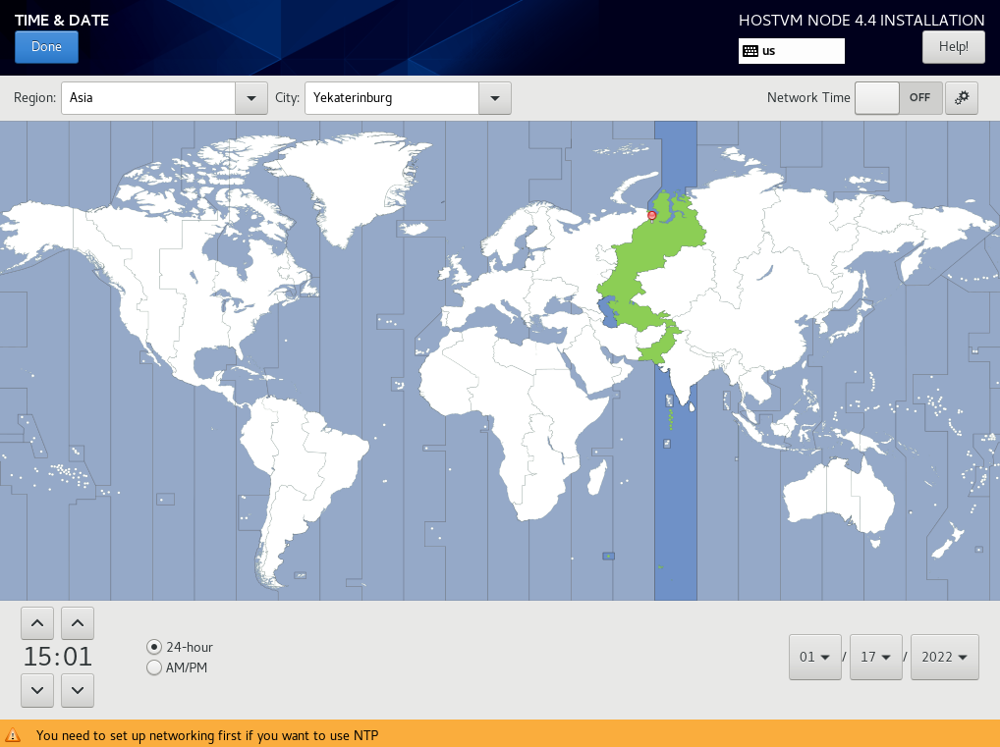
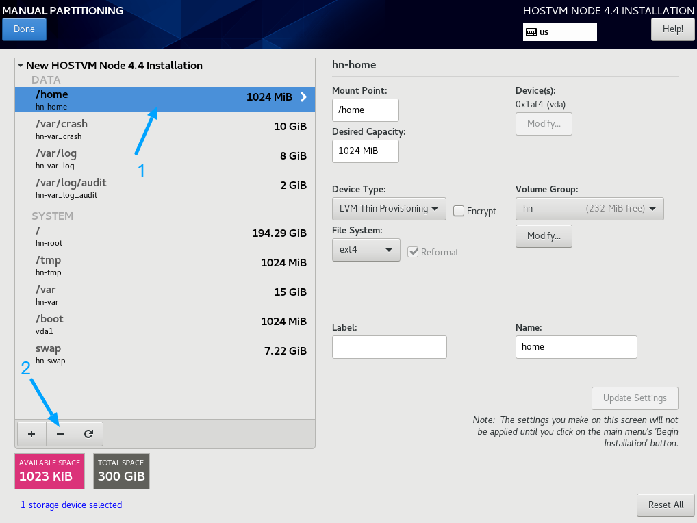
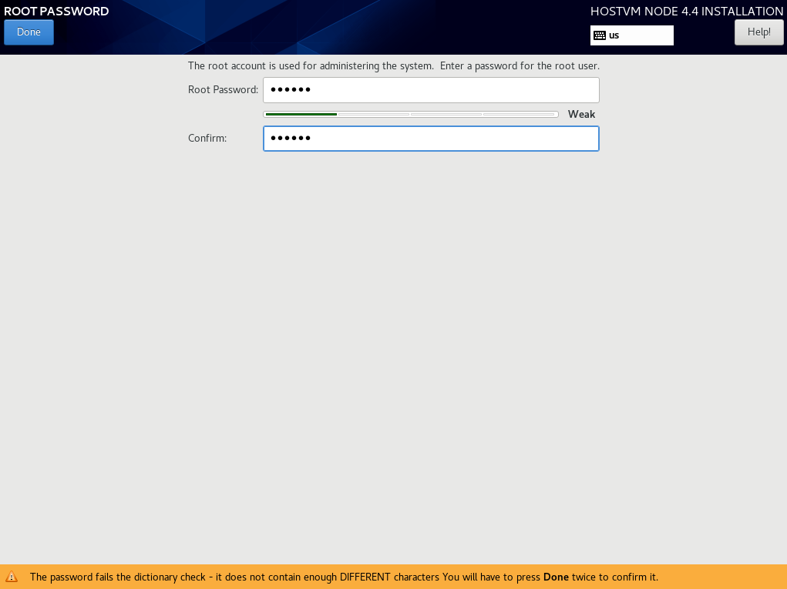
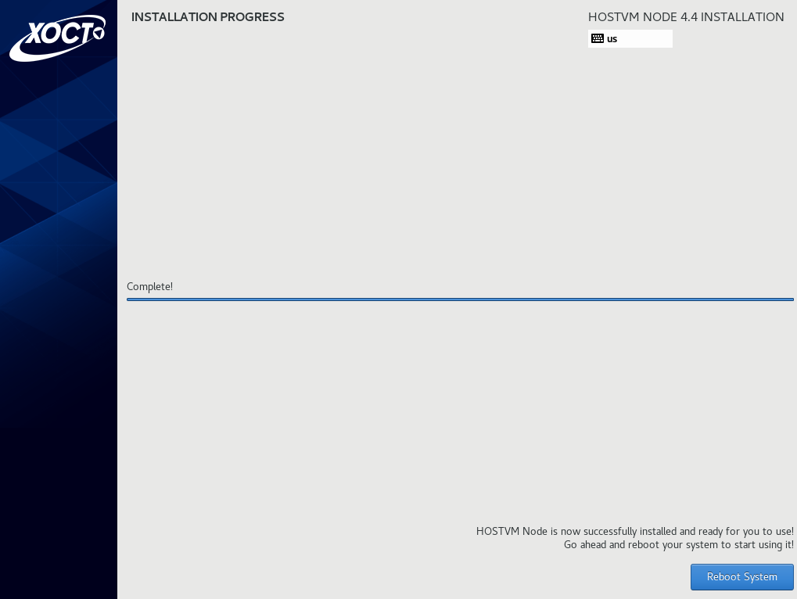

# Процесс установки

При загрузке откроется меню выбора действия. За 60 секунд выберите _Install HOSTVM Node 4.4.8_. Если за 60 секунд после загрузки не выбрать данный пункт, то начинается тестирование ресурсов сервера и только после этого начнется установка. Остановить тестирование ресурсов сервера возможно через нажатие клавиши _esc_.

В случае если загрузка установщика зависнет, то нужно повторно загрузиться с установочного диска и в стартовом меню действий выбрать пункт «Troubleshooting», затем “Install HOSTVM Node 4.4.8 in basic graphics mode” для запуска установки с с использованием псевдографического интерфейса.

В открывшемся окне выберите английский язык (English), который будет использоваться в интерфейсе установщика.

_Выбранный язык не влияет на язык внутри самой операционной системы, которая устанавливается без графической оболочки._

Скриншоты инструкции выполнены в интерфейсе с английским языком. Нажмите _Continue_.

.png>)

Далее автоматически открывается меню настроек.

.png>)

**ВАЖНО!: пароль root по умолчанию: HostvmNode**

Перейдите в _DATE & TIME_, укажите ваш часовой пояс, время и дату. Нажмите _Done_.

**ВАЖНО!: Для корректной установки, необходимо, чтобы серверу, на этапе установки, был задан корректный IPv4 адрес, который имеет доступ в интернет (для доступа к репозиториям). Также должен быть указан корректный DNS сервер.**

&#x20;Перейдите в _NETWORK & HOST NAME_.

Выберите интерфейс, нажмите кнопку _Configure..._. В открывшемся окне перейдите на вкладку  General и отметьте пункт "Connect automatically with priority":

Далее перейдите на вкладку _IPv4 Settings_, выберите _Method: Manual_, введите ip, маску, gw, DNS-сервер. Нажмите кнопку _Save_.

Переведите тригер возле названия подключения в положение _On_. В поле _Host name_ введите имя сервера, нажмите кнопку _Apply_. Нажмите кнопку _Done_.

Перейдите в _Instalation Destination_. Выберите диск на который необходимо выполнить установку. Выберите радиокнопку _Custom_. Нажмите _Done_.

**Примечание:** Если в списке доступных устройств не отображаются диски - убедитесь, что данные диски не содержат разделов с неподдерживаемыми Centos 8 файловыми системами.

После выбора места установки автоматически открывается следующее меню.

Если диск уже использовался (имел таблицу разделов), то удалите их, как показано ниже.

Когда на диске не останется существующих разделов Из выпадающего меню выберите _LVM Thin Provisioning._ Нажмите _Click here to create them automatically_.

Вы увидите, что на диске появилась предварительная разметка:

Удалите все пункты кроме /boot и /swap, как показано ниже.

Для работы гипервизору необходимо минимум 90GB на системном диске. Для разворачивания виртуальной машины HOSTVM Engine необходим выделенный раздел для домена хранения, размер раздела необходимо задать согласно [системным требованиям](../requirements.md#sistemnye-trebovaniya-dlya-virtualnoi-mashiny-engine-upravlenie-sistemoi-virtualizacii). \
Если необходимо, измените поле _Desired Capacity_ раздела _/_, чтобы изменить размер системного раздела. Не менее 16GB необходимо для раздела /var.

**Примечание:** В случае, если установка производится в системе с включенным режимом UEFI, при разметке необходимо задать дополнительную точку монтирования вида /boot/efi размером в 1 GB.

Далее создайте новый раздел с точкой монтирования в _/data:_

.png>)

Нажмите _Done_.

Создайте раздел /var:

Создайте раздел / (корневая файловая система):

Подтвердите действие кнопкой _Accept Changes_.

ВАЖНО! Далее необходимо задать пароль для пользователя root, если этого не сделать, вход в систему будет невозможен! Для этого необходимо в стартовом меню перейти в _Root Password_:

Введите ваш пароль (рекомендуемый пароль **engine**). Дважды нажмите _Done_.&#x20;

Пароль root по умолчанию для новой версии hostvm node: HostvmNode.

В стартовом меню нажмите кнопку _Begin Installation_, чтобы начать установку.

Если на этом этапе возникнет ошибка с postinstall скриптом, то это означает, что:

 (1).png>)

1\) Сервер не имеет доступа в интернет и не смог скачать установочные скрипты из репозитория

2\) Имя репозитория не распознано, т.к. DNS сервер не задан или не имеет доступа в интернет

3\) ISO образ для установки скачан давно, и некоторые пути в скриптах установки изменились - нужно скачать ISO заново и выполнить установку с него.

Альтернативно, можно выполнить данный скрипт вручную из ОС (смотри раздел - [прокси и репозиторий](https://kb.pvhostvm.ru/installation-guide/installation-hostvm-on-local-disks#nastroika-proksi-esli-ispolzuetsya-i-repozitoriya)).

Ожидайте окончания установки. После завершения подтвердите перезагрузку нажатием на кнопку _Reboot_.

##
