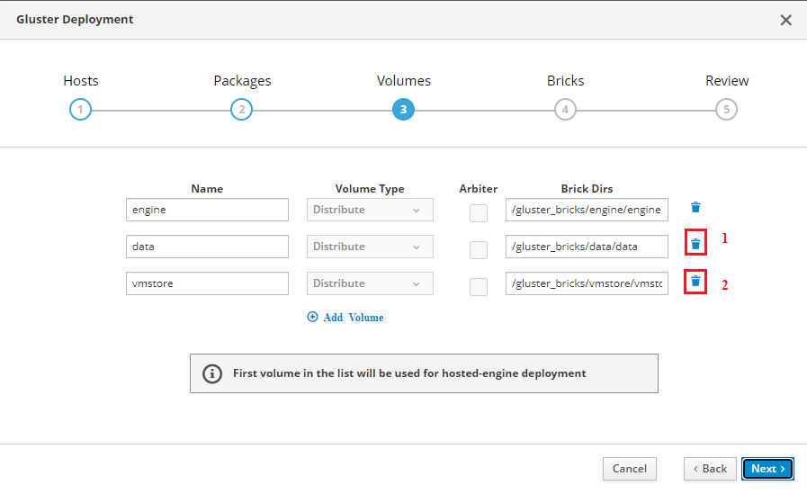

# Установка HOSTVM Manager на Gluster

После установки ISO-дистрибутива на сервер обратитесь по адресу, указанному в процессе установки на порт 9090 через браузер и зайдите под пользователем root.

Пароль root по умолчанию для новой версии hostvm node: HostvmNode.

Пример адреса: https://192.168.0.5:9090\
\
На DNS-сервере должны быть как минимум две записи типа A, содержащие в себе FQDN-имя сервера, а также имя виртуальной машины hosted-engine, которая будет установлена.\
\
Если на DNS-сервере отсутствуют записи, то их можно добавить вручную на ноде HOSTVM: [deistviya-pri-ustanovke-hostvm-pri-otsutstvii-zapisei-v-dns.md](../deistviya-pri-ustanovke-hostvm-pri-otsutstvii-zapisei-v-dns.md "mention")

Перейдите на вкладку Терминал и поочередно введите команды:

```
root@testname1 ~]# ssh-keygen
root@testname1 ~]# ssh-copy-id root@flexnode1
```

\*root - имя пользователя

\*flexnode1 - FQDN хоста, на котором будет хранилище

.png>)

Далее нужно создать раздел, для этого заходим в Storage -> Create partition

.png>)

Задаем параметры, как на скриншоте ниже, определяем размер раздела (не меньше 90 GB). Type раздела выбираем No filesystem.

 (2) (1).png>)

Запоминаем, какой раздел был создан, в нашем случае /dev/sda3

.png>)

Далее заходим в Virtualization -> Hosted Engine -> Hyperconverged

.png>)

Выбираем Run Gluster Wizard For Single Node для установки хранилища на одной ноде

 (1).png>)

Вводим имя хоста, для которого генерировали ключи, жмем next

.png>)

Оставляем как есть, жмем next

 (1) (1).png>)

Удаляем data(1) и vmstore(2), жмем next

<figure><figcaption></figcaption></figure>

·         Выбираем нужный тип RAID

·         В Device Name выбираем раздел, который был создан ранее (/dev/sda3)

·         Задаем размер LV Size в соответствии с системными требованиями, жмем next.

<figure><figcaption></figcaption></figure>

Нажимаем deploy

 (1).png>)

На DNS-сервере должны быть как минимум две записи типа A, содержащие в себе FQDN-имя сервера, а также имя виртуальной машины hosted-engine, которая будет установлена.

Заполните форму. Виртуальная машина создается со статическим файлом с использованием файла hosts.

.png>)

Заполните следующую форму. Укажите пароль от веб-интерфейса будущей виртуальной машины. Заполните настройки отправки уведомлений e-mail при необходимости.

 (1).png>)

Проверяем параметры, нажимаем Prepare VM

 (1).png>)

Выбираем Storage Type = Gluster

Storage Connection = flexnode1:/engine

\*flexnode1 – имя ноды

\*engine – местонахождение хранилища

 (1).png>)

## Если что-то пошло не так

1. Проверить корректность данных, которые были введены в IP-wizard. При обнаружении ошибки выполните команду `ansible-playbook /etc/ansible/clean-node.yml` и начните сначала.
2. Если на этапе `/root/script-hosted-engine-deploy | tee -a /root/script-hosted-engine-deploy.log` появилась ошибка, то выполните команду `ansible-playbook /etc/ansible/clean-node.yml` и начните сначала
3. Если на этапе `ansible-playbook /etc/ansible/make-prepare.yml` появилась ошибка, повторите выполнение данной команды
4. Если на этапе `ansible-playbook /etc/ansible/make-gluster-storages.yml` появилась ошибка, повторите выполнение данной команды
5. Если на этапе `ansible-playbook /etc/ansible/make-ovirt.yml` появилась ошибка, повторите выполнение данной команды
6. Если после завершения установки вам не открывается страница в браузере с адресом [https://engine.mydomain.ru](https://engine.mydomain.ru), то
   1. Проверьте, что ip для engine, указанный в таблице в начале установки отвечает на команду ping
   2. Проверьте, что имя `engine.mydomain.ru` разрешается вашим dns-сервером.
7. Если на этапе установки engine `/root/script-hosted-engine-deploy | tee -a /root/script-hosted-engine-deploy.log` установка зависает на этапе `Engine VM domain: [rtc.local]rtc.local Enter root password that will be used for the engine appliance: engine`, то подключитесь к консоли сервера не по SSH, а с помощью ipmi(iLO, iDRAC, etc.) и повторно запустите скрипт установки engine.

Схема установки hostvm и самостоятельного решения проблем представлена на рисунке ниже:


Если устранить проблему не удалось, обратитесь в [техническую поддержку](https://lk.pvhostvm.ru/) используя [инструкцию](https://lk.pvhostvm.ru/) К обращению приложите лог вывода вашей консоли, который был настроен в начале установки и файл `/root/script-hosted-engine-deploy.log`.
