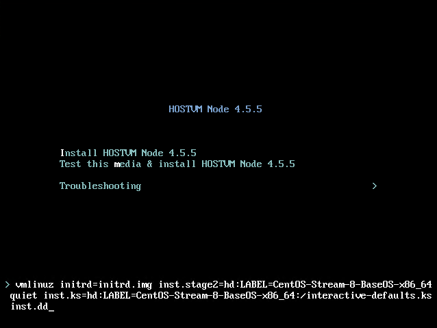

# Часто задаваемые вопросы

### **Как удалить NonResponsive-хост из кластера?**

Через Web-интерфейс HOSTVM Manager:&#x20;

1. Во вкладке **Compute -> Hosts** кликните по NonResponsive-хосту.
2. В правом верхнем углу откройте меню с тремя точками, выберите **Confirm host has been rebooted**.&#x20;

<figure><figcaption></figcaption></figure>

3. После этого станет доступно удаление хоста из кластера/датацентра.\
   &#x20;

### Как выбрать новый Master Storage Domain?

В версиях HOSTVM 4.4.x:&#x20;

1. Выберите нужный домен, нажмите на кнопку с 3 вертикальными точками в правом верхнем углу и выберите "Select as master storage domain"

<figure><figcaption></figcaption></figure>

В версиях HOSTVM 4.3.x:

1. Погасите все ВМ, кроме HostedEngine.
2. Отправьте мастер-домен в Maintenance mode: Data Centre -> Storage -> ПКМ -> Maintenance. Новый мастер-домен будет выбран автоматически из свободных.&#x20;
3. Если необходимо выбрать какой-то конкретный домен, отправьте все домены, кроме мастер-домена и нового мастер-домена в Maintenance Mode, после чего отправьте мастер-домен в Maintenance Mode. Оставшийся работающий домен автоматически станет мастер-доменом.
