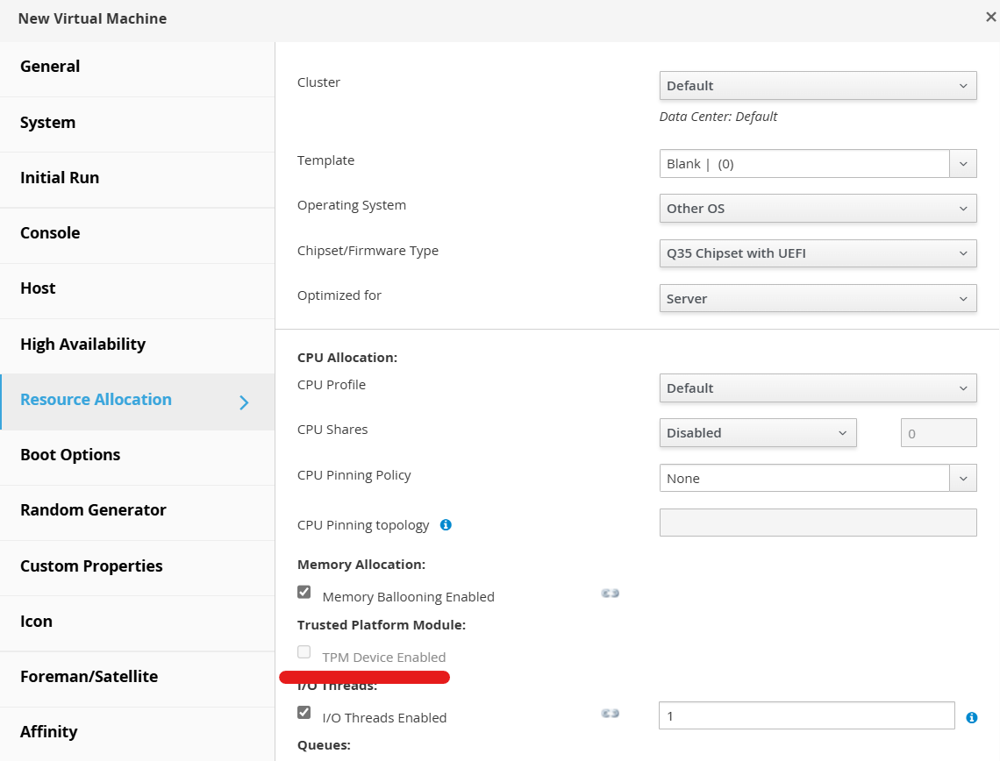
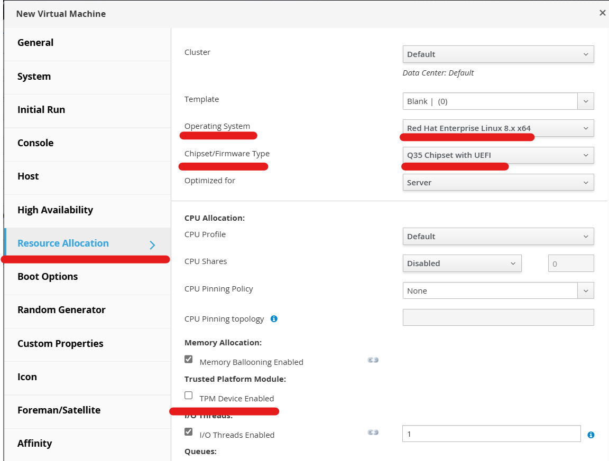

# Включение модуля TPM

По умолчанию использование модуля TPM отключено.

<figure><figcaption></figcaption></figure>

Для включения модуля TPM необходимо выполнить следующие действия:

1. Создать новую ВМ
2. Перейти на вкладку Resourse Allocation
3. Выбрать Chipset/Firmware type:&#x20;

* Q35 Chipset with UEFI \
  или&#x20;
* Q35 Chipset with UEFI Secure Boot

4. В поле Operating System указать одну из поддерживаемых ОС:

* &#x20;Windows 8 или новее
* Windows Server 2012 или новее
* &#x20;RHEL 7 или новее

После этих действий параметр TPM Device Enabled станет активным.

<figure><figcaption></figcaption></figure>
