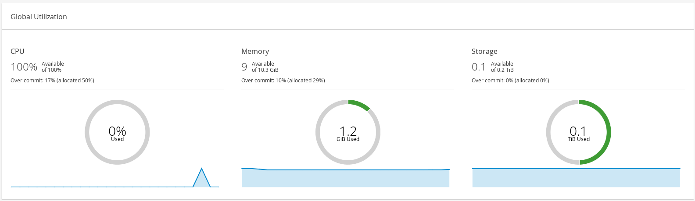
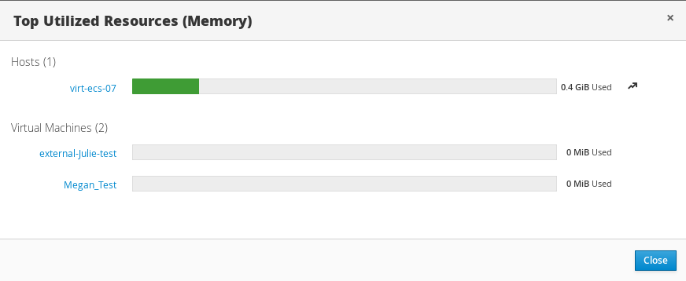
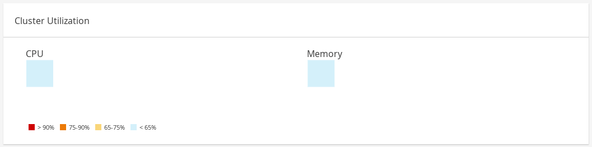
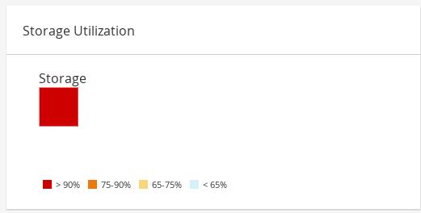

# Панель управления

Панель управления предоставляет обзорную информацию по состоянию системы виртуализации, ее ресурсам и их утилизации. Информация по утилизации ресурсов обновляется один раз в 15 минут, перечень ресурсов – каждые 15 секунд или при повторном входе, или при обновлении страницы.

<figure><figcaption></figcaption></figure>

Верхняя секция панели управления отображает общий перечень ресурсов системы и включает в себя дата-центры, кластеры, хосты, хранилища данных, ВМ и события. В заголовке указывается общее количество ресурсов данного типа, их статус отображается ниже в виде соответствующих иконок, и количество элементов в этом статусе. Статус для кластеров всегда отображается как N/A.

<figure><figcaption></figcaption></figure>

| Иконка                                                                        | Статус                                                                                                                                                                                                                                                                                                                                                                                                                                                                                                                                                                                                                                                                                                                                                                                                                                                                                                                                                     |
| ----------------------------------------------------------------------------- | ---------------------------------------------------------------------------------------------------------------------------------------------------------------------------------------------------------------------------------------------------------------------------------------------------------------------------------------------------------------------------------------------------------------------------------------------------------------------------------------------------------------------------------------------------------------------------------------------------------------------------------------------------------------------------------------------------------------------------------------------------------------------------------------------------------------------------------------------------------------------------------------------------------------------------------------------------------- |
|  | Ресурсы данного типа не добавлены                                                                                                                                                                                                                                                                                                                                                                                                                                                                                                                                                                                                                                                                                                                                                                                                                                                                                                                          |
|  | 
Количество ресурсов в статусе warning. Нажатие на иконку перенаправляет на соответствующую страницу с результатами поиска ресурсов в этом статусе. Условия поиска ресурсов:

• Data Centers – результатом поиска будут дата-центры в статусе not operational или non-responsive;

• Gluster Volumes – результатом поиска будут тома gluster в статусе powering up, paused, migrating, waiting, suspended, или powering down;

• Hosts – результатом поиска будут хосты, не добавленные в кластер, в режиме обслуживания, установки, перезапуска или подключения;

• Storage Domains – результатом поиска будут хранилища в режиме обслуживания, в статусе uninitialized, unattached, inactive, detaching, activating;

• Virtual Machines – результатом поиска будут ВМ в статусе powering up, paused, migrating, waiting, suspended, powering down;

• Events – результатом поиска будут события со статусом warning
 |
|  | Количество ресурсов в статусе up. Нажатие на иконку перенаправляет на соответствующую страницу с результатами поиска ресурсов в этом статусе                                                                                                                                                                                                                                                                                                                                                                                                                                                                                                                                                                                                                                                                                                                                                                                                               |
|  | 
Количество ресурсов в статусе down. Нажатие на иконку перенаправляет на соответствующую страницу с результатами поиска ресурсов в этом статусе. Условия поиска ресурсов:

• Data Centers – результатом поиска будут дата-центры в режиме обслуживания, в статусе uninitialized или в статусе down;

• Gluster Volumes – результатом поиска будут тома gluster в статусе detached или inactive;

• Hosts – результатом поиска будут хосты в статусе non-responsive, non-operational, initializing, down, а также имеющие ошибки;

• Storage Domains – результатом поиска будут хранилища в статусе detached или inactive;

• Virtual Machines – результатом поиска будут ВМ в статусе not responding или rebooting
                                                                                                                                                                                                          |
|  | Количество ресурсов в статусе alert. Нажатие на иконку перенаправляет на соответствующую страницу с результатами поиска ресурсов в этом статусе                                                                                                                                                                                                                                                                                                                                                                                                                                                                                                                                                                                                                                                                                                                                                                                                            |
|     | Количество ресурсов в статусе error. Нажатие на иконку перенаправляет на соответствующую страницу с результатами поиска ресурсов в этом статусе                                                                                                                                                                                                                                                                                                                                                                                                                                                                                                                                                                                                                                                                                                                                                                                                            |

Секция Global Utilization показывает общую утилизацию ресурсов системы (CPU, Memory, Storage).

<figure><figcaption></figcaption></figure>

В верхней части отображается количество свободных ресурсов и коэффициент переподписки. Например, для CPU коэффициент рассчитывается делением доступных для ВМ виртуальных ядер на физические на основании последних данных из базы Data Warehouse (DWH).

Графики отображают среднее использование за последние 5 минут. При наведении курсора на секцию графика будет показано ее значение.

При нажатии на графики CPU и Memory будет отображен список из десяти хостов и ВМ с наивысшим потреблением. Для Storage будет отображен список из десяти хранилищ и ВМ. Стрелка справа показывает тренд утилизации ресурса за последнюю минуту.

<figure><figcaption></figcaption></figure>

Секция Cluster Utilization показывает утилизацию кластерами CPU и памяти за последние 24 часа в виде блоков соответствующего цвета. При наведении курсора на блок отображается имя кластера. При нажатии на блок отображается страница с перечнем хостов кластера. Значение рассчитывается как общее среднее на основании средней утилизации ресурса каждым из хостов за последние 24 часа.

<figure><figcaption></figcaption></figure>

Секция Storage Utilization показывает утилизацию хранилищ за последние 24 часа в виде блоков соответствующего цвета. При наведении курсора на блок отображается имя хранилища. При нажатии на блок отображается страница с результатом поиска хранилища. Значение рассчитывается как общее среднее на основании средней утилизации ресурса каждым из хостов за последние 24 часа.

<figure><figcaption></figcaption></figure>
