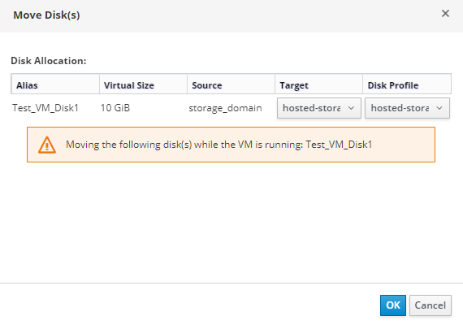
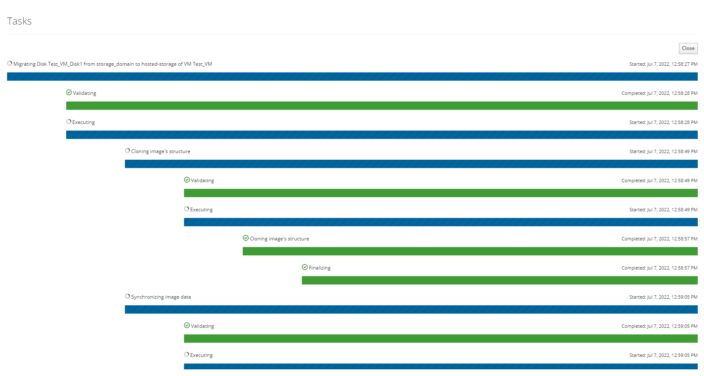

# Перемещение дисков в другой домен хранения

Вам может потребоваться переместить диски ВМ в другой домен данных другого дата-центра. Также вы можете экспортировать ВМ в новый дата-центр, переместив их в новый домен данных и затем переместить этот домен данных в другой дата-центр. HOSTVM поддерживает ручную миграцию дисков ВМ из одного домена данных в другой. Чтобы переместить диски ВМ в новый домен данных с помощью портала администрирования, выполните следующие действия:

1. На вкладке Storage > Disks выберите диски, закрепленный за нужной ВМ. Щелкните Move;

<figure><figcaption></figcaption></figure>

2. Откроется окно Move Disk(s). Для каждого диска выберите целевой домен данных в полях Target и Disk profile fields. Нажмите OK, чтобы переместить диски ВМ в целевой домен данных. Перемещение дисков ВМ может занять некоторое время;

<figure><figcaption></figcaption></figure>

3. На вкладке Disks нажмите на соответствующую запись о диске. Отобразятся несколько разделов, содержащие сведения о диске. Далее перейдите на вкладку Storage и убедитесь, что целевой домен данных указан в списке;

<figure><figcaption></figcaption></figure>
