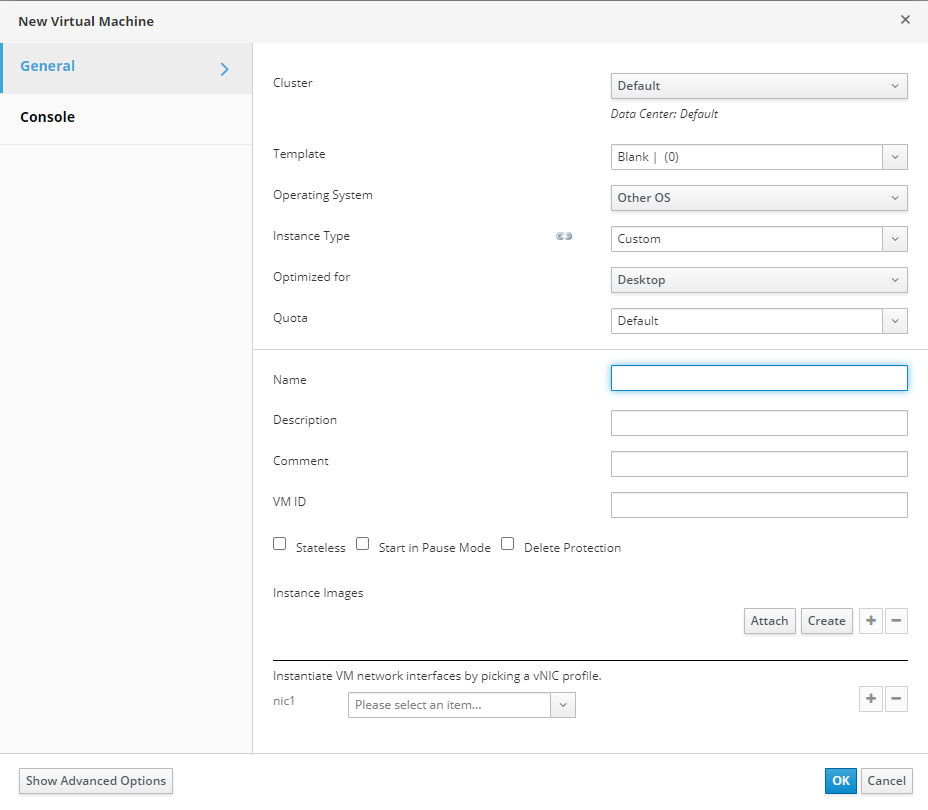
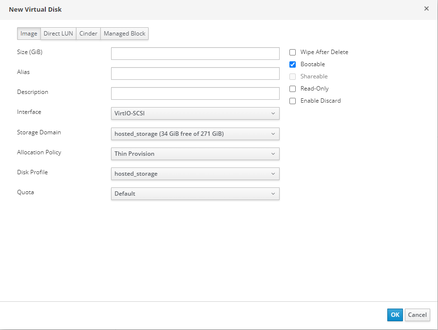
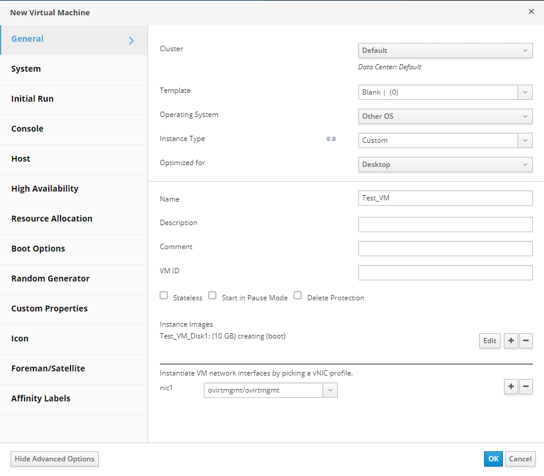

# Создание ВМ

Для создания новой ВМ через портал администрирования:

1. Перейдите в «Compute» -> «Virtual Machines»;
2. Нажмите «New», чтобы открыть окно диалога создания новой ВМ;
3. Выберите дата-центр и кластер, в котором хотите развернуть машину;
4. Выберите тип ОС;
5. Выберите один из преднастроенных наборов ресурсов для ВМ в поле Instance или задайте их вручную;
6. Выберите тип оптимизации среды для ВМ (Desktop или Server);
7. Задайте имя ВМ.

<figure><figcaption></figcaption></figure>

В нижней части диалогового окна размещены два последних параметра, которые необходимо указать. Эти два параметра очень важны. Первый определяет новый образ в домене хранения для новой ВМ. Это основной жесткий диск, который будет использоваться ВМ. Второй параметр создает сетевое устройство для новой ВМ. Чтобы создать новый образ, воспользуйтесь кнопкой Create справа под строкой Instance images. В новом диалоговом окне укажите размер образа, имя алиаса (псевдоним) и описание. Минимально достаточно указать размер образа в гигабайтах (ГБ). Вы можете оставить все остальные параметры и их значения по умолчанию. При успешном выполнении вы должны увидеть новую строку в Instance Images, отображающую детали вашего только что созданного диска.

<figure><figcaption></figcaption></figure>

Последний параметр, который необходимо указать, – это доступ к сетевому интерфейсу для вашей новой ВМ. В самой нижней части диалогового окна под строкой Instantiate VM network by picking a vNIC profile, нажмите кнопку списка Please select an item list, рядом с именем первой доступной сетевой карты для вашей ВМ под названием nic1. В открывшемся списке всех доступных логических сетей выберите ту, к которой должна быть подключена эта ВМ. Нажмите кнопку OK, чтобы закрыть диалоговое окно New Virtual Machine и создать ВМ.

<figure><figcaption></figcaption></figure>
