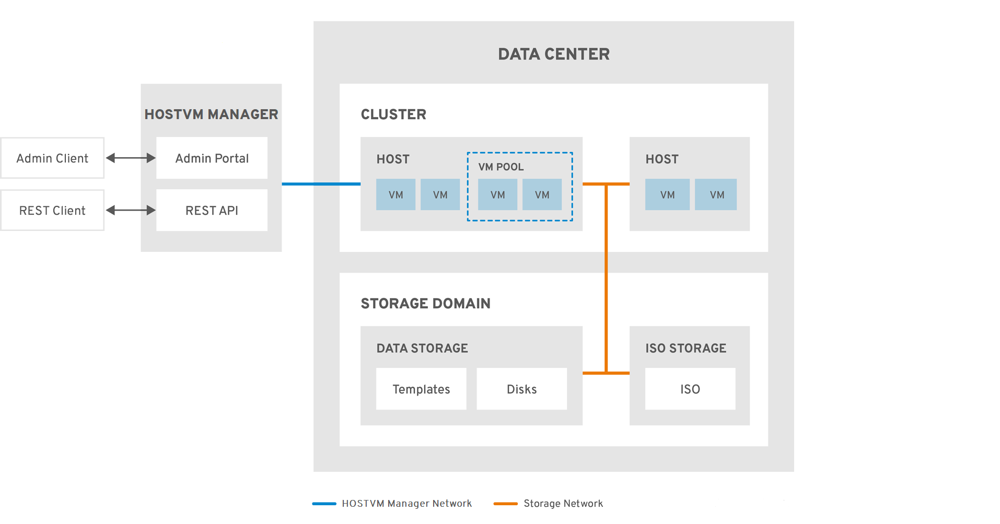

# Дата-центры

Дата-центр является объектом верхнего уровня системы виртуализации HOSTVM, представляет собой логическую сущность, объединяющую все физические и логические ресурсы для одной самодостаточной среды виртуализации: кластеры, хосты, логические сети и хранилища.

Дата-центр может представлять собой:

* ресурсы, находящиеся в конкретном физическом дата-центре или местоположении;
* набор систем и хранилищ, принадлежащих конкретному бизнес-подразделению или организации;
* ресурсы, организованные по иному признаку на усмотрение администратора системы.

<figure><figcaption></figcaption></figure>

Дата-центр позволяет изолировать друг от друга ресурсы, принадлежащие разным подразделениям, ограничив доступ к данным и серверам конкретной группой пользователей.

Все хосты и кластеры дата-центра должны иметь доступ к подключенным к нему хранилищам данных. Если каким-либо хостам не может или не должен быть предоставлен доступ к этим хранилищам, их нужно подключить в отдельный дата-центр. При развертывании системы виртуализации HOSTVM автоматически создается дата-центр с именем Default. Дополнительные дата-центры могут быть созданы при необходимости, в зависимости от потребностей конкретной инсталляции. Все дата-центры управляются через единый портал администрирования.
