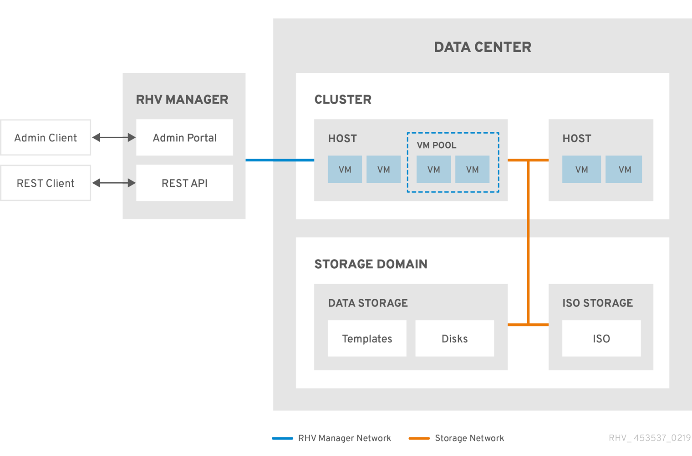

# Кластеры

Кластер представляет собой группу хостов, имеющих одну архитектуру и модель CPU. Кластер обеспечивает возможность «живой» миграции ВМ между хостами. «Живая» миграция возможна между хостами одного кластера. Если в кластере собраны хосты с разными моделями CPU, то модель виртуального CPU для всего кластера будет понижена до уровня, включающего инструкции, доступные всем хостам кластера. Это обеспечивает возможность беспроблемной миграции ВМ между всеми хостами кластера, но также ограничивает доступный для ВМ набор инструкций CPU, исключая возможности более новых моделей на части хостов кластера, что может ограничивать производительность. Поэтому все хосты, подключенные к кластеру, должны иметь одинаковую модель CPU. Тип CPU выставляется в настройках кластера и должен поддерживаться всеми его хостами. Если хост не поддерживает тип CPU кластера, его невозможно будет добавить.

Рекомендуется стандартизировать вендора, модель, набор аппаратного обеспечения и версии прошивок для всех хостов одного кластера. Это позволяет получить предсказуемые характеристики производительности ВМ, работающих в кластере, вне зависимости от хоста, на котором они запущены.

В дата-центре может быть создано несколько кластеров. Можно использовать их для разделения разных типов аппаратного обеспечения. Также можно разделять компоненты приложений, например, ВМ с front-end и back-end частями приложения могут быть запущены в разных кластерах для разделения нагрузки.

Все кластеры дата-центра должны иметь доступ к подключенным к нему хранилищам данных. Поэтому дата-центр с типом хранилища Local ограничен одним кластером и одним хостом, поскольку только он имеет доступ к локальному хранилищу. Для такого дата-центра недоступна часть функций, например, «живая» миграция.

Каждый кластер в системе должен принадлежать дата-центру, каждый хост – кластеру. ВМ запускаются на одном из хостов кластера и могут мигрировать между ними в соответствии с политиками кластера и настройками ВМ. Кластер является самым верхним уровнем для настройки политик балансировки и управления питанием.

Количество хостов и ВМ отображаются в строке кластера в соответствующих колонках Host Count и VM Count в разделе портала Compute->Clusters.

<figure><figcaption></figcaption></figure>
