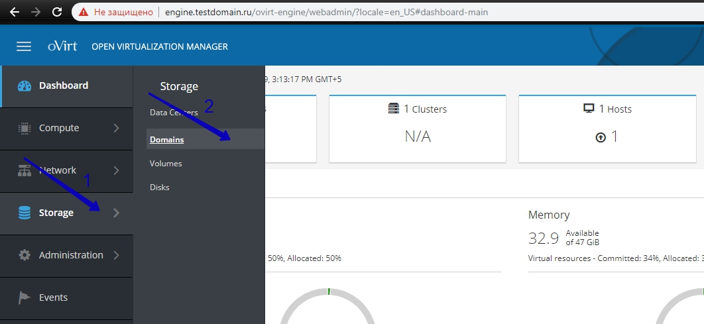
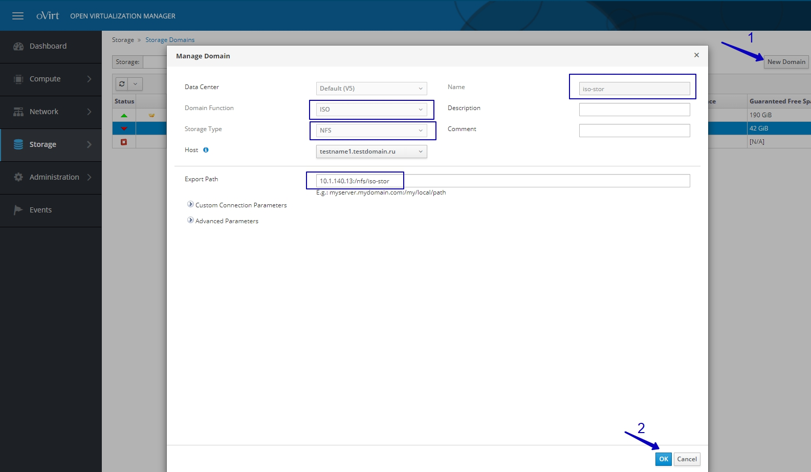
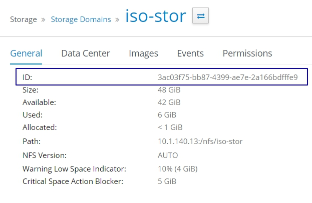
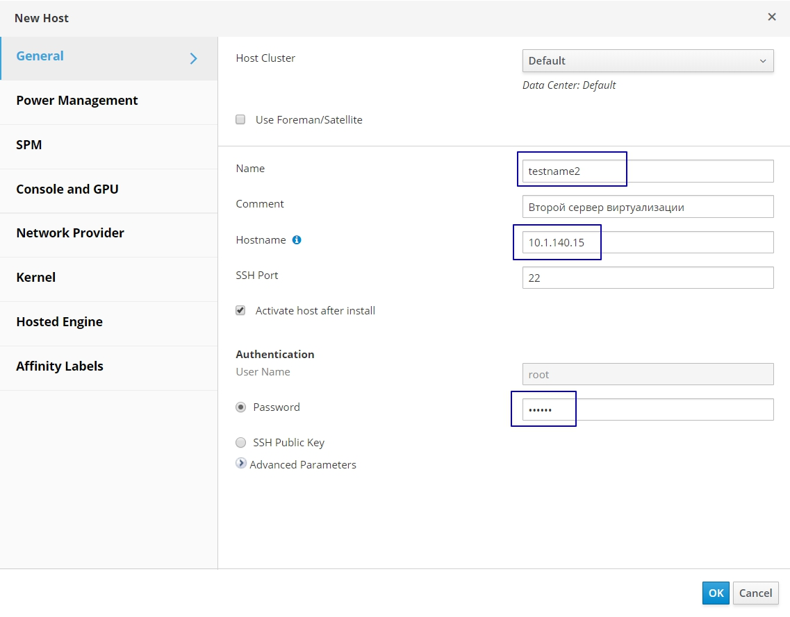

# Дествия после установки виртуализации

## Настройка iso-хранилища

Iso-домен нужен для хранения и доставки к виртуальным машинам iso-образов. Далее будет описано, как создать iso-домен с помощью nfs.

### Настройка nfs-сервера

nfs-сервер может быть установлен на одном из хостов виртуализации

Создайте папку /nfs/iso-stor

```text
mkdir -p /nfs/iso-stor
```

Создайте пользователей, необходимых для работы с хранилищем.

```text
groupadd kvm -g 36
useradd vdsm -u 36 -g 36
```

Если nfs-хранилище будет настроено на хосте виртуализации, то при создании появится сообщение, что пользователь и группа уже существуют

```text
[root@testname1 ~]# groupadd kvm -g 36
groupadd: group 'kvm' already exists
[root@testname1 ~]# useradd vdsm -u 36 -g 36
useradd: user 'vdsm' already exists
```

Настройте права доступа на созданную папку

```text
chown -R 36:36 /nfs/iso-stor
chmod 0755 /nfs/iso-stor
```

Настроим nfs-сервер Установим необходимые пакеты

```text
yum install nfs-utils -y
```

Добавим необходимые службы в автозагрузку и включим

```text
systemctl enable rpcbind nfs-server
systemctl start rpcbind nfs-server
```

Настроим файл конфигурации nfs-сервера. Для работы будем использовать текстовый редактор `nano`. Установим его командой:

```text
yum install nano -y
```

Откройте файл /etc/exports для редактирования:

```text
nano /etc/exports
```

Введите следующий текст:

```text
/nfs/iso-stor 10.1.140.0/25(rw)
```

**Важно!:** необходимо соблюдать формат записи, лишних пробелов быть не должно.

В данной записи:

```text
/nfs/iso-stor - путь к папке, которая будет nfs-хранилищем;
10.1.140.0/25 –IP-подсеть, которой разрешён доступ к nfs-хранилищу;
(rw) - набор опций для nfs-хранилища.
```

Клавишей 'ctrl'+'o' сохрание файл Клавишей 'ctrl'+'x' выйдите из редактора

Применяем новую конфигурацию командой `exportfs -r`

Убедимся, что ресурсы опубликованы

```text
[root@testname1 ~]# exportfs
/nfs/iso-stor   10.1.140.0/25
```

### Создание iso-хранилища

Откройте браузер, перейдите в панель управления `https://engine.testdomain.ru`

Перейдите в `Storage -> Domains -> New Domain`. Выберете `Domain Function`, `Storage Type` как показано на картинке ниже. В поле `Export Part` введите адрес вашей nfs-share в формате `ip-адрес:/путь/до/папки` . Нажмите `OK`.





Убедитесь, что iso-домен активен


### Загрузка iso-образов

Для того, чтобы загрузить iso-образ в виртуализацию, необходимо поместить выбранный iso-образ в папку `/путь к папке iso-домена/<domain-id>/images/11111111-1111-1111-1111-111111111111/`

Получить `<domain-id>` можно в панели управления

Domain-ID из примера ниже - `3ac03f75-bb87-4399-ae7e-2a166bdfffe9` , `/путь к папке iso-домена` в предыдущем шаге обозначили как `/nfs/iso-stor` значит iso-образ загрузим в папку `/nfs/iso-stor/3ac03f75-bb87-4399-ae7e-2a166bdfffe9/images/11111111-1111-1111-1111-111111111111/`



Для передачи файла на сервер с рабочего места, где установлена ОС Windows, необходимо использовать утилиту [WinSCP](https://winscp.net), которая доступна в [наборе дистрибьютивов для развертывания решения](https://github.com/hostco-ru/hostvm/tree/1e76c2e8efd1596a96107b99841d3e81adefe102/docs/hostvm-public-link]/README.md).


После загрузки файлов в указанную папку, необходимо изменить владельца файла.

Перейдите в папку `/путь к папке iso-домена/<domain-id>/images/11111111-1111-1111-1111-111111111111/` командой `cd /путь к папке iso-домена/<domain-id>/images/11111111-1111-1111-1111-111111111111/`

Назначим нового владельца файла командой `chown 36:36 ./<ваш-образ>.iso` . Обратите внимание, что владелец и группа файла изменилась с `root root` на `vdsm kvm`

```text
[root@testname1 ~]# cd /nfs/iso-stor/3ac03f75-bb87-4399-ae7e-2a166bdfffe9/images/11111111-1111-1111-1111-111111111111/
[root@testname1 11111111-1111-1111-1111-111111111111]# ls -la
total 93936
drwxr-xr-x. 2 vdsm kvm        46 Oct 29 15:22 .
drwxr-xr-x. 3 vdsm kvm        50 Oct 28 19:18 ..
-rw-r--r--. 1 root root 96187182 Oct 29 15:22 CentOS-7-x86_64-Minimal-1908.iso
[root@testname1 11111111-1111-1111-1111-111111111111]# chown 36:36 CentOS-7-x86_64-Minimal-1908.iso
[root@testname1 11111111-1111-1111-1111-111111111111]# ls -la
total 93936
drwxr-xr-x. 2 vdsm kvm       46 Oct 29 15:22 .
drwxr-xr-x. 3 vdsm kvm       50 Oct 28 19:18 ..
-rw-r--r--. 1 vdsm kvm 96187182 Oct 29 15:22 CentOS-7-x86_64-Minimal-1908.iso
```

Перейдите в панель управления и убедитесь, то iso-образ доступен


## Добавление хостов

Для того, чтобы подготовить второй и последующие серверы к работе на них необходимо установить ОС Centos7. Инструкция по установки приведена на странице [Установка Centos7](installation-centos7.md).

После установки ОС, подключитесь к серверу с помощью [PuTTY](https://www.putty.org) под пользователем root. Добавьте необходимые репозитории командой с помощью команды `yum install -y http://resources.ovirt.org/pub/yum-repo/ovirt-release43.rpm`

Убедитесь, что сервер "видит" диск, на котором размещены виртуальные машины. Командой `multipath -ll` выведете доступные по FC диски. Из примера ниже видим, что диск с guid `3600508b400099f8e0002e000036a0000`, который использовался для установки первой ноды, подключен.

```text
[root@testname2 ~]# multipath -ll
3600508b400099f8e0002e000036a0000 dm-3 HP      ,HSV300
size=250G features='1 queue_if_no_path' hwhandler='0' wp=rw
|-+- policy='service-time 0' prio=50 status=active
| |- 1:0:3:1 sdg 8:96  active ready running
| `- 2:0:0:1 sdb 8:16  active ready running
`-+- policy='service-time 0' prio=10 status=enabled
  |- 1:0:0:1 sda 8:0   active ready running
  `- 2:0:3:1 sdh 8:112 active ready running
```

Имя управляющей виртуальной машины должно разрещаться на сервере. В файл `/etc/hosts` с помощью редактора nano добавьте запись в формате `<ip-адрес управляющей машины> <engine.<domain>.ru` которая сообщает системе адрес и именя управляющей машины.

Установим nano

```text
yum install nano -y
```

Откроем файл и внесем в него изменения. В примере ниже мы сообщили системе, что по адресу `10.1.140.15` расположена управляющуя машина с именем `engine.testdomain.ru`

```text
nano /etc/hosts
#
127.0.0.1   localhost localhost.localdomain localhost4 localhost4.localdomain4
::1         localhost localhost.localdomain localhost6 localhost6.localdomain6

10.1.140.15     engine.testdomain.ru
```

Клавишей 'ctrl'+'o' сохрание файл

Клавишей 'ctrl'+'x' выйдите из редактора

Командой `ping -c 4 engine.testdomain.ru` убедитесь, что адрес доступен для сервера

```text
[root@testname1 ~]# ping engine.testdomain.ru -c 4
PING engine.testdomain.ru (10.1.140.15) 56(84) bytes of data.
64 bytes from engine.testdomain.ru (10.1.140.15): icmp_seq=1 ttl=64 time=0.250 ms
64 bytes from engine.testdomain.ru (10.1.140.15): icmp_seq=2 ttl=64 time=0.210 ms
64 bytes from engine.testdomain.ru (10.1.140.15): icmp_seq=3 ttl=64 time=0.238 ms
64 bytes from engine.testdomain.ru (10.1.140.15): icmp_seq=4 ttl=64 time=0.200 ms

--- engine.testdomain.ru ping statistics ---
4 packets transmitted, 4 received, 0% packet loss, time 2999ms
rtt min/avg/max/mdev = 0.200/0.224/0.250/0.025 ms
```

Откройте панель управления, перейдите в `Compute -> Hosts`, нажмите кнопку `New`


В открывшемся окне заполните поля `Name`, `Hostname`\(достаточно указать ip-адрес\), `Password` от учетной записи root. Нажмите `Ок`



После заверщения установки, оба хосте будут доступны для работы


## Настройка рабочего места пользователя

Для доступа к виртуальной консоли виртуальных машин необходимо использовать программу [virt-viewer](https://virt-manager.org/download/), которая доступна в [наборе дистрибьютивов для развертывания решения](https://cloud.hostco.ru/s/w7n8nDKXY7FbyKg).

## Установка виртуальных машин

