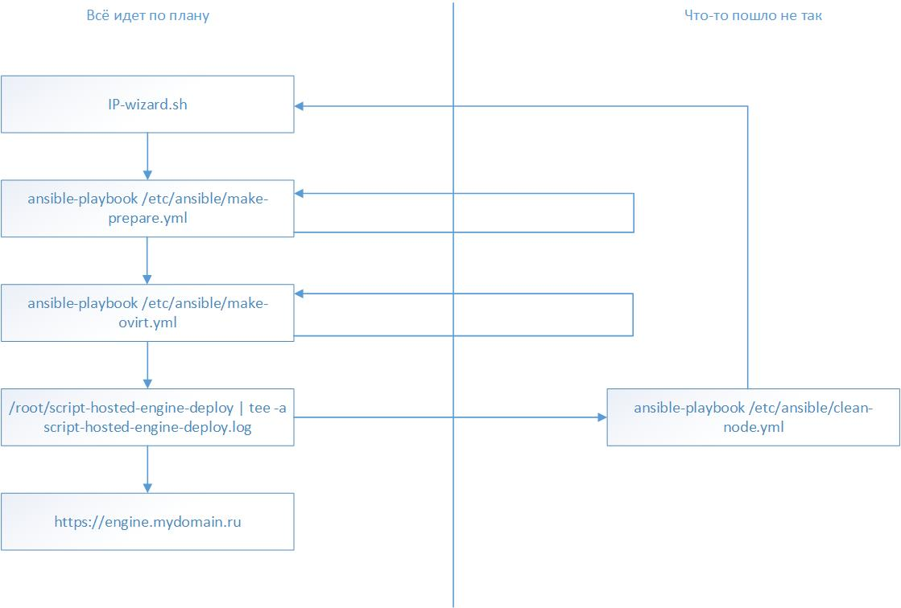

# Установка виртуализации на диски СХД

## Подготовка сервера к развертыванию на диски схд

### Подготовка putty к работе

Убедитесь, что требования, описанные на странице [Системные требования](requirements.md) выполняются.

С помощью программы [PuTTY](https://www.putty.org), которая доступна в [наборе дистрибьютивов для развертывания решения](https://reestr.hostco.ru/downloads), под пользователем root подключитесь к серверу.

Перед началом работы рекомендуется настроить логирование сессии putty. Для этого нужно выполнить следующие действия

1. Сохраните имя сервера:


2. Перейдите на вкладку Журнал \(мы можем добавить ссылку на страницу с этой вкладкой?\), выберите `Весь вывод`, укажите путь до файла логов в следующем виде: `C:\path\to\log\hostname-&H-&Y&M&D-&T.log`. Часть `&H-&Y&M&D-&T` указывает, что файл с логом будет создаваться для каждой сессии и автоматически указывать время и дату ее начала:


3. Перейдите на вкладку Сеанс, нажмите кнопку `Сохранить`, нажмите клавишу `Enter` чтобы запустить сессию:


### Проверить, что диск предназначенный для размещения виртуальных машин подключен

Командой `multipath -ll` выведете подключенные по FC устройства. Если диск нужного размера отсутствует, проверьте, что маппинг настроен верно, что на схд диск презентован серверу, что настройки диска и сервера на стороне схд выполнены верно. После этого выполните процедуру переобнаружения дисков:

1. Узнайте количество host bus адаптеров, которые есть на сервере:

   ```text
   # ls /sys/class/fc_host
   host0  host1
   ```

2. Запустите сканирование:

   ```text
   echo "1" > /sys/class/fc_host/host0/issue_lip
   echo "- - -" > /sys/class/scsi_host/host0/scan
   echo "1" > /sys/class/fc_host/host1/issue_lip
   echo "- - -" > /sys/class/scsi_host/host1/scan
   ```

   `host0` и `host2` замените на значения, полученные в предыдущем шаге

3. Перезапустите службу multipathd

   ```text
   service multipathd restart
   ```

4. Проверьте, что необходимый диск стал доступен

   ```text
   multipath -ll
   ```

### Загрузка и выполнение подготовительного скрипта `initial.sh`

С помощью команды `curl` выполните загрузку файла `initial.sh` с репозитория repo.hostco.ru

```text
[root@host1 ~]# curl -o /root/initial.sh https://repo.hostco.ru/hostvm/initial.sh
  % Total    % Received % Xferd  Average Speed   Time    Time     Time  Current
                                 Dload  Upload   Total   Spent    Left  Speed
100  1192  100  1192    0     0   7791      0 --:--:-- --:--:-- --:--:--  7842
```

Cделайте файл `initial.sh` исполняемым

```text
[root@host1 ~]# chmod +x initial.sh 
[root@host1 ~]# ls 
anaconda-ks.cfg  initial.sh  original-ks.cfg
[root@host1 ~]# ls -la
total 40
dr-xr-x---.  2 root root  155 Apr  7 09:31 .
dr-xr-xr-x. 18 root root  255 Apr  7 08:36 ..
-rw-r--r--.  1 root root   18 Dec 29  2013 .bash_logout
-rw-r--r--.  1 root root  176 Dec 29  2013 .bash_profile
-rw-r--r--.  1 root root  176 Dec 29  2013 .bashrc
-rw-r--r--.  1 root root  100 Dec 29  2013 .cshrc
-rw-r--r--.  1 root root  129 Dec 29  2013 .tcshrc
-rw-------.  1 root root 5570 Jun  1  2019 anaconda-ks.cfg
-rwxr-xr-x.  1 root root  169 Apr  7 09:32 initial.sh
-rw-------.  1 root root 5300 Jun  1  2019 original-ks.cfg
[root@host1 ~]#
```

Выполните скрипт `initial.sh`

```text
[root@host1 ~]# sh initial.sh
```

По итогу выполнения скрипта, в директории /root/ будет создан лог-файл `initial_log_текущая-дата.log`

## Заполнение формы для установки значений переменных

### Сбор данных для заполнения формы

Перед началом работы рекомендуется заполнить последний столбец следующей таблицы \(_способ сбора данных для таблице описан ниже по тексту\)_:

| Название | Как узнать | Значение |
| :--- | :---: | :---: |
| ip для engine | - |  |
| ip сервера | ip addr |  |
| ip шлюза по умолчанию | ip route |  |
| ip dns-сервера | - |  |
| домен установки | - |  |
| hostname сервера | - |  |
| название интерфейса | ip addr |  |
| guid на который выполняем установку | multipath -ll |  |

Для получения ip-адреса сервера и название интерфейса выполните команду `ip addr` :

Согласно примеру ниже видно, что ip-адрес сервера - `10.1.140.14`, название интерфейса - `enp3s0`.

```text
[root@host1 ~]# ip addr
1: lo: <LOOPBACK,UP,LOWER_UP> mtu 65536 qdisc noqueue state UNKNOWN group default qlen 1000
    link/loopback 00:00:00:00:00:00 brd 00:00:00:00:00:00
    inet 127.0.0.1/8 scope host lo
       valid_lft forever preferred_lft forever
    inet6 ::1/128 scope host
       valid_lft forever preferred_lft forever
2: enp3s0: <BROADCAST,MULTICAST,UP,LOWER_UP> mtu 1500 qdisc mq state UP group default qlen 1000
    link/ether 00:17:a4:77:00:0c brd ff:ff:ff:ff:ff:ff
    inet 10.1.140.14/25 brd 10.1.140.127 scope global noprefixroute enp3s0
       valid_lft forever preferred_lft forever
    inet6 fe80::b50a:7c22:2229:b169/64 scope link noprefixroute
       valid_lft forever preferred_lft forever
3: enp7s0: <BROADCAST,MULTICAST,UP,LOWER_UP> mtu 1500 qdisc mq state UP group default qlen 1000
    link/ether 00:17:a4:77:00:0e brd ff:ff:ff:ff:ff:ff
```

Для получения ip-адреса шлюза выполните команду `ip route`.

Согласно примеру ниже видно, что ip шлюза по умолчанию - `10.1.140.1`

```text
[root@host1 ~]# ip route
default via 10.1.140.1 dev enp3s0 proto static metric 100
10.1.140.0/25 dev enp3s0 proto kernel scope link src 10.1.140.14 metric 100
```

Для получения guid диска выполните команду `multipath -ll`

Согласно примеру ниже видно, что используется 2 внешних диска, один на 56G, второй на 250G. Первый используется как системный. Использовать системный диск как хранилище виртуальных машин нельзя, по этому выбираем второй диск. guid-диска - `3600508b400099f8e0002e000036a0000`

```text
[root@testname1 ~]#  multipath -ll
36001438009b0222800007000033f0000 dm-0 HP      ,HSV340
size=56G features='1 queue_if_no_path' hwhandler='0' wp=rw
|-+- policy='service-time 0' prio=50 status=active
| |- 1:0:2:1 sde 8:64  active ready running
| `- 2:0:2:1 sdf 8:80  active ready running
`-+- policy='service-time 0' prio=10 status=enabled
  |- 1:0:1:1 sdc 8:32  active ready running
  `- 2:0:1:1 sdd 8:48  active ready running
3600508b400099f8e0002e000036a0000 dm-3 HP      ,HSV300
size=250G features='1 queue_if_no_path' hwhandler='0' wp=rw
|-+- policy='service-time 0' prio=50 status=active
| |- 1:0:3:1 sdg 8:96  active ready running
| `- 2:0:0:1 sdb 8:16  active ready running
`-+- policy='service-time 0' prio=10 status=enabled
  |- 1:0:0:1 sda 8:0   active ready running
  `- 2:0:3:1 sdh 8:112 active ready running
```

### Запуск программы-помощника IP-wizard

Запустите `IP-wizard.sh`, чтобы подготовить файлы переменных к работе. Следуйте указаниями инструкции в программе:

```text
[root@host1 ~]# sh IP-wizard.sh

Добро пожаловать в программу-помощник IP-wizard Группы компаний ХОСТ!
Мы попросим ответить на несколько вопросов и сформируем нужные файлы конфигурации Ansible.

Внимание! Программа изменит файлы в папках /etc/ansible/group_vars и /etc/ansible/host_vars!

Нажмите ENTER для продолжения или ^C для выхода из программы!

Укажите ваш Домен: mydomain.ru
Домен: mydomain.ru

Укажите кластерный IP адрес oVirt Engine: 10.1.140.15
Engine: 10.1.140.15


Укажите guid для луна, на котором будут размещены виртуальные машины (имеет вид 3600508b400099f8e0002e000036a0000, можно посмотреть командой multipath -l : 3600508b400099f8e0002e000036a0000
guid: 3600508b400099f8e0002e000036a0000

Укажите IP адрес первого сервера  : 10.1.140.13
nodeip1: 10.1.140.13

Укажите шлюз (gateway) сети первого сервера : 10.1.140.1
Public LAN gateway: 10.1.140.1

Укажите hostname первого сервера (без домена) : host1
hostname первого сервера: host1

Укажите hostname имя интерфейса первого сервера (Например, enp2s0f0. Можно посмотреть командой ip addr) : enp2s0f0
имя интерфейса первого сервера: enp2s0f0


Укажите ваш DNS сервер: 10.1.64.248
DNS: 10.1.64.248
Начинаю модификацию файлов...

dns_root: 10.1.64.248
Изменен файл /etc/ansible/group_vars/all.

ansible_connection: ssh
ansible_ssh_user: root
ansible_ssh_pass: engine
ansible_ssh_common_args: '-o StrictHostKeyChecking=no'
ovirt_engine_ip: 10.1.140.15
ovirt_engine_fqdn: 'engine.mydomain.ru'
ovirt_engine_domain: 'mydomain.ru'
ovirt_engine_password: 'engine'
guid_for_store: 3600508b400099f8e0002e000036a0000
Изменен файл /etc/ansible/group_vars/nodes.

Генерируем /etc/ansible/host_vars/host1...
hostname: host1.mydomain.ru
shothostname: host1
ip: 10.1.140.13
ip_gateway: 10.1.140.1
nic_for_ovirtmgmt_bridge: enp2s0f0
Изменен файл /etc/ansible/host_vars/host1.

[root@host1 ~]#
```

## Установка виртуализации

Выполните команду `ansible-playbook /etc/ansible/make-prepare.yml`, чтобы подготовить к работе /etc/hosts и диск с указанным guid. _Сервер будет перезагружен!_

```text
[root@host1 ~]# ansible-playbook /etc/ansible/make-prepare.yml
[DEPRECATION WARNING]: The use of 'include' for tasks has been deprecated. Use 'import_tasks' for static inclusions or 'include_tasks' for dynamic inclusions. This feature will be removed in a future release. Deprecation warnings can be
 disabled by setting deprecation_warnings=False in ansible.cfg.
[DEPRECATION WARNING]: include is kept for backwards compatibility but usage is discouraged. The module documentation details page may explain more about this rationale.. This feature will be removed in a future release. Deprecation
warnings can be disabled by setting deprecation_warnings=False in ansible.cfg.

PLAY [Ensure that dns and /etc/hosts was configured] ****************************************************************************************************************************************************************************************

TASK [Gathering Facts] **********************************************************************************************************************************************************************************************************************
ok: [localhost]

TASK [set-net : Push resolv.conf] ***********************************************************************************************************************************************************************************************************
changed: [localhost]

TASK [set-net : Push hosts] *****************************************************************************************************************************************************************************************************************
changed: [localhost]

PLAY [Ensure that disk with guide {{ guid_for_store }} are ready] ***************************************************************************************************************************************************************************

TASK [Gathering Facts] **********************************************************************************************************************************************************************************************************************
ok: [localhost]

TASK [set-disk : run dd and clean the Lun] **************************************************************************************************************************************************************************************************
fatal: [localhost]: FAILED! => {"changed": true, "cmd": "dd if=/dev/zero of=/dev/mapper/3600508b400099f8e0002e000036a0000 bs=1M", "delta": "0:00:12.366169", "end": "2019-10-22 11:58:59.287969", "msg": "non-zero return code", "rc": 1, "start": "2019-10-22 11:58:46.921800", "stderr": "dd: error writing ‘/dev/mapper/3600508b400099f8e0002e000036a0000’: No space left on device\n24049+0 records in\n24048+0 records out\n25216602112 bytes (25 GB) copied, 10.1213 s, 2.5 GB/s", "stderr_lines": ["dd: error writing ‘/dev/mapper/3600508b400099f8e0002e000036a0000’: No space left on device", "24049+0 records in", "24048+0 records out", "25216602112 bytes (25 GB) copied, 10.1213 s, 2.5 GB/s"], "stdout": "", "stdout_lines": []}
        to retry, use: --limit @/etc/ansible/make-prepare.retry

TASK [multipath-add-blacklist : Configure MultiPath configuration] **************************************************************************************************************************
changed: [localhost]
TASK [multipath-add-blacklist : restart multipathd] *****************************************************************************************************************************************
changed: [localhost]
PLAY [ovirt-master] *************************************************************************************************************************************************************************

TASK [Gathering Facts] **********************************************************************************************************************************************************************
ok: [localhost]
TASK [reboot] ****************************************************************
```

Запустите установку необходимых пакетов виртуализации командой `ansible-playbook /etc/ansible/make-ovirt.yml`. На ее выполнение уйдет чуть больше часа.

```text
[root@host1 ~]# ansible-playbook /etc/ansible/make-ovirt.yml
[DEPRECATION WARNING]: The TRANSFORM_INVALID_GROUP_CHARS settings is set to allow bad characters in group names by default, this will change, but still be user configurable on deprecation. This feature will be removed in version 2.10.
Deprecation warnings can be disabled by setting deprecation_warnings=False in ansible.cfg.
 [WARNING]: Invalid characters were found in group names but not replaced, use -vvvv to see details


PLAY [ovirt-master] *************************************************************************************************************************************************************************************************************************

TASK [Gathering Facts] **********************************************************************************************************************************************************************************************************************
ok: [localhost]

TASK [ovirt-master : Ensure that ovirt-release43.rpm is installed] **************************************************************************************************************************************************************************
[DEPRECATION WARNING]: Invoking "yum" only once while using a loop via squash_actions is deprecated. Instead of using a loop to supply multiple items and specifying `name: "{{ item }}"`, please use `name:
['http://resources.ovirt.org/pub/yum-repo/ovirt-release4
ok: [localhost] => (item=[u'http://resources.ovirt.org/pub/yum-repo/ovirt-release43.rpm'])
3.rpm']` and remove the loop. This feature will be removed in version 2.11. Deprecation warnings can be disabled by setting deprecation_warnings=False in ansible.cfg.
TASK [ovirt-master : Ensure that ovirt-hosted-engine-setup is installed. !A very long time. Wait!] ******************************************************************************************************************************************
[DEPRECATION WARNING]: Invoking "yum" only once while using a loop via squash_actions is deprecated. Instead of using a loop to supply multiple items and specifying `name: "{{ item }}"`, please use `name: ['ovirt-hosted-engine-
setup-2.3.12-1.el7.noarch']` and remove the loop. This feature will be removed in version 2.11. Deprecation warnings can be disabled by setting deprecation_warnings=False in ansible.cfg.
ok: [localhost] => (item=[u'ovirt-hosted-engine-setup-2.3.12-1.el7.noarch'])

TASK [ovirt-master : Ensure that ovirt-engine-appliance is installed. !A very long time. Wait!] *********************************************************************************************************************************************
[DEPRECATION WARNING]: Invoking "yum" only once while using a loop via squash_actions is deprecated. Instead of using a loop to supply multiple items and specifying `name: "{{ item }}"`, please use `name: ['ovirt-engine-
appliance-4.3-20190926.1.el7.x86_64']` and remove the loop. This feature will be removed in version 2.11. Deprecation warnings can be disabled by setting deprecation_warnings=False in ansible.cfg.
ok: [localhost] => (item=[u'ovirt-engine-appliance-4.3-20190926.1.el7.x86_64'])

TASK [ovirt-master : Ensure that expect is installed] ***************************************************************************************************************************************************************************************
[DEPRECATION WARNING]: Invoking "yum" only once while using a loop via squash_actions is deprecated. Instead of using a loop to supply multiple items and specifying `name: "{{ item }}"`, please use `name: ['expect']` and remove the
loop. This feature will be removed in version 2.11. Deprecation warnings can be disabled by setting deprecation_warnings=False in ansible.cfg.
ok: [localhost] => (item=[u'expect'])

TASK [ovirt-master : Ensure that script-hosted-engine-deploy is pushed] *********************************************************************************************************************************************************************
changed: [localhost]

TASK [ovirt-master : Ensure that script getFCLun.py is pushed] ******************************************************************************************************************************************************************************
changed: [localhost]

TASK [ovirt-master : Check hosted-deploy status] ********************************************************************************************************************************************************************************************
ok: [localhost]

TASK [ovirt-master : debug] *****************************************************************************************************************************************************************************************************************
ok: [localhost] => {
    "msg": "You must run deploy first"
}

PLAY RECAP **********************************************************************************************************************************************************************************************************************************
localhost                  : ok=9    changed=2    unreachable=0    failed=0    skipped=0    rescued=0    ignored=0

[root@host1 ~]#
```

Сформированный файл `/root/script-hosted-engine-deploy` содержит инструкции, необходимые для развертывания виртуализации Запустите его на исполнение командой `/root/script-hosted-engine-deploy | tee -a /root/script-hosted-engine-deploy.log`:

```text
/root/script-hosted-engine-deploy | tee -a /root/script-hosted-engine-deploy.log
```

Ответьте на вопросы по завершению установки:

* выберете диск, на котором должно быть хранилище виртуальных машин;
* выберете размер диска управляющей виртуальной машины \(рекомендуемый размер 51GiB\).

```text
The following luns have been found on the requested target:
              [1]          36001438009b0222800007000033f0000              56GiB    HP          HSV340
                             status: used, paths: 4 active

              [2]          36001438009b022280000700003a30000             550GiB  HP          HSV340
                             status: used, paths: 4 active

              [3]          3600508b400099f8e0002e000036a0000              250GiB  HP          HSV300
                             status: used, paths: 4 active

          Please select the destination LUN (1, 2, 3) [1]: 
          ...
          Please specify the size of the VM disk in GiB: [51]:
```

После завершения развертывания виртуализации откройте браузер и перейдите по адресу [https://engine.mydomain.ru](https://engine.mydomain.ru), чтобы попасть в панель управления.

## Если что-то пошло не так

1. Проверить корректность данных, которые были введены в IP-wizard. При обнаружении ошибки выполните команду `ansible-playbook /etc/ansible/clean-node.yml` и начните сначала.
2. Если на этапе `/root/script-hosted-engine-deploy | tee -a /root/script-hosted-engine-deploy.log` появилась ошибка, то выполните команду `ansible-playbook /etc/ansible/clean-node.yml` и начните сначала
3. Если на этапе `ansible-playbook /etc/ansible/make-prepare.yml` появилась ошибка, повторите выполнение данной команды
4. Если на этапе `ansible-playbook /etc/ansible/make-ovirt.yml` появилась ошибка, повторите выполнение данной команды
5. Если после завершения установки вам не открывается страница в браузере с адресом [https://engine.mydomain.ru](https://engine.mydomain.ru), то
   1. Проверьте, что ip для engine, указанный в таблице в начале установки отвечает на команду ping
   2. Проверьте, что имя `engine.mydomain.ru` разрешается вашим dns-сервером.
6. Если на этапе установки engine `/root/script-hosted-engine-deploy | tee -a /root/script-hosted-engine-deploy.log` установка зависает на этапе `Engine VM domain: [rtc.local]rtc.local Enter root password that will be used for the engine appliance: engine`, то подключитесь к консоли сервера не по SSH, а с помощью ipmi\(iLO, iDRAC, etc.\) и повторно запустите скрипт установки engine.

Схема установки hostvm и самостоятельного решения проблем представлена на рисунке ниже:



Если устранить проблему не удалось, обратитесь в [техническую поддержку](https://github.com/hostco-ru/hostvm/tree/1e76c2e8efd1596a96107b99841d3e81adefe102/docs/hostco.ru) используя [инструкцию](https://reestr.hostco.ru/downloads) К обращению приложите лог вывода вашей консоли, который был настроен в начале установки и файл `/root/script-hosted-engine-deploy.log`.

