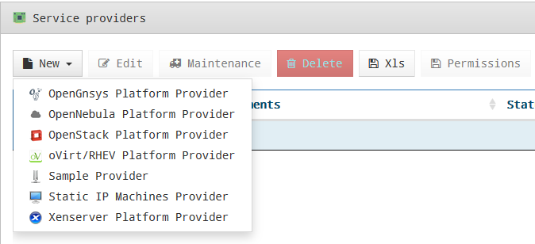
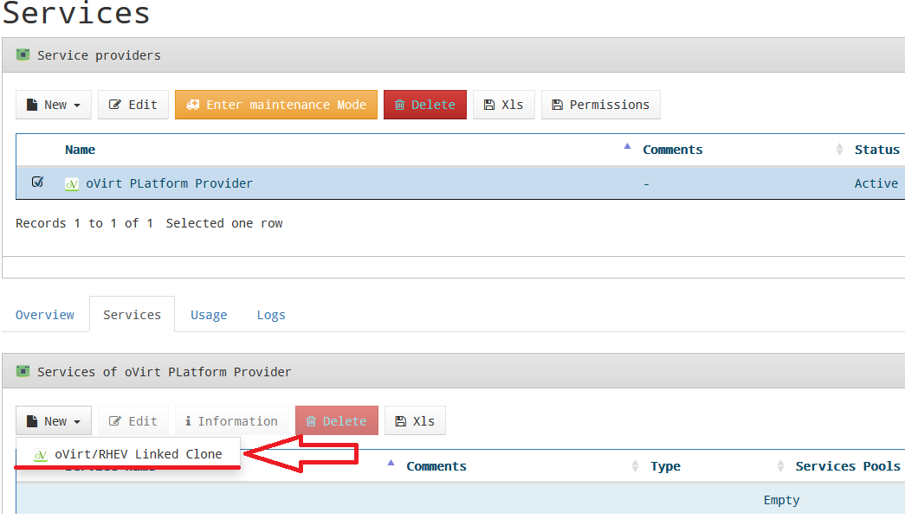
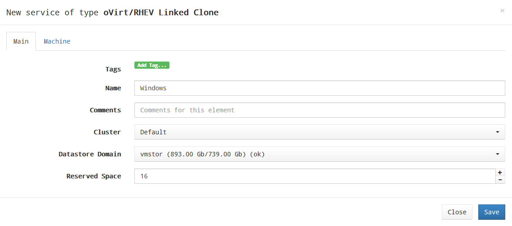
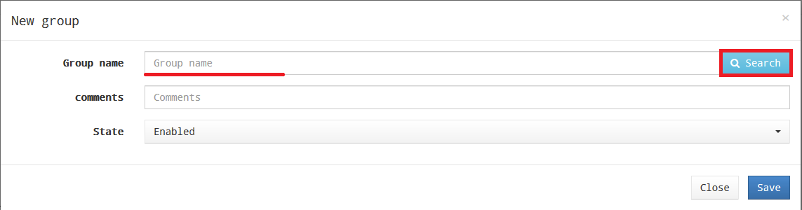
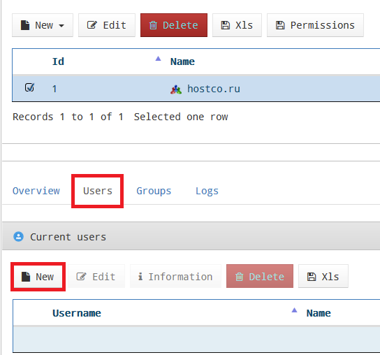
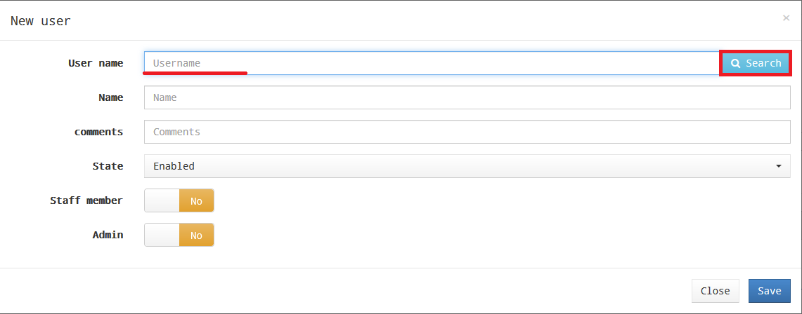
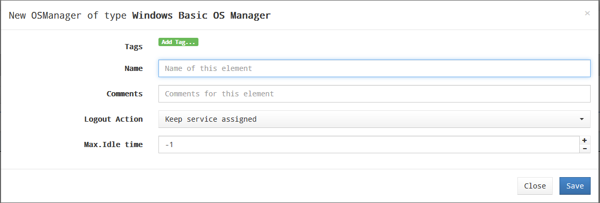
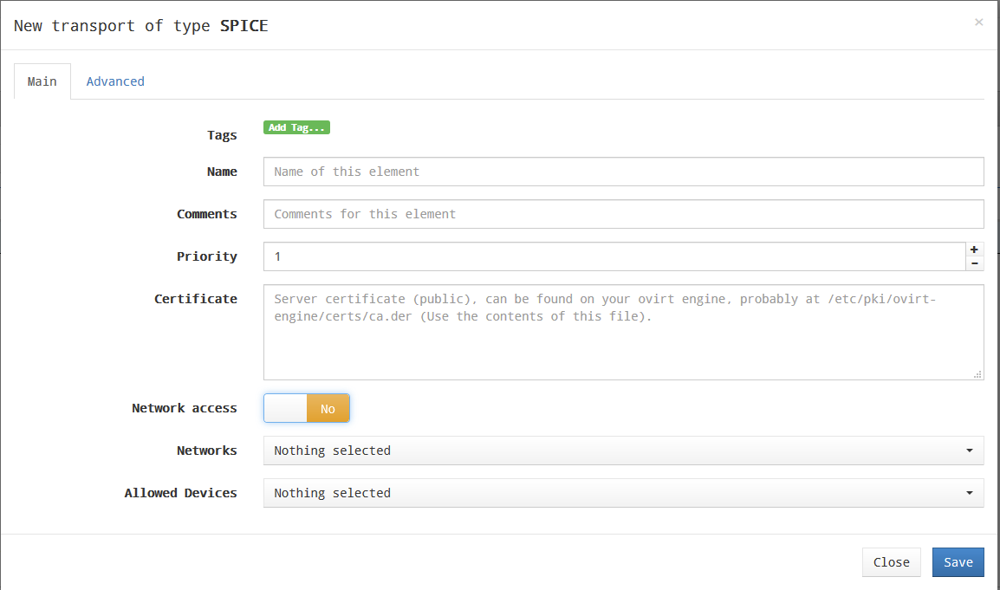
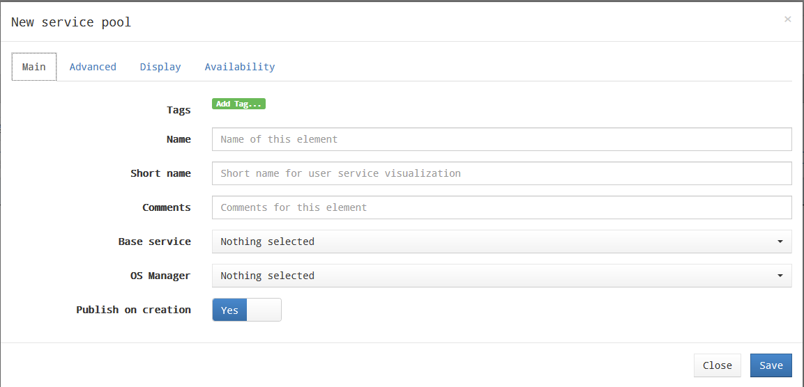
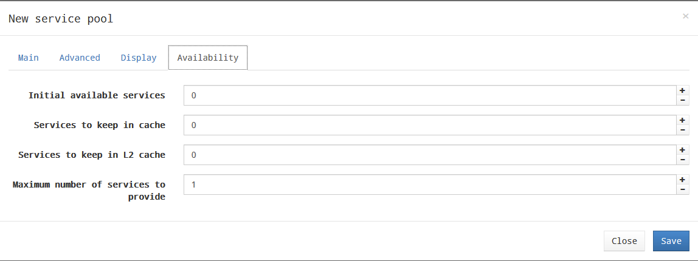

# Руководство администратора HOSTVM VDI Appliance

## Глоссарий

| Понятие | Определение |
| :---: | :---: |
| Аутентификатор \(Authenticator\) | Ресурс, обеспечивающий управление правами доступа пользователей к виртуальным ресурсам |
| Базовый образ \(Base Machine\) | Базовый шаблон виртуальной машины |
| Менеджеры операционной системы \(OS Managers\) | Управляющий компонент для операционной системы виртуального рабочего места |
| Сервис \(Service\) | Ресурс, обеспечивающий выделение виртуальных рабочих мест |
| Тонкий клон \(Linked Clone\) | Клонированный образ виртуальной машины минимального размера |
| Транспорты \(Transports\) | Приложения для подключения к виртуальным рабочим местам по требуемым протоколам |

## Общие данные

Руководство описывает действия администратора при настройке основных компонентов программного комплекса и содержит список и описание наиболее часто встречающихся команд.

## Администрирование UDS

Для первоначальной настройки и администрирования программного комплекса необходимо ввести IP-адрес или имя сервера VDI Appliance \(UDS брокера\) через http или https доступ.

При первом входе в панель администрирования UDS необходимо ввести имя и пароль администратора, как показано на Рис. 1.

После входа в панели администрирования можно изменить пароль, создать или выбрать новых пользователей, которым будет разрешен доступ в панель администрирования.

**Рис. 1**

Если уже существует настроенная учетная запись пользователя с правами администратора для платформы UDS, необходимо ввести имя и пароль этого пользователя и выбрать тип аутентификации, который будет использоваться для входа.

Если настроено несколько аутентификаторов, и необходимо получить доступ к панели администрирования с помощью локальной учетной записи администратора, выбранный аутентификатор не будет использоваться, так как этот пользователь не будет сопоставлен с аутентификатором.

Для перехода к порталу администрирования необходимо выбрать **«Dashboard»\(Панель\)** в меню пользователя, как показано на Рис. 2.

**Рис. 2**

После перехода к администрированию платформы будет создан пул сервисов, в котором выполняется развертывание виртуальных рабочих столов и сервисов, как показано на Рис. 3

**Рис. 3**

Конфигурация каждого пула сервисов составляется из различных элементов:

* каждый пул состоит из различных компонентов \(базовые сервисы, менеджеры ОС, транспорты и аутентификаторы\);
* после настройки компонентов первого пула, начнется его создание. Этот процесс повторится и для всех остальных сервисных пулов;
* все настроенные сервисные пулы вместе образуют тип развертывания виртуального рабочего стола, управляемого платформой UDS.

## Настройка сервис-провайдеров

Сервис-провайдер отвечает за предоставление IP-сервисов.

Сервисы, предоставляемые платформой, могут быть виртуальными рабочими столами по требованию или приложениями, предоставляемыми платформой виртуализации или постоянными физическими/виртуальными рабочими столами, назначенными конкретным пользователям путем назначения IP-адресов.

Для создания пула сервисов должен быть создан хотя бы один сервис-провайдер. Поддерживаемые типы сервис-провайдеров приведены на Рис. 4.

**Рис. 4.**

## Настройка платформы VDI на базе HOSTVM

В данном разделе описано развертывание платформы VDI через виртуальную инфраструктуру HOSTVM

### Регистрация провайдера «oVirt Platform Provider»

Для регистрации провайдера «oVirt Platform Provider» необходимо зайти в раздел «Services», нажать «New» и выбрать «oVirt/RHEV Platform Provider», как показано на Рис. 5.

**Рис. 5.**

В разделе «oVirt/RHEV Platform Provider» должны быть настроены следующие параметры:

**Основные, как показано на Рис. 6:**

* Имя \(Name\): имя сервисного провайдера;
* Версия oVirt/RHEV \(oVirt Verison\): версия подключаемого oVirt/RHEV;
* Host: имя или IP-адрес oVirt-engine \(сервера RHEV-Manager\);
* Имя пользователя \(Username\): имя пользователя \(в формате user@domain\), имеющего доступ с правами администратора на oVirt-engine \(RHEV-Manager\);
* Пароль \(Password\): пароль пользователя.

**Рис. 6.**

**Дополнительные, как показано на Рис. 7:**

* количество одновременных задач создания рабочего стола \(поле «Creation concurrency»\);
* количество одновременных задач удаления рабочего стола \(поле «Removal concurrency»\);
* тайм-аут при установлении соединения с помощью oVirt-engine \(RHEV-Manager\);
* диапазон MAC-адресов для присвоения виртуальным рабочим столам.

**Рис. 7**

С помощью кнопки «Test» можно проверить, что соединение выполнено успешно.

После сохранения настроенные сервис-провайдеры будут подтверждены и готовы для создания базовых сервисов в oVirt.

Количество сервис-провайдеров типа «oVirt/RHEV Platform Provider», регистрируемых в рамках платформы, не ограничено.

Чтобы изменить какой-либо параметр в уже существующих сервис-провайдерах, необходимо выбрать его и нажать «Edit», как показано на Рис. 8.

**Рис. 8**

С помощью кнопки «Enter Maintenance Mode» можно приостановить все операции, запущенные платформой для данного сервис-провайдера.

Рекомендуется поставить провайдер в режим обслуживания в случае потери связи или его остановки для обслуживания.

## Настройка сервиса на основе «oVirt / RHEV Linked Clone»

После установки платформы oVirt, где будут созданы рабочие столы, необходимо создать базовые сервисы на основе тонких клонов виртуальных машин oVirt / RHEV.

Следует выбрать сервис-провайдера, в котором будет создан тонкий клон оVirt / RHEV и нажать «New», как показано на Рис. 9.

**Рис. 9**

Минимальные параметры, которые необходимо настроить в «оVirt / RHEV Linked Clone»:

**Основные параметры:**

* Имя \(Name\): имя сервиса;
* Кластер \(Cluster\): кластер серверов oVirt, на котором будут размещены развернутые связанные клоны;
* Домен хранилища данных \(Datastore Domain\): хранилище, установленное для развертывания клонов виртуальных машин;
* Зарезервированное пространство \(Reserved Space\): минимальное свободное пространство, которое может использоваться системой UDS.

**Рис. 10**

**Параметры виртуальной машины:**

* Базовый образ \(Base Machine\): шаблон для развертывания виртуальных рабочих столов \(Golden Image\);
* Память \(Memory\): объем памяти, который будет присвоен \(в мегабайтах\);
* Гарантированная память \(Memory Guaranteed\): объем памяти, который будет гарантированно доступен для тонких клонов;
* USB: если выбрано, то виртуальные рабочие столы будут поддерживать перенаправление USB-устройств;
* Отображение \(Display\): протокол подключения виртуальных рабочих столов, развернутых через тонкий клон;
* Имена машин \(Machine Names\): префикс имени для всех тонких клонов, которые будут развернуты в этой службе \(например, имена машин = win-\);
* Длина имени \(Name Length\): длина номера суффикса, прикрепленного к корневому имени \(например, Name Length = 3, win-000 ... win-999\).

**Рис. 11**

После сохранения этой конфигурации будет готов действующий «oVirt Linked Clone» на платформе oVirt, как показано на Рис. 12.

Можно зарегистрировать необходимое количество «OVirt Linked Clone» на платформе UDS.

**Рис. 12**

После настройки всех компонентов среды UDS \(сервисы, аутентификаторы, менеджеры ОС и транспорты подключений\) и создания пула сервисов на сервере oVirt-engine можно видеть развернутые виртуальные рабочие столы на базе тонких клонов oVirt, как показано на Рис. 13.

**Рис. 13**

## Настройка аутентификаторов

Аутентификатор является основным компонентом платформы доставки рабочих столов, так как позволяет пользователям и группам пользователей, которым предоставлены учетные данные, подключаться к различным сервисам на рабочих столах.

Если в пуле сервисов не назначен хотя бы один аутентификатор, не будет возможности для подключения пользователей к сервисам рабочих столов платформы.

В зависимости от деятельности и платформы можно выбирать внешние аутентификаторы \(Active Directory, OpenLDAP и т. д.\) или внутренние \(внутренняя база данных и аутентификация по IP\), как показано на Рис. 14.

**Рис. 14**

### Аутентификатор Active Directory

Этот внешний аутентификатор обеспечивает доступ пользователям и группам пользователей, принадлежащим Active Directory, к виртуальным рабочим столам или приложениям.

**Рис. 15**

Минимальные параметры, которые необходимо настроить в аутентификаторе Active Directory:

* Имя \(Name\): имя аутентификатора;
* Приоритет \(Priority\): приоритет аутентификатора: чем ниже приоритет, тем выше он будет отображаться в списке аутентификаторов, доступных в окне доступа пользователя \(это поле допускает отрицательные значения\);
* Метка \(Label\): метка, позволяет получать прямой доступ к странице входа с использованием данного аутентификатора без необходимости выбора, используя URL вида: UDSServer / login / label \(например, https: // UDSServer / login / AD\);
* Host: IP-адрес или имя сервера AD;
* Port: порт подключения к серверу AD \(обычно 389, или 636 при использовании SSL\);
* Использовать SSL \(Use SSL\): если установлено значение «Yes», используется SSL-соединение с сервером AD;
* Пользователь \(Ldap User\): пользователь с правами чтения AD в формате: user @ domain;
* Пароль \(Password\): пароль пользователя;
* Тайм-аут \(Timeout\): тайм-аут соединения с аутентификатором;
* Base: базовая запись поиска в AD \(например dc=example, dc=com\).

**Рис. 16**

Нажав кнопку «Test», можно проверить, правильно ли настроено соединение с AD.

### Настройка пользователей и групп

После настройки аутентификатора необходимо указать группы пользователей, участникам которых будет предоставлен доступ к сервисам виртуальных рабочих столов.

Для добавления группы выберите нужный аутентификатор в списке, перейдите на вкладку “Groups” и нажмите “New”.

**Рис. 17**

Для поиска укажите имя группы или его часть и нажмите “Search”.

**Рис. 18**

Выберите нужную группу в результатах поиска и нажмите “Accept”.

**Рис. 19**

Пользователи, состоящие в добавленных в аутентификатор группах, будут автоматически добавлены в систему при первом входе.

Исключение составляют аутентификаторы “Internal Database” и “IP Authenticator”, для которых пользователи добавляются только вручную.

Для добавления пользователя выберите нужный аутентификатор в списке, перейдите на вкладку “Users” и нажмите “New”.

**Рис. 20**

Для поиска укажите имя пользователя или его часть и нажмите “Search”. Выберите нужного пользователя в результатах поиска и нажмите “Accept”.

**Рис. 21**

При необходимости можно назначить пользователю специальные права доступа:

* Staff member: права администратора UDS и доступ к разделу Downloads \(возможность скачивания приложения UDS Actor\);
* Admin: права Staff Member, а также доступ к расширенным настройкам UDS \(раздел “Tools” – “Configuration”\).

### Настройка менеджеров ОС

Менеджеры ОС обеспечивают управление ранее созданными сервисами Linked Clone.

Тип и настройки менеджера ОС определяют взаимодействие между ОС тонкого клона и брокером подключений UDS через приложение UDS Actor.

Для создания менеджера ОС необходимо нажать “New” в разделе “OS Managers” – “Current OS Managers”. Доступные типы менеджеров ОС показаны на Рис. 22.

**Рис. 22**

### Настройка Linux OS Manager

Менеджер Linux OS предназначен для управления виртуальными рабочими столами на базе Linux-систем.

Минимально необходимые параметры настройки менеджера:

* Name: имя менеджера ОС;
* Logout action: выполняемое при завершении сеанса пользователя действие. Доступные варианты: Keep service assigned \(виртуальный рабочий стол остается зарезервированным за пользователем, и при следующем обращении предоставляется ему же\), Remove service \(виртуальный рабочий стол удаляется, при следующем обращении назначается новый\);
* Max. Idle time: максимальное время неактивности пользователя, по достижении которого выполняется автоматический выход из системы. Применяется только при выборе опции Logout action: Remove service.

**Рис. 23**

### Настройка Windows Basic OS Manager

Менеджер Windows Basic OS предназначен для управления виртуальными рабочими столами на базе Windows-систем, не являющихся членами домена.

Минимально необходимые параметры настройки менеджера:

* Name: имя менеджера ОС;
* Logout action: выполняемое при завершении сеанса пользователя действие. Доступные варианты: Keep service assigned \(виртуальный рабочий стол остается зарезервированным за пользователем, и при следующем обращении предоставляется ему же\), Remove service \(виртуальный рабочий стол удаляется, при следующем обращении назначается новый\);
* Max. Idle time: максимальное время неактивности пользователя, по достижении которого выполняется автоматический выход из системы. Применяется только при выборе опции Logout action: Remove service.

**Рис. 24**

## Настройка транспортов подключения

Для подключения к виртуальным рабочим столам и приложениям необходимо создать транспорт подключения.

Транспорт - это небольшие приложения, которые отвечают за предоставление доступа к развернутому сервису и запускаются на клиенте.

В зависимости от типа настроенного виртуального рабочего стола, места расположения и способа подключения к виртуальным рабочим столам, должны быть созданы различные типы транспортов.

На клиенте и виртуальной машине должны быть установлены необходимые протоколы соединения, которые будут использоваться в разделе транспорта.

В настоящее время доступно туннелированное \(Рис. 25\) и прямое \(Рис. 26\) подключение.

**Рис. 25**

**Рис. 26**

Прямое подключение \(транспорт\) используется для доступа пользователей к виртуальным рабочим столам и приложениям из внутренней локальной сети, VPN, LAN Extension и т. д.

Туннелированное подключение \(транспорт\) используется для доступа пользователей к виртуальным рабочим столам и приложениям из глобальной сети. Эти транспорты будут полагаться на сервер UDS туннеля, чтобы установить соединение.

Транспорт HTML5 может использоваться для доступа пользователей к виртуальным рабочим столам с помощью всех типов доступа \(LAN, WAN и т. д.\). Этот транспорт использует сервер туннелирования для соединения с виртуальными рабочими столами.

Для создания транспортов необходимо нажать «New» в разделе «Connectivity» - «Current Transports», как показано на Рис. 27.

**Рис. 27**

### Прямой транспорт SPICE

Прямой транспорт SPICE обеспечивает доступ к виртуальным рабочим столам пользователей Windows / Linux через протокол SPICE. Для этого клиентам необходимо установить SPICE-соединение \(Virt-Manager\).

Транспорт SPICE можно использовать только с сервис-провайдерами oVirt или Red Hat Enterprise Virtualization \(RHEV\) и OpenNebula.

**Рис. 28**

Минимальные параметры, которые необходимо настроить для прямого транспорта SPICE:

**Основные параметры:**

* Имя \(Name\): имя транспорта;
* Приоритет \(Priority\): чем ниже значение параметра, тем выше транспорт будет отображаться в списке доступных услуг. Транспорт с наименьшим значением параметра будет использоваться по умолчанию при нажатии на изображение сервиса;
* Сертификат \(Certificate\): сертификат, сгенерированный в oVirt-engine / RHEV-manager, необходим для подключения к виртуальным рабочим столам \(обычно размещается в /etc/pki/ovirt-engine/certs/ca.der\);
* Доступ к сетям \(Networks Access\): указывается, если в выбранной сети в разделе «Networks» предоставляется доступ пользователям с помощью этого транспорта \(доступные сети будут настроены в разделе «Networks»\);
* Сети \(Networks\): сетевые диапазоны, подсети или IP-адреса, перечисленные в разделе «Current Networks» - «Connectivity». 

Используется вместе с полем «Network Access», чтобы включить или отключить доступ пользователя к сервису на основе сетевого местоположения.

**Рис. 29**

**Дополнительные параметры:**

* Показать полноэкранный режим \(Show fullscreen\): включение/отключение полноэкранного режима для удаленного рабочего стола.

**Рис. 30**

## Настройка пула сервисов.

После того, как будут настроены основные компоненты программного комплекса, можно приступить к созданию пула сервисов.

Для создания пула сервисов требуются следующие ранее настроенные компоненты: базовый сервис \(тонкий клон\) сервис-провайдера, менеджер ОС, транспорт подключения, и группа пользователей, которым планируется предоставить доступ к сервису.

Для создания нового пула сервисов нажмите “New” в разделе “Service Pools”, как показано на Рис. 31.

**Рис. 31**

Минимально необходимые параметры для настройки нового пула сервисов:

**Основные:**

* Имя \(Name\): имя пула сервисов;
* Короткое имя \(Short name\): имя сервиса, отображаемое пользователям;
* Базовый сервис \(Base service\): настроенный ранее базовый сервис \(тонкий клон\) сервис-провайдера;
* Менеджер ОС \(OS Manager\): настроенный ранее менеджер ОС;
* Публикация при создании \(Publish on creation\): если опция включена, то после завершения настройки пула сервисов и нажатия кнопки “Save” сразу начнется публикация нового сервиса. Если опция выключена, публикация осуществляется вручную на вкладке “Publications” созданного сервиса.

**Рис. 32**

**Параметры доступности:**

* Initial available services: количество сервисов \(виртуальных рабочих столов\), которые будут развернуты и доступны для назначения пользователям сразу после создания пула;
* Maximum number of services to provide: максимально возможное количество предоставляемых пулом сервисов \(виртуальных рабочих столов\).

**Рис. 33**

Для предоставления пользователям доступа к сервису необходимо добавить соответствующую группу пользователей в созданный пул сервисов.

Группы пользователей создаются в настройках аутентификатора. Для добавления группы нажмите “New” на вкладке “Groups” созданного пула сервисов, как показано на Рис. 34.

**Рис. 34**

Выберите аутентификатор и группу из списка доступных для выбранного аутентификатора.

**Рис. 35**

Для добавления транспорта подключения нажмите “New” на вкладке “Transports” созданного пула сервисов. Выберите из списка ранее созданных транспортов нужный.

**Рис. 36**

