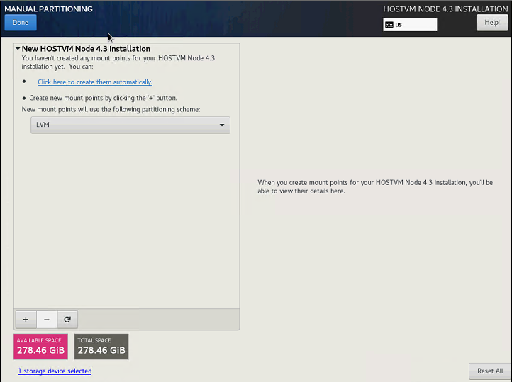
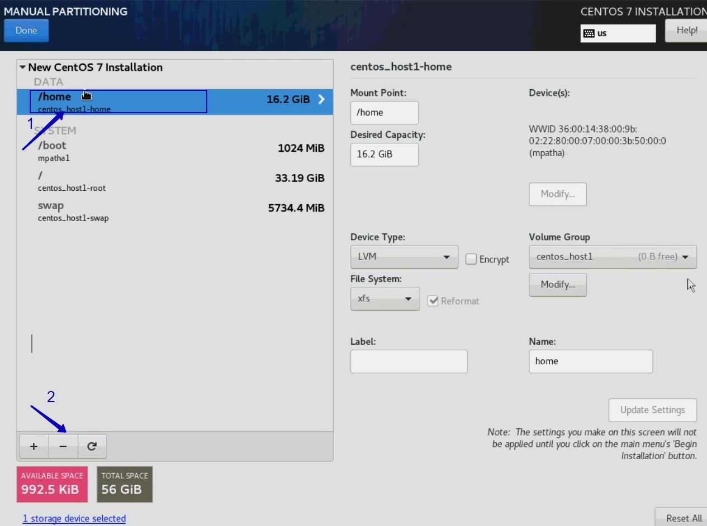

# Установка HOSTVM Node на локальные диски

## Перед установкой

Перед установкой подготовьте диски вашего сервера: соберите диски в raid-группы используя инструкции вендора вашего оборудования.

Для установки необходимо использовать iso-образ HOSTVM Node, который доступна в [наборе дистрибутивов для развертывания решения](https://reestr.hostco.ru/downloads)

Подключите полученный iso-образ к серверу, запустите сервер.

## Процесс установки

При загрузке откроется меню выбора действия. За 60 секунд выберите _Install Centos 7_. Если за 60 секунд после загрузки не выбрать данный пункт, то начинается тестирование ресурсов сервера и только после этого начнется установка. Остановить тестирование ресурсов сервера возможно через нажатие клавиши _esc_. 

В случае если загрузка установщика зависнет, то нужно повторно загрузиться с установочного диска и в стартовом меню действий выбрать пункт «Troubleshooting», затем “Install CentOS 7 in basic graphics mode” для запуска установки с с использованием псевдографического интерфейса.

В открывшемся окне выберите английский язык \(English\), который будет использоваться в интерфейсе установщика.

_Выбранный язык не влияет на язык внутри самой операционной системы, которая устанавливается без графической оболочки._

Скриншоты инструкции выполнены в интерфейсе с английским языком. Нажмите _Continue_.

Далее автоматически открывается меню настроек.

Перейдите в _DATE & TIME_, укажите ваш часовой пояс, время и дату. Нажмите _Done_.

Перейдите в _NETWORK & HOST NAME_.

Выберите интерфейс, нажмите кнопку _Configure..._. В открывшемся окне перейдите на вкладку _IPv4 Settings_, выберите _Method: Manual_, введите ip, маску, gw, DNS-сервер. Нажмите кнопку _Save_.

Переведите тригер возле названия подключения в положение _On_. В поле _Host name_ введите имя сервера, нажмите кнопку _Apply_. Нажмите кнопку _Done_.

Перейдите в _Instalation Destination_. Выберете диск на который необходимо выполнить установку. Выберете радиокнопку _I will configure partitioning_. Нажмите _Done_.

После выбора места установки автоматически открывается следующее меню.

Если диск уже использовался \(имел таблицу разделов\), то удалите их, как показано ниже.

Когда на диске не останется существующих разделов, нажмите _Click here to create them automatically_.

Удалите _home_, как показано ниже.

Для работы гипервизору необходимо минимум 45GB на системном диске. Для работы hostvm на локальных дисках необходимо 61GB выделенных для домена хранения. Домен хранения рекомендуем создавать на отдельном разделе. Если необходимо, измените поле _Desired Capacity_ раздела _/_, чтобы изменить размер системного раздела

На освободившемся после удаления _home_ месте, создайте новый раздел с точкой монтирования в _/data_.

Нажмите _Done_.

Подтвердите действие кнопкой _Accept Changes_.

В стартовом меню нажмите кнопку _Begin Instalation_, чтобы начать установку.

В открывшемся окне выберете _Root Password_. Введите ваш пароль \(рекомендуемый пароль **engine**\). Дважды нажмите _Done_.

Ожидайте окончания установки. После завершения подтвердите перезагрузку нажатием на кнопку _Reboot_.

