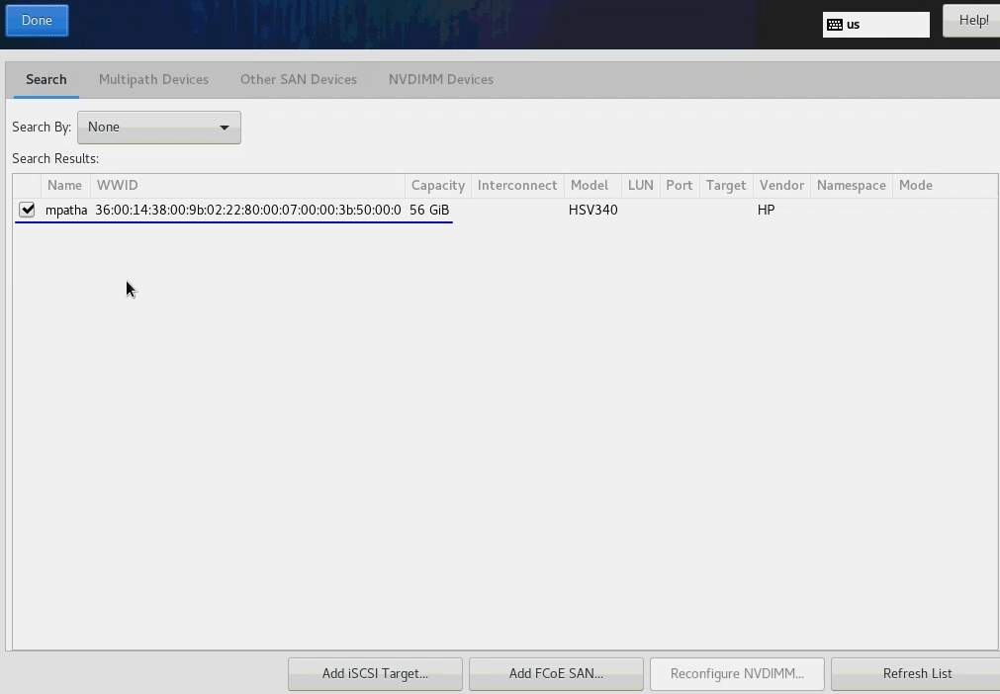

# Установка HOSTVM Node на диски СХД

## Перед установкой

Перед установкой подготовьте на вашей схд системный лун и лун для хранения виртуальных машин. Выполните маппинг сервера к выделенным ему лунам\(vdisk'ам\) по инструкциям от производителя вашего серверного оборудования. В случае использования системного луна, подключенного по FC, настройте bootFromSan по инструкциям от производителя вашего серверного оборудования.

Для установки необходимо использовать iso-образ [Centos7](https://www.centos.org), который доступна в [наборе дистрибьютивов для развертывания решения](https://reestr.hostco.ru/downloads)

Подключите полученный iso-образ к серверу, запустите сервер.

## Процесс установки

При загрузке откроется меню выбора действия. За 60 секунд выберите _Install Centos 7_. Если за 60 секунд после загрузки не выбрать данный пункт, то начинается тестирование ресурсов сервера и только после этого начнется установка. Остановить тестирование ресурсов сервера возможно через нажатие клавиши _esc_. 

В случае если загрузка установщика зависнет, то нужно повторно загрузиться с установочного диска и в стартовом меню действий выбрать пункт «Troubleshooting», затем “Install CentOS 7 in basic graphics mode” для запуска установки с сиспользованием псевдографического интерфейса.

В открывшемся окне выберите английский язык \(English\), который будет использоваться в интерфейсе установщика.

_Выбранный язык не влияет на язык внутри самой операционной системы, которая устанавливается без графической оболочки._

Скриншоты инструкции выполнены в интерфейсе с английским языком. Нажмите _Continue_.

Далее автоматически открывается меню настроек.

Перейдите в _DATE & TIME_, укажите ваш часовой пояс, время и дату. Нажмите _Done_.

Перейдите в _NETWORK & HOST NAME_.

Выберите интерфейс, нажмите кнопку _Configure..._. В открывшемся окне перейдите на вкладку _IPv4 Settings_, выберите _Method: Manual_, введите ip, маску, gw, DNS-сервер. Нажмите кнопку _Save_.

Переведите тригер возле названия подключения в положение _On_. В поле _Host name_ введите имя сервера, нажмите кнопку _Apply_. Нажмите кнопку _Done_.

Перейдите в _Instalation Destination_. Выберете диск на который необходимо выполнить установку. Выберете радиокнопку _I will configure partitioning_. Нажмите _Done_.

Если диск не отображается, необходимо открыть дополнительное окно под кнопкой _Add a disk..._, поставить галочку напротив необходимого диска и нажать кнопку _Done_.

После выбора места установки автоматически открывается следующее меню.

Если диск уже использовался \(имел таблицу разделов\), то удалите их, как показано ниже.

Когда на диске не останется существующих разделов, нажмите _Click here to create them automatically_.

Удалите _home_, как показано ниже.

Освободившееся место отдайте разделу _/_. Для этого выберете его, укажите в поле Desired Capacity его размер. Минимальный размер диска: 45GB. Измените фокус \(выберете другой раздел\), чтобы изменения отобразились на экране.

Нажмите _Done_.

Подтвердите действие кнопкой _Accept Changes_.

В стартовом меню нажмите кнопку _Begin Instalation_, чтобы начать установку.

В открывшемся окне выберете _Root Password_. Введите ваш пароль \(рекомендуемый пароль **engine**\). Дважды нажмите _Done_.

Ожидайте окончания установки. После завершения подтвердите перезагрузку нажатием на кнопку _Reboot_.

