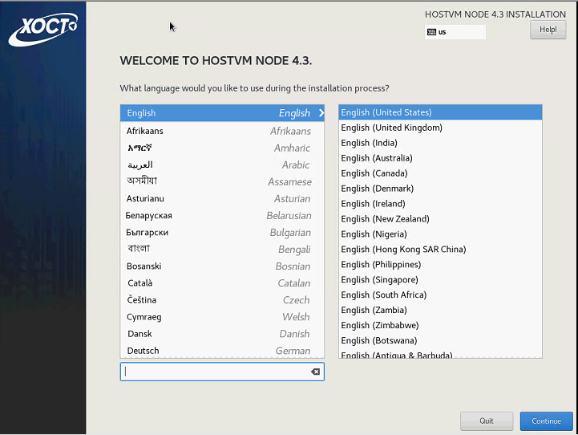
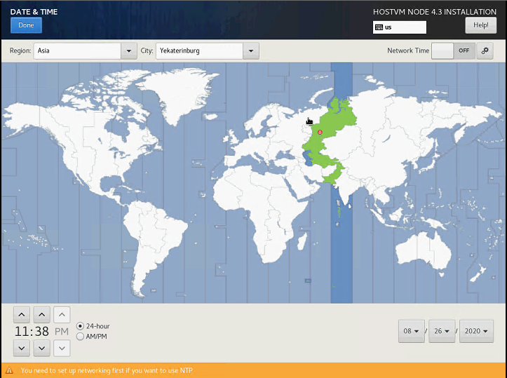
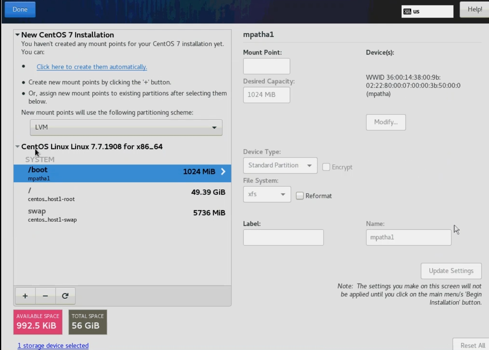
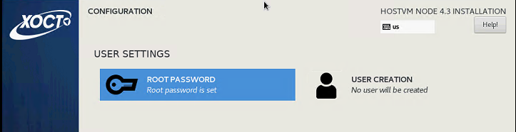
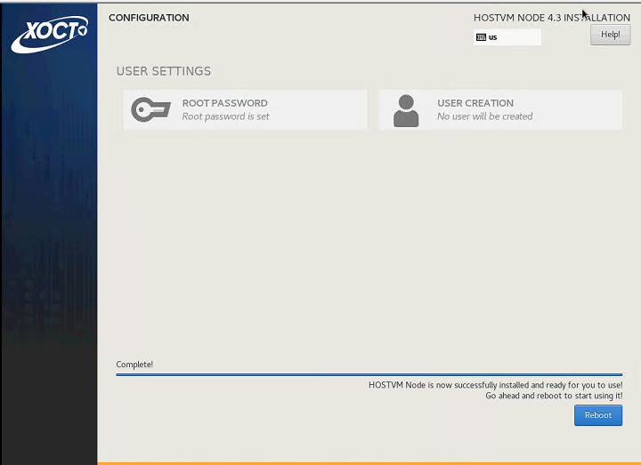

# Установка HOSTVM Node на диски СХД

## Перед установкой

Перед установкой подготовьте на вашей схд системный лун и лун для хранения виртуальных машин. Выполните маппинг сервера к выделенным ему лунам\(vdisk'ам\) по инструкциям от производителя вашего серверного оборудования. В случае использования системного луна, подключенного по FC, настройте bootFromSan по инструкциям от производителя вашего серверного оборудования.

Для установки необходимо использовать iso-образ HOSTVM Node, который доступна в [наборе дистрибутивов для развертывания решения](https://reestr.hostco.ru/downloads)

Подключите полученный iso-образ к серверу, запустите сервер.

## Процесс установки

При загрузке откроется меню выбора действия. За 60 секунд выберите _Install HOSTVM Node_ Если за 60 секунд после загрузки не выбрать данный пункт, то начинается тестирование ресурсов сервера и только после этого начнется установка. Остановить тестирование ресурсов сервера возможно через нажатие клавиши _esc_. 

В случае если загрузка установщика зависнет, то нужно повторно загрузиться с установочного диска и в стартовом меню действий выбрать пункт «Troubleshooting», затем “Install CentOS 7 in basic graphics mode” для запуска установки с использованием псевдографического интерфейса.

В открывшемся окне выберите английский язык \(English\), который будет использоваться в интерфейсе установщика.

_Выбранный язык не влияет на язык внутри самой операционной системы, которая устанавливается без графической оболочки._

Скриншоты инструкции выполнены в интерфейсе с английским языком. Нажмите _Continue_.

Далее автоматически открывается меню настроек.

Перейдите в _DATE & TIME_, укажите ваш часовой пояс, время и дату. Нажмите _Done_.

Перейдите в _NETWORK & HOST NAME_.

Выберите интерфейс, нажмите кнопку _Configure..._. В открывшемся окне перейдите на вкладку _IPv4 Settings_, выберите _Method: Manual_, введите ip, маску, gw, DNS-сервер. Нажмите кнопку _Save_.

Переведите тригер возле названия подключения в положение _On_. В поле _Host name_ введите имя сервера, нажмите кнопку _Apply_. Нажмите кнопку _Done_.

Перейдите в _Instalation Destination_. Выберете диск на который необходимо выполнить установку. Выберете радиокнопку _I will configure partitioning_. Нажмите _Done_.

Если диск не отображается, необходимо открыть дополнительное окно под кнопкой _Add a disk..._, поставить галочку напротив необходимого диска и нажать кнопку _Done_.

После выбора места установки автоматически открывается следующее меню.

Если диск уже использовался \(имел таблицу разделов\), то удалите их, как показано ниже.

Когда на диске не останется существующих разделов Из выпадающего меню выберите _LVM Thin Provisioning._ Нажмите _Click here to create them automatically_.

Удалите _home_, как показано ниже.

Освободившееся место отдайте разделу _/_. Для этого выберете его, укажите в поле Desired Capacity его размер. Минимальный размер диска: 45GB. Измените фокус \(выберете другой раздел\), чтобы изменения отобразились на экране.

Добавьте раздел /var. Присвойте ему не менее 15GB свободного места

Нажмите _Done_.

Подтвердите действие кнопкой _Accept Changes_.

В стартовом меню нажмите кнопку _Begin Instalation_, чтобы начать установку.

В открывшемся окне выберете _Root Password_. Введите ваш пароль \(рекомендуемый пароль **engine**\). Дважды нажмите _Done_.

Ожидайте окончания установки. После завершения подтвердите перезагрузку нажатием на кнопку _Reboot_.

